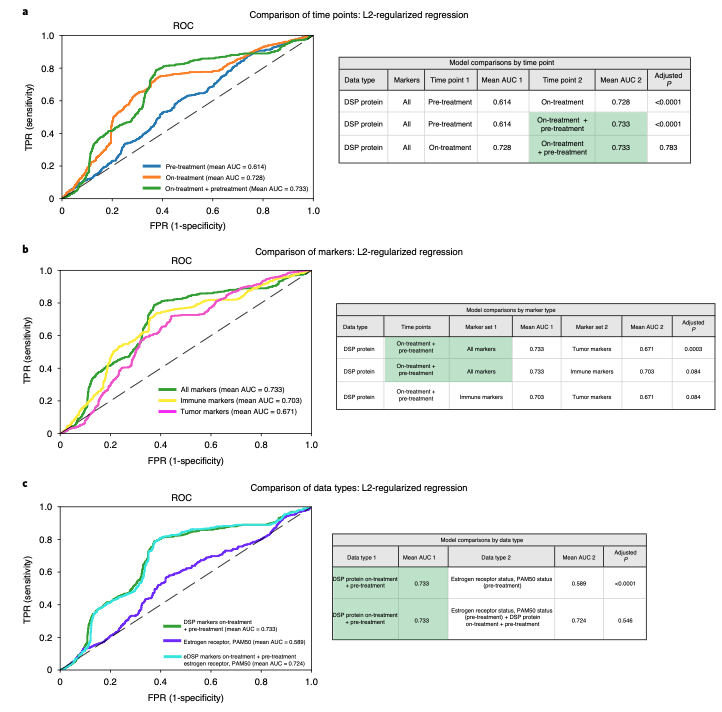

欢迎关注“小丫画图”公众号，回复“小白”，看小视频，实现点鼠标跑代码。

小丫微信: epigenomics  E-mail: figureya@126.com

作者：大鱼海棠，他的更多作品看这里<https://k.koudai.com/OFad8N0w>

单位：中国药科大学生物统计和计算药学研究中心，国家天然药物重点实验室

小丫编辑校验

```{r setup, include=FALSE}
knitr::opts_chunk$set(echo = TRUE)
```

# 需求描述

这篇文章Fig4的a，b，c；实现以下关键词：nested cross-validation； Holm–Bonferroni correction for multiple hypotheses； L2-regularized classifiers



出自<https://www.nature.com/articles/s43018-021-00190-z>

Fig. 4 | DSP of pan-CK-enriched paired pre- and on-treatment biopsies is associated with pathological complete response in the discovery cohort and outperforms established markers. The AUrOC performance of various models was compared using nested cross-validation (based on a two-sided t-test) with Holm–Bonferroni correction for multiple hypotheses in the discovery (training) cohort (n = 23 patients with paired data for both time points). a–c, rOC curves were generated using cases with DSP pan-CK-enriched data from both the pre-treatment and on-treatment time points (23 biologically independent cases were used in these analyses). 
a, rOC curves and statistical comparison of L2-regularized classifiers trained using DSP protein marker mean values (averaged across rOIs) pre-treatment, on-treatment and the combination of pre-treatment and on-treatment (‘on-treatment + pre-treatment’). AUC, area under the curve. 
b, rOC curves and statistical comparison of DSP protein on-treatment + pre-treatment L2-regularized classifiers trained using all marker, tumor marker and immune marker mean values. Cross-region mean marker values from both the pre-treatment and on-treatment time points were used in this analysis. 
c, rOC curves and statistical comparison of the on-treatment + pre-treatment DSP protein L2-regularized classifier to a model trained using estrogen receptor and PAM50 status. These two models were compared to a model that incorporates on-treatment + pre-treatment DSP protein data, estrogen receptor and PAM50 status. 

# 应用场景

实现nested cross-validation, holm-bonferroni correction for multiple hypotheses, 以及L2-regularized classifiers

> 重要：请先阅读当前文件夹下的README.txt文件，了解各函数的用法，参数，注意事项。

# 环境设置

使用国内镜像安装包

```{r eval=FALSE}
options("repos"= c(CRAN="https://mirrors.tuna.tsinghua.edu.cn/CRAN/"))
options(BioC_mirror="http://mirrors.tuna.tsinghua.edu.cn/bioconductor/")
install.packages("sampling")
install.packages("InformationValue")
install.packages("pROC")
install.packages("glmnet")
```

加载包

```{r}
library(rms)
library(InformationValue)
library(pROC)
library(ggplot2)
library(glmnet)
Sys.setenv(LANGUAGE = "en") #显示英文报错信息
options(stringsAsFactors = FALSE) #禁止chr转成factor
```

自定义函数以方便后续分析

```{r}
#构建一个函数Calculate01()，该函数可以计算一个向量中0，1的数目并返回一个计数向量
Calculate01<-function(ob){
  Negative=0
  Positive=0
  for (i in 1:length(ob)){
    if (ob[i] == 0){Negative = Negative +1}
    if (ob[i] == 1){Positive = Positive +1}
  }
  result<-c(Positive,Negative)
  names(result)<-c("Positive","Negative")
  return(result)
}

#构建一个函数str_sample(),用于进行分层抽样
str_sample<-function(data,strataname,size){
  sample_vec<-data[,strataname]
  select0_amount<-size[1]
  select1_amount<-size[2]
  select0_id<-sample(which(sample_vec==0),size=select0_amount,replace=F)
  select1_id<-sample(which(sample_vec==1),size=select1_amount,replace=F)
  result<-data.frame(select=c(select0_id,select1_id))
  return(result)
}


#构建一个函数strata_nfolds()，用于分层抽样来构建交叉验证中每一折的样本，保证每一折都包含至少两种不同类型的样本,每折所包含的样本的编号用列表形式进行返回
#data为包含各建模特征，且二分类outcome列名为“outcome”并处于最后一列的数据框,注意：二分类outcome要以0，1表示
#nfolds为分层折叠的折叠数
strata_nfolds<-function(data,nfolds){
  lst<-list()
  nsamples_everyfold<-round(nrow(data)/nfolds)
  pandn_numbers<-Calculate01(data[,ncol(data)])
  if (nfolds > min(pandn_numbers)) {stop("请合理设置折叠数（折叠数不能超过二分类变量中最少类别的样本数）")}
  if (pandn_numbers[1] >= pandn_numbers[2]){#计算出每一折中不同类别的样本个数，这样可以保证每一折中都会存在而分类中的小群体样本
    nnegative_everyfold <<- round(pandn_numbers[2]/nfolds)
    npositive_everyfold <<- nsamples_everyfold - nnegative_everyfold
  }
  if(pandn_numbers[1] < pandn_numbers[2]){
    npositive_everyfold <<- round(pandn_numbers[1]/nfolds)
    nnegative_everyfold <<- nsamples_everyfold - npositive_everyfold
  }
  mydata<-data
  mydata_backup<-data
  id_vec_already<-c()#稍后用来构建已经抽选出来的所有样本的编号，从而得到最后一折的样本编号
  for (i in 1:nfolds){#开始构建每一折的样本的编号向量
    if (i != nfolds){
      mystrata<-str_sample(mydata,strataname="outcome",size=c(nnegative_everyfold,npositive_everyfold))
      id_vec<-rownames(mydata)[mystrata[,1]]#获取抽样的样本编号向量，但注意此处的id_vec为字符串形式的
      id_vec<-as.numeric(id_vec)
      mydata<-mydata[-mystrata[,1],]#除去已经被抽选出来的样本
      id_vec_already<-c(id_vec_already,id_vec)
      lst[[i]]<-id_vec#将编号向量加入到列表中
    }
    if (i == nfolds){
      id_vec<-rownames(mydata_backup[-id_vec_already,])
      id_vec<-as.numeric(id_vec)
      lst[[i]]<-id_vec}}
  return(lst)
}

#构建一个函数logis_cal(),用于计算线性outcome的对应归一化outcome
logis_cal<-function(x){
  m<-1/(1+exp(-x))
  return(m)
}

#构建一个函数logis_straCV()，可进行分层交叉验证，得出最佳lambda
logis_straCV<-function(li,data,nfolds,formula){
  miserror<-c()#构建误判率向量
  lambda_vec<-seq(from=0.03,to=9.99,by=0.03)#所有尝试的正则项系数lambda的向量，以0.03为步长，从0.03到9.99
  for (i in 1:nfolds){#开始内层交叉验证
    validation<-data[li[[i]],]
    train<-data[-li[[i]],]
    for (mylambda in lambda_vec){
      model<-lrm(formula = formula,
                 train,
                 x = T,
                 y = T,
                 penalty = mylambda)
      #计算验证集得分
      coe<-model$coefficients
      for (n in 1:length(coe)){
        if (n == 1) {Score = rep(coe[n],nrow(validation))}
        if (n != 1) {
          name11 = names(coe)[n]#name11是为了防止与数据中有名字为“name”的列撞名
          Score = Score + coe[n]*validation[,name11]}
      }
      probs<-apply(matrix(Score,ncol = 1),MARGIN = 1,FUN = logis_cal)#计算出验证集中各样本为阳性的概率
      pred_result<-ifelse(probs>0.5,1,0)
      misclasserror<-misClassError(data[,("outcome")],probs)
      miserror<-c(miserror,misclasserror)
    }
  }
  #找出对应误分类率最低的最大lambda
  miserror_matrix<-matrix(miserror,nrow = nfolds,byrow = T)
  mean_miserror<-apply(miserror_matrix,MARGIN=2,FUN=mean)
  min_error<-min(mean_miserror)
  perfect_lambda_address<-max(which(mean_miserror == min_error))
  perfect_lambda<-lambda_vec[perfect_lambda_address]
  return_list<-list()
  return_list[[1]]<-perfect_lambda
  return_list[[2]]<-miserror_matrix
  return_list[[3]]<-mean_miserror
  return(return_list)
}

#构建一个函数add1000(),其可以把一个取值在01之间的升序向量sensity根据1-specificity的值扩展至1000个元素，拟合连续型变量,vect是roc曲线横轴从0至1变化时最高点的坐标
add1000<-function(vec_sen,vec_spe){
  vect<-rep(0,1001)
  vec<-round(vec_spe,3)
  spe_min<-c()
  spe_max<-c()
  sen_min<-c()
  sen_max<-c()
  spe_min_ad<-c()
  spe_max_ad<-c()
  for (i in 2:length(vec_sen)){#返回1-specificity和sensity同时发生变化的点的信息
    if (vec_sen[i] != vec_sen[i-1] & vec_spe[i] != vec_spe[i-1]){
      spe_min<-c(spe_min,vec_spe[i-1])#spe_min中第i个元素就是roc曲线横轴纵轴同时变化点中较小的（1-specificity）数值，对应最终roc横轴坐标为（1-specificity），为roc第1000*round(（1-specificity）,3)+1个元素
      spe_max<-c(spe_max,vec_spe[i])#spe_min中第i个元素就是横轴纵轴同时变化点中较大的（1-specificity）数值
      sen_min<-c(sen_min,vec_sen[i-1])
      sen_max<-c(sen_max,vec_sen[i])
    }
  }
  vect[vec*1000+1]<-vec_sen
  for (i in 1:1001){
    if (vect[i] == 0) vect[i] = max(vect[1:i])
  }
  if (length(sen_min) != 0 ){
    spe_min_ad<-round(spe_min,3)*1000+1
    spe_max_ad<-round(spe_max,3)*1000+1
    if (length(sen_min) != 1){
      for (i in 1:length(spe_min)){
        if (i == 1){
          for (j in spe_min_ad[i]:spe_max_ad[i]){
            vect[j] = vect[spe_min_ad[i]] +(sen_max[i]-sen_min[i])/(spe_max_ad[i]/1000-spe_min_ad[i]/1000)*(j-spe_min_ad[i])/1000
          }
        }
        if (i != 1){
          vect[spe_min_ad[i]] = sen_min[i]
          for (j in spe_min_ad[i]:spe_max_ad[i]){
            vect[j] = vect[spe_min_ad[i]] +(sen_max[i]-sen_min[i])/(spe_max_ad[i]/1000-spe_min_ad[i]/1000)*(j-spe_min_ad[i])/1000
          }
        }
      }
    }
    if (length(sen_min) == 1){
      for (i in 1:length(spe_min)){
        for (j in spe_min_ad[i]:spe_max_ad[i]){
          vect[j] = vect[spe_min_ad[i]] +(sen_max[i]-sen_min[i])/(spe_max_ad[i]/1000-spe_min_ad[i]/1000)*(j-spe_min_ad[i])/1000
        }
      }
    }
  }
  return(vect)
}

#构建一个函数Ncv，用于构建嵌套交叉验证模型并记录单次嵌套交叉验证的平均roc曲线
#data为包含建模数据的数据框
#outer_fold为外层折叠数
#inter_fold为内层折叠数
#biresult_col为二分类outcome所在列
#model_col为模型纳入的变量所在的列
#formula为模型公式，如：outcome~年龄+健康状况
Ncv<-function(data,outer_fold,inter_fold,biresult_col,model_col,formula){
  f<-formula
  nsamples<-nrow(data)
  auc_vec<-c()
  sensity_vec<-c()
  specificity_vec<-c()
  roc_vec<-c()
  rownames(data)<-c(1:nsamples)#对所有样本进行编号
  data_for_model<-data[,c(model_col,biresult_col)]
  colnames(data_for_model)[ncol(data_for_model)]<-"outcome"#让data_for_model的最后一列的列名为"outcome"
  
  #step 1:利用分层抽样将验证集和剩余（N-1）折的训练集抽取出来，保证验证集有两个来自不同二分类outcome的样本，并进行内层的分层交叉验证
  outerfolds_list<<-strata_nfolds(data_for_model,nfolds = outer_fold)
  for (i in 1:outer_fold){#进行外层嵌套
    data_test<<-data_for_model[outerfolds_list[[i]],]
    data_train<-data_for_model[-outerfolds_list[[i]],]
    rownames(data_train)<-c(1:nrow(data_train))#为了方便strata_nfolds()根据行名的样本抽取，行名再次改为从1顺序排列到最后
    interfolds_list<-strata_nfolds(data_train,nfolds = inter_fold)#构建包含内部分层交叉验证各折数据编号的列表
    str_CV<-logis_straCV(interfolds_list,data_train,inter_fold,f)#进行内层分层交叉验证，返回该组训练集筛选出的最佳lambda
    best_lambda<-str_CV[[1]][1]#提取最佳lambda
    mod<-lrm(formula = f,#使用最佳lambda对测试集进行建模
             data_test,
             x = T,
             y = T,
             penalty = best_lambda)
    linear_pred<<-mod[["linear.predictors"]]#提取模型中线性部分计算outcome
    mod_prob<<- apply(matrix(linear_pred,nrow=1,byrow=T),MARGIN=2,FUN=logis_cal)
    mod_pred<-ifelse(linear_pred>0,1,0)#生成模型的预测outcome（0 or 1）
    datatestr<<-data_test$outcome
    #绘制外层测试集中模型的roc曲线并得出auc面积以及"sensities"和“specificities”的各数值，用于之后的平均化处理
    if (i == 1){#设置if语句是为了让第一幅打印出的roc曲线图之前刷新绘图界面，而其余的ROC曲线图可以叠加到第一幅图上
      LR_test <- plot.roc(data_test$outcome,mod_prob,ylim=c(0,1),xlim=c(1,0),
                          smooth=F, #绘制平滑曲线
                          ci=TRUE,
                          main="",
                          col=1, #线的颜色
                          lwd=2, #线的粗细
                          legacy.axes=T,
                          print.auc=F)
      mod_auc<-LR_test[["auc"]]#得出auc面积
      auc_vec<-c(auc_vec,mod_auc)
      mod_specificity<-rev(1-LR_test[["specificities"]])
      mod_sensity<-rev(LR_test[["sensitivities"]])#specificity和sensity的坐标个数容易受roc曲线中斜线部分影像，所以接下来要对坐标进行填充，保证长度一致
      if (length(mod_specificity) < (nrow(data)/outer_fold+1)) mod_specificity<-c(mod_specificity,rep(1,((nrow(data)/outer_fold+1)-length(mod_specificity))))
      if (length(mod_sensity) < (nrow(data)/outer_fold+1)) mod_sensity<-c(mod_sensity,rep(1,((nrow(data)/outer_fold+1)-length(mod_sensity))))
      sensity_vec<-c(sensity_vec,mod_sensity)
      specificity_vec<-c(specificity_vec,mod_specificity)
      mod_roc<-add1000(vec_sen=mod_sensity,vec_spe=mod_specificity)
      roc_vec<-c(roc_vec,mod_roc)
    }else{
      LR_test <- plot.roc(data_test$outcome,mod_prob,ylim=c(0,1),xlim=c(1,0),
                          smooth=F, #绘制平滑曲线
                          ci=TRUE,
                          main="",
                          col=1, #线的颜色
                          lwd=2, #线的粗细
                          legacy.axes=T,
                          print.auc=F,
                          add=T)
      mod_auc<-LR_test[["auc"]]#得出auc面积
      auc_vec<-c(auc_vec,mod_auc)
      mod_specificity<-rev(1-LR_test[["specificities"]])
      mod_sensity<-rev(LR_test[["sensitivities"]])
      if (length(mod_specificity) < (nrow(data)/outer_fold+1)) mod_specificity<-c(mod_specificity,rep(1,((nrow(data)/outer_fold+1)-length(mod_specificity))))
      if (length(mod_sensity) < (nrow(data)/outer_fold+1)) mod_sensity<-c(mod_sensity,rep(1,((nrow(data)/outer_fold+1)-length(mod_sensity))))
      sensity_vec<-c(sensity_vec,mod_sensity)
      specificity_vec<-c(specificity_vec,mod_specificity)
      mod_roc<-add1000(vec_sen=mod_sensity,vec_spe=mod_specificity)
      roc_vec<-c(roc_vec,mod_roc)
    }
    #step2: 计算每次嵌套交叉验证的平均roc曲线的散点坐标
    sensity_matrix<-matrix(sensity_vec,nrow=outer_fold,byrow=T)
    specificity_matrix<-matrix(specificity_vec,nrow=outer_fold,byrow=T)
    roc_matrix<-matrix(roc_vec,nrow=outer_fold,byrow=T)
    mean_sensity<-apply(sensity_matrix,MARGIN=2,FUN=mean)#计算出每次嵌套交叉验证的平均sensitity序列
    mean_specificity<-apply(specificity_matrix,MARGIN=2,FUN=mean)#计算出每次嵌套交叉验证的平均specificity序列
    mean_roc<-apply(roc_matrix,MARGIN=2,FUN=mean)
  }
  return_list<-list()
  return_list[["mean_sensity"]]<-mean_sensity
  return_list[["mean_specificity"]]<-mean_specificity
  return_list[["mean_roc"]]<-mean_roc
  return_list[["mean_auc"]]<-mean(auc_vec)
  return_list[["roc_mat"]]<-roc_matrix
  return_list[["sensity_mat"]]<-sensity_matrix
  return_list[["specificity_mat"]]<-specificity_matrix
  return(return_list)
}

#构建一个函数repeat_ncv(),用于将Ncv()函数重复n次，并获得平均roc曲线，默认n为100次（根据文献）
#data为包含建模数据的数据框
#outer_fold为外层折叠数
#inter_fold为内层折叠数
#biresult_col为二分类outcome所在列
#model_col为模型纳入的变量所在的列
#formula为模型公式，如：outcome~年龄+健康状况
#n_repeat为嵌套交叉验证重复的次数，默认为100次
#返回列表中包含以下value
#mean_sensity:roc曲线sensity向量在n_repeat次重复的平均值
#mean_specificity:roc曲线1-specificity向量在n_repeat次重复的平均值
#sensity_mat：roc曲线sensity向量在n_repeat次重复中每一次的取值，纵轴代表循环次数，横轴对应每一次的向量
#specificity_mat：roc曲线1-specificity向量在n_repeat次重复中每一次的取值，纵轴代表循环次数，横轴对应每一次的向量
#mean_roc:n_repeat次重复中roc曲线的平均值
#mean_AUROC:每一次嵌套验证的平均auc面积的向量
#mean_auc:mean_AUROC的平均值，即所有n_repeat次嵌套交叉验证中所有外层测试集的auc平均值
repeat_ncv<-function(data,outer_fold,inter_fold,biresult_col,model_col,formula,n_repeat=100){
  all_sensity_vec<-c()#用于将每次for循环outcome得到的mean_sensity和mean_specificity向量分别排成一个长向量
  all_specificity_vec<-c()
  all_roc_vec<-c()
  mean_AUROC<-c()#用于记录每次嵌套验证中平均AUROC的向量
  for (i in 1:n_repeat){
    Ncv_result<-Ncv(data = data,
                    outer_fold = outer_fold,
                    inter_fold =inter_fold,
                    biresult_col = biresult_col,
                    model_col = model_col,
                    formula = formula)
    all_sensity_vec<-c(all_sensity_vec,Ncv_result[["mean_sensity"]])
    all_specificity_vec<-c(all_specificity_vec,Ncv_result[["mean_specificity"]])
    all_roc_vec<-c(all_roc_vec,Ncv_result[["mean_roc"]])
    mean_AUROC<-c(mean_AUROC,Ncv_result[["mean_auc"]])
    print(paste0("已完成第",i,"次嵌套验证"))
  }
  sensity_mat<-matrix(all_sensity_vec,nrow=n_repeat,byrow = T)#将sensity和specificity向量折叠成按行排列的矩阵
  specificity_mat<-matrix(all_specificity_vec,nrow=n_repeat,byrow = T)
  roc_mat<-matrix(all_roc_vec,nrow=n_repeat,byrow = T)
  mean_sensity<-apply(sensity_mat,MARGIN=2,FUN=mean)#利用sensity和specificity矩阵计算100次循环后sensity和specificity的均值向量
  mean_specificity<-apply(specificity_mat,MARGIN=2,FUN=mean)
  mean_roc<-apply(roc_mat,MARGIN=2,FUN=mean)
  mean_auc<-mean(mean_AUROC)
  result_list<-list()
  result_list[["mean_sensity"]]<-mean_sensity
  result_list[["mean_specificity"]]<-mean_specificity
  result_list[["sensity_mat"]]<-sensity_mat
  result_list[["specificity_mat"]]<-specificity_mat
  result_list[["mean_roc"]]<-mean_roc
  result_list[["mean_AUROC"]]<-mean_AUROC
  result_list[["mean_auc"]]<-mean_auc
  return(result_list)
  prnit("outcome已生成,任务结束")
}

#构建一个函数roc.plot(),用于绘制多个模型的ROC曲线
#model_list为多个repeat_ncv的outcome构成的列表
#roc_color为人为为模型选定的颜色向量
#model_name为必填选项，为人为指定的模型名称
roc.plot<-function(model_list,roc_color=NULL,model_name=NULL){
  if (is.null(model_name)) stop("请填写模型名称向量")
  bb<-roc_color
  n_model<-length(model_list)
  x_vec<-c()
  y_vec<-c()
  mean_auc<-c()
  group_vec<-c()
  color_vec<-c()
  if (is.null(bb)){#此情况为没有输入颜色向量的情况，配色方案为ggplot2的默认配色方案
    for (i in 1:n_model){#提取每个模型的平均auc
      mean_auc<-c(mean_auc,model_list[[i]][["mean_auc"]])
    }
    mean_auc<-round(mean_auc,3)
    model_name<-paste(model_name,"(mean_auc=")#将模型名称改变为“模型名称（mean_auc=xxx）”的形式
    model_name<-paste(model_name,mean_auc)
    model_name<-paste(model_name,")")
    for (i in 1:n_model){#对列表中的模型逐一遍历，生成作图所需的数据框，x_vec和y_vec轴每次延长都多加了一个0，是为了让roc曲线有（0，0）坐标，group_vec记录每个点所属的模型
      x_vec<-c(x_vec,c(0,seq(from=0,to=1,by=0.001)))#
      y_vec<-c(y_vec,c(0,model_list[[i]][["mean_roc"]]))
      n_rocpoint<-length(c(0,model_list[[i]][["mean_roc"]]))
      group_vec<-c(group_vec,rep(model_name[i],n_rocpoint))
    }
    rocs_data<-data.frame(x_vec,y_vec,group_vec)
    graph<-ggplot(rocs_data, aes(x=x_vec, y=y_vec, colour=group_vec,group=group_vec)) + 
      geom_line(size=1)+
      labs(title="ROC", x="1-Specificity", y="Sensity")+
      theme(plot.title = element_text(hjust = 0))+#让标题居中
      guides(color=guide_legend(title = "Model"))+#设置图例名称
      theme_bw()
  }
  if (length(roc_color) == length(model_list)){#此情况为输入的颜色向量中颜色个数正好等于模型列表中模型个数的情况，按照自定义的配色方案进行配色
    for (i in 1:n_model){
      mean_auc<-c(mean_auc,model_list[[i]][["mean_auc"]])
    }
    mean_auc<-round(mean_auc,3)   
    model_name<-paste(model_name,"(mean_auc=")
    model_name<-paste(model_name,mean_auc)
    model_name<-paste(model_name,")")
    for (i in 1:n_model){#对列表中的模型逐一遍历，生成作图所需的数据框，x_vec代表x（1-specificity）轴数据，y_vec代表y（sensity）轴数据，group_vec记录每个点所属的模型
      x_vec<-c(x_vec,c(0,seq(from=0,to=1,by=0.001)))#
      y_vec<-c(y_vec,c(0,model_list[[i]][["mean_roc"]]))
      n_rocpoint<-length(c(0,model_list[[i]][["mean_roc"]]))
      group_vec<-c(group_vec,rep(model_name[i],n_rocpoint))
      color_vec<-c(color_vec,rep(roc_color[i],n_rocpoint))
    }
    rocs_data<-data.frame(x_vec,y_vec,group_vec,color_vec)
    group_name<-c()
    for (i in 1:length(group_vec)){#提取group_vec中出现的元素
      if (i == 1){
        group_name<-c(group_name,group_vec[i])
      }
      if (i != 1){
        if (group_vec[i] != group_name[length(group_name)]) group_name<-c(group_name,group_vec[i])
      }
    }
    color_deal<-roc_color
    names(color_deal)<-group_name
    graph<-ggplot(rocs_data, aes(x=x_vec, y=y_vec, group = group_vec,color = group_vec)) + 
      geom_line(size=1)+
      labs(title="ROC", x="1-Specificity", y="Sensity")+
      theme(plot.title = element_text(hjust = 0.5))+#让标题居中
      guides(color=guide_legend(title = "Model"))+#设置图例名称
      scale_color_manual(values=color_deal)+
      theme_bw()
  }
  if (length(roc_color) != length(model_list) & !is.null(bb)){
    stop("颜色向量中颜色数目与模型数目不符")}
  return(graph)
}


#构建一个函数ttest_HB(),来对不同模型的mean_AUROC进行Holm–Bonferroni校正的非配对双尾t检验
#model_list为数个repeat_ncv()函数outcome的列表(同roc.plot()函数中的model_list),model_name为列表中每个模型的名称向量，按model_list顺序一一对应
#函数ttest_HB()的返回值为一个数据框，model列为进行t检验的两个模型的名称；Pvalue列为检验P值，带"*"代表显著；order为Pvalue的降序排列的序号，
ttest_HB<-function(model_list,model_name){
  model_name<-as.character(model_name)#将模型名称转化为字符串向量
  mean_AUROC_list<-list()
  for (i in 1:length(model_list)){#将每个模型的mean_AUROC向量提取到mean_AUROC_list表格，之后用来进行t检验
    mean_AUROC_list[[i]]<-model_list[[i]][["mean_AUROC"]]
  }
  model_number<-length(model_list)#模型个数
  name_vec<-c()
  P_value<-c()
  for (i in 1:(model_number-1)){
    for (j in (i+1):model_number){
      name_vec<-c(name_vec,paste0(model_name[i],"and",model_name[j]))
      p_ttest<-t.test(x=model_list[[i]][["mean_AUROC"]],
                      y=model_list[[j]][["mean_AUROC"]],
                      paired =F,#非配对
                      alternative="two.sided")#对两个模型的mean_AUROC进行双尾非配对检验
      P_value<-c(P_value,p_ttest$p.value)#构建每次双尾t检验的P值向量
    }
  }
  order_vec<-rev(ceiling(rank(P_value)))#获得P值的降序排列序数向量,ceiling()为向上取整
  alpha = 0.05#构建显著性
  alpha_vec<-c()
  star_vec<-c()
  for (i in 1:length(P_value)){
    alpha_vec<-c(alpha_vec,alpha/order_vec[i])#计算每个模型对应的Holm–Bonferroni显著性
    if (P_value[i] <= alpha_vec[i]) star_vec<-c(star_vec,"*")
    if (P_value[i] > alpha_vec[i]) star_vec<-c(star_vec,"")
  }
  P_value<-paste(P_value,star_vec)#为P值小于显著性的P值添加*号
  data_return<-data.frame(model = name_vec,
                          Pvalue = P_value,
                          order = order_vec,
                          alpha = alpha_vec)
  return(data_return)
}

#构建一个岭回归（L2逻辑回归）函数L2log()
#x为数据框中自变量切片
#y为数据框中因变量的切片
#nfolds为交叉检验折叠数
#返回值：lambda取lambda.min和lambda.1se两个值时的模型系数,lambda取lambda.min模型准确率更高,lambda取lambda.1se模型更精简，但牺牲准确率
L2log<-function(x,y,nfolds){
  myx<-data.matrix(x)
  myy<-y
  model <- cv.glmnet(x = myx, y =myy,
                     type.measure = "mse",
                     ## K = 10 is the default.
                     nfold = nfolds,
                     ## ‘alpha = 1’ is the lasso penalty, and ‘alpha = 0’ the ridge penalty.
                     alpha = 0)
  coef_lambda.min<- coef(model,s="lambda.min") #使用最小预测误差的lambda值计算特征系数
  coef_lambda.1se<- coef(model,s="lambda.1se") #使用距离最小预测误差一个标准差之内的最大lambda值计算特征系数
  list_return<-list()
  list_return[["coef_lambda.min"]]<-coef_lambda.min
  list_return[["coef_lambda.1se"]]<-coef_lambda.1se
  return(list_return)
}
```

# 输入文件

easy_input.txt，保证最后一列的列名为outcome，且为二分类变量。

```{r eval=FALSE}
# 生成输入文件
age <- c(10,20,30,40,50,60,70,80,90,100,110,120,130,140,150)
health <- c(1,5,1,11,23,3,11,3,1,3,80,3,1,3,4)
weight <- c(1,3,2,5,2,7,7,7,5,8,4,5,8,7,3)
outcome <- c(1,0,1,1,0,1,0,0,0,0,0,0,0,1,1)
dat <- data.frame(age, health, weight, outcome)
write.table(dat, "easy_input.txt",sep = "\t",row.names = F,col.names = T,quote = F)
```


```{r}
# 加载输入文件
dat <- read.table(file = "easy_input.txt", sep = "\t", row.names = NULL, header = T, check.names = F, stringsAsFactors = F)
head(dat) 
```

# 模型验证模块

对目标数据进行n_reapeat次的嵌套交叉验证

```{r}
res1 <- repeat_ncv(data = dat,
                  outer_fold = 3,
                  inter_fold = 2,
                  biresult_col = c(4),
                  model_col = c(1,2),
                  formula = outcome ~ age + health,
                  n_repeat = 3)
res2 <- repeat_ncv(data = dat,
                   outer_fold = 3,
                   inter_fold = 2,
                   biresult_col = c(4),
                   model_col = c(2,3),
                   formula = outcome ~ health + weight,
                   n_repeat = 3)
res3 <- repeat_ncv(data = dat,
                   outer_fold = 3,
                   inter_fold = 2,
                   biresult_col = c(4),
                   model_col = c(1,2,3),
                   formula = outcome ~ age + health + weight,
                   n_repeat = 3)

#构建3个模型的列表
modelList <- list(res1, res2, res3)
```

# 绘图模块

分别测试指定颜色和不指定颜色

对多个模型经过repeat_ncv()函数返回值制成的列表进行多个模型平均roc曲线的绘制

```{r}
roc.plot(model_list = modelList, model_name = c("health + age","health + weight","age + health + weight"), roc_color = c("#C51B7D","#4D9221","#CCFFFF"))
ggsave(filename = "roc with customized color.pdf", width = 8,height = 5)
roc.plot(model_list = modelList, model_name = c("health + age","health + weight","age + health + weight"))
ggsave(filename = "roc with default color.pdf", width = 8,height = 5)
```

# 多重检验模块

对model_list中包含的模型进行两两n_repeat个mean_AUROC的Holm–Bonferroni校正的非配对双尾t检验

```{r}
hbres <- ttest_HB(model_list = modelList, model_name = c("health + age","health + weight","age + health + weight")) 
print(hbres) # 输出制作表格的结果
write.table(hbres, file = "Holm-Bonferroni test result.txt",sep = "\t", row.names = F, col.names = T, quote = F)
```

# L2逻辑回归建模模块

```{r}
model <- L2log(x = dat[,c(1,2)], y = dat[,4],nfolds = 3)#使用L2log()函数构建L2逻辑回归模型（岭回归）
print(model) # 输出制作表格的结果
write.table(as.matrix(model$coef_lambda.min), 
            file = "L2-regularized classifiers using lambda.1se.txt",sep = "\t", row.names = T, col.names = NA, quote = F)
write.table(as.matrix(model$coef_lambda.min), # 更常用
            file = "L2-regularized classifiers using lambda.min.txt",sep = "\t", row.names = T, col.names = NA, quote = F)
```

# Session Info

```{r}
sessionInfo()
```