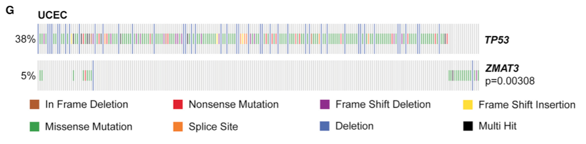
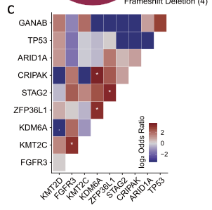

欢迎关注“小丫画图”公众号，回复“小白”，看小视频，实现点鼠标跑代码。

小丫微信: epigenomics  E-mail: figureya@126.com

作者：大鱼海棠，他的更多作品看这里<https://k.koudai.com/OFad8N0w>

单位：中国药科大学国家天然药物重点实验室，生物统计与计算药学研究中心

小丫编辑校验

```{r setup, include=FALSE}
knitr::opts_chunk$set(echo = TRUE)
```

# 需求描述

瀑布图，重点是基因之间突变相关性pvalue。

两个基因之间：



出自<https://linkinghub.elsevier.com/retrieve/pii/S1097276520307292>

Figure 5. ZMAT3 Has p53-Dependent and -Independent Activities
(G) Mutations in ZMAT3 are mutually exclusive with TP53 mutations in UCEC. p value, DISCOVER mutual exclusivity test.

多个基因之间：



出自<https://genomebiology.biomedcentral.com/articles/10.1186/s13059-020-02230-w>

Fig. 1 Genetic landscape of somatic mutations identified by whole-exome sequencing of 30 upper tract urothelial carcinomas (UTUC), including 15 muscle-invasive tumors and 15 non-muscle-invasive tumors. 
c Heatmap for genes with mutual exclusivity or co-occurrence in the whole UTUC cohort. Stars refer to correlations that are statistically significant

# 应用场景

Mutual-exclusivity analysis，我们众筹过FigureYa70mutationEvents<https://k.youshop10.com/5qGbYAM3>，用Discover包实现TCGA的基因突变数据分析Co-occurrence/mutual exclusivity，未计算Odds Ratio。

这次我们用单侧Fisher's exact检验，并计算**Odds Ratio和P值**。

从费谢尔检验的代码来看，"less" 表示mutual-exclusivity analysis（二者“竞争”出现；OR<1）, 而"greater"则代表co-occurrence analysis（二者“共生”出现; OR>1）

# 环境设置

使用国内镜像安装包

```{r}
options("repos"= c(CRAN="https://mirrors.tuna.tsinghua.edu.cn/CRAN/"))
options(BioC_mirror="http://mirrors.tuna.tsinghua.edu.cn/bioconductor/")

```

加载包

```{r}
library(ggplot2)
library(dplyr)
library(tidyverse)
library(readr)
library(maftools)

Sys.setenv(LANGUAGE = "en") #显示英文报错信息
options(stringsAsFactors = FALSE) #禁止chr转成factor
```

# 第一种情况：一两个基因的作用

按照原文所示，当考虑两个基因的作用时，计算mutual exclusivity并绘制热图：

## 输入文件

easy_input_two_genes.txt，突变的MAF文件。这里文件事先处理了，只保存了原文的两个基因。

```{r}
maf <- read_tsv("easy_input_two_genes.txt", comment = "#")
label <- c("Tumor_Sample_Barcode",
           "Hugo_Symbol",
           "Chromosome",
           "Start_Position",
           "End_Position",
           "Variant_Classification",
           "Variant_Type",
           "Reference_Allele",
           "Tumor_Seq_Allele1",
           "Tumor_Seq_Allele2")
maf <- maf[,label] # 保存一些可能会用到的列
```

## 计算突变二值矩阵（1为突变型，0为野生型）

```{r}
mut.binary <- matrix(0,nrow = length(unique(maf$Hugo_Symbol)),ncol = length(unique(maf$Tumor_Sample_Barcode)),dimnames = list(unique(maf$Hugo_Symbol),unique(maf$Tumor_Sample_Barcode)))
for (i in colnames(mut.binary)) {
  tmp <- maf[which(maf$Tumor_Sample_Barcode == i),]
  # 仅考虑如下非同义突变
  tmp <- tmp[which(tmp$Variant_Classification %in% c("Frame_Shift_Del", "Frame_Shift_Ins", "Splice_Site", "Translation_Start_Site","Nonsense_Mutation", "Nonstop_Mutation", "In_Frame_Del","In_Frame_Ins", "Missense_Mutation")),]
  for (j in tmp$Hugo_Symbol)
    mut.binary[j,i] <- 1
}
mut.binary <- as.data.frame(mut.binary)#; rownames(mut.binary) <- toupper(rownames(mut.binary))

write.table(mut.binary,"binary_mutation_matrix_two_genes.txt",sep = "\t",row.names = T,col.names = NA,quote = F)
```

## 计算mutual exclusivity

```{r}
tmp <- as.data.frame(t(mut.binary))
print(fisher.test(table(tmp$TP53,tmp$ZMAT3)))
```

可以看到此时OR是小于1的，所以为“竞争”关系，采用单侧检验计算，可以看到置信区间发生了一些改变（大多数情况P值也会改变）

```{r}
print(fisher.test(table(tmp$TP53,tmp$ZMAT3),alternative = "less"))
```

## 绘制热图

这里简单采用maftools里的绘图方法，瀑布图的绘制众筹过许多，这里不再赘述使用方法。用ComplexHeatmap重绘瀑布图更灵活，可参考FigureYa42oncoprint<https://k.youshop10.com/CUxBnX=A>，或FigureYa113MutSigCV<https://k.youshop10.com/0VYtgolm>，或FigureYa276panSNV<https://k.youshop10.com/D1fxfyJr>分析泛癌中特定通路基因的突变情况。

```{r}
maf <- read.maf("easy_input_two_genes.txt")
pdf("oncoprint_two_genes.pdf", width = 10,height = 3)
oncoplot(maf,
         drawColBar = F,
         drawRowBar = F,
         titleFontSize = 1.2,
         #titleText = "UCEC",
         legendFontSize = 1)
invisible(dev.off())
```

# 第二种情况：多基因相互之间的mutual exclusivity

当存在许多基因时，考虑相互之间的mutual exclusivity，更多情况下可以考虑使用如下展示方法：

## 输入文件

easy_input_multiple_genes.txt，突变矩阵，行为样本，列为感兴趣基因，入值元素1为突变型，0为野生型。

```{r}
mutMat <- read.table("easy_input_multiple_genes.txt",sep = "\t",row.names = 1,check.names = F,stringsAsFactors = F,header = T) 
res <- NULL # 初始化结果
```

## 循环计算每一个基因

```{r}
for(i in 1:ncol(mutMat)){ 
  for(j in i:ncol(mutMat)){
    tab <- table(mutMat[,i], mutMat[,j]) # 构建2x2列联表
    if(i!=j){
      f <- fisher.test(tab) # 使用双边费谢尔精确检验
      # 处理当2x2列联表存在有0元素的情况
      if(f$estimate == 0) { # 当双侧列联表OR估计值为0时，表明可能为“竞争”
        f <- fisher.test(tab,alternative = "less") # 因此采用单侧“less”重新计算OR值和P值
        # 所构建的结果表格包括以下内容
        res <- rbind.data.frame(res,cbind.data.frame(geneA=colnames(mutMat)[i], # 基因A的名称
                                                     geneB=colnames(mutMat)[j], # 基因B的名称
                                                     Neither=tab[1,1], # 均野生的计数
                                                     AnotB=tab[2,1], # A突变B野生的计数
                                                     BnotA=tab[1,2], # A野生B突变的计数
                                                     Both=tab[2,2], # 均突变的计数
                                                     oddsRatio=f$estimate, # 单侧检验的OR值
                                                     pvalue=fisher.test(tab,alternative = "less")$p.value), # 单侧检验的P值
                                stringsAsFactors = F)
      } else {
        if(is.infinite(f$estimate)) { # 如果双侧检验出现无穷值，表明2x2列联表中存在0元素
          f <- fisher.test(tab + 1) # 对表格元素+1以便估计OR值
          if(log(f$estimate) > 0) { # 此时若OR值>1，测表明可能“共生”
            f <- fisher.test(tab + 1,alternative = "greater") # 重新采用单侧“greater”检验
            res <- rbind.data.frame(res,cbind.data.frame(geneA=colnames(mutMat)[i],
                                                         geneB=colnames(mutMat)[j],
                                                         Neither=tab[1,1],
                                                         AnotB=tab[2,1],
                                                         BnotA=tab[1,2],
                                                         Both=tab[2,2],
                                                         oddsRatio=f$estimate,
                                                         pvalue=fisher.test(tab,alternative = "greater")$p.value),
                                    stringsAsFactors = F)
          } else{ # 此时若OR值<1，测表明可能“竞争”
            f <- fisher.test(tab + 1,alternative = "less") # 重新采用单侧“less”检验
            res <- rbind.data.frame(res,cbind.data.frame(geneA=colnames(mutMat)[i],
                                                         geneB=colnames(mutMat)[j],
                                                         Neither=tab[1,1],
                                                         AnotB=tab[2,1],
                                                         BnotA=tab[1,2],
                                                         Both=tab[2,2],
                                                         oddsRatio=f$estimate,
                                                         pvalue=fisher.test(tab,alternative = "less")$p.value),
                                    stringsAsFactors = F)
          }
          
        } else { # 若不存在0原则，则无无穷之，如下计算
          if(log(f$estimate) > 0) {
            f <- fisher.test(tab,alternative = "greater")
          } else{f <- fisher.test(tab,alternative = "less")}
          res <- rbind.data.frame(res,cbind.data.frame(geneA=colnames(mutMat)[i],
                                                       geneB=colnames(mutMat)[j],
                                                       Neither=tab[1,1],
                                                       AnotB=tab[2,1],
                                                       BnotA=tab[1,2],
                                                       Both=tab[2,2],
                                                       oddsRatio=f$estimate,
                                                       pvalue=f$p.value),
                                  stringsAsFactors = F)
        }   
      }
    }
  }
}

# 对结果进行一些格式修正
res <- as.data.frame(res)
res$Tendency <- ifelse(as.numeric(res$oddsRatio) > 1,"Co-occurrence","Mutual-exclusivity")
res$geneA <- factor(res$geneA,levels=c("MLL2","FGFR3","MLL3","KDM6A","ZFP36L1","STAG2","CRIPAK","ARID1A","TP53","GANAB")) # 通过设置因子使得基因按照某些顺序排列
res$geneB <- factor(res$geneB,levels=c("MLL2","FGFR3","MLL3","KDM6A","ZFP36L1","STAG2","CRIPAK","ARID1A","TP53","GANAB")) # 通过设置因子使得基因按照某些顺序排列
res$oddsRatio <- as.numeric(as.character(res$oddsRatio))
res$log2OR <- log2(as.numeric(as.character(res$oddsRatio))+0.1) # 有OR值可能很大，因此取对数，但有可能存在OR值为0，因此加上0.1
res$pvalue <- as.numeric(as.character(res$pvalue))
res$stars <- cut(res$pvalue, breaks=c(-Inf, 0.001, 0.01, 0.05, 0.1, Inf), label=c("***", "**", "*", ".","")) # 对p值进行分割
write.table(res,"mutual_exclusivity_multiple_genes.txt",sep = "\t",row.names = F)
```

## 开始画图

这里用ggplot2来画图，还可以用corrplot来画，可参考FigureYa70mutationEvents。

```{r}
p <- ggplot(res, aes(geneA, geneB)) + 
  geom_tile(aes(fill = log2OR),colour = "white") + 
  scale_fill_gradient2(low = "darkblue",mid = "grey80",
                       high = "darkred",midpoint=0) + 
  geom_text(aes(label=stars), color="white", size=5) + 
  theme_classic()+
  theme(axis.text.x = element_text(angle = 45, hjust = 1, colour = "black"),
        axis.title = element_blank())
p
ggsave("mutual_exclusivity_multiple_genes.pdf",width = 5,height = 5)
```

# Session Info

```{r}
sessionInfo()
```