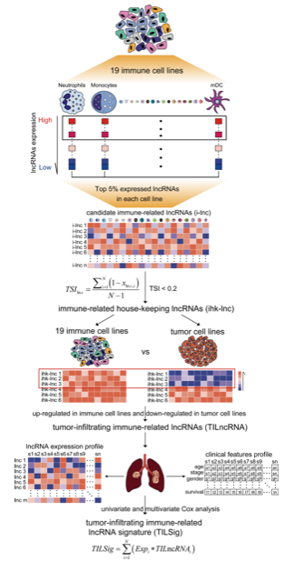

欢迎关注“小丫画图”公众号，回复“小白”，看小视频，实现点鼠标跑代码。

小丫微信: epigenomics E-mail: figureya@126.com

作者：李国齐，这是第一次合作，以后他的更多作品会在这里出现<https://k.youshop10.com/wWoVgT5G>

小丫编辑校验

```{r setup, include=FALSE}
knitr::opts_chunk$set(echo = TRUE)
```

# 需求描述

利用纯化细胞系计算免疫相关指数的计算方法，想学习框里的这个复现方法



出自<https://jitc.bmj.com/content/8/1/e000110.long>

Figure 1 Strategy for identifying tumor-infiltrating immune-related lncRNA signature (TILSig) in this study. Top 5% expressed long non-coding RNAs (lncRNAs) were obtained as candidate immune-related lncRNAs for each immune cell line. The specificity of expression of a candidate immune-related lncRNA with respect to different immune cell types was calculated using tissue specificity index (TSI). Those housekeeping lncRNAs (hklncRNAs) which are upregulated in immune cell lines and downregulated in non-small cell lung cancer (NSCLC) cell lines were selected as tumor-infiltrating immune-related lncRNAs.

A prognostic signature by focusing tumor-infiltrating immune-related lncRNAs (TILSig) was constructed using the linear combination of the expression values of the prognostic tumor-infiltrating immune-related lncRNAs, weighted by their estimated regression coefficients in the multivariate Cox regression analysis.

# 应用场景

从表达数据鉴定肿瘤免疫浸润相关lncRNA。

# 环境设置

使用国内镜像安装包

```{r eval=FALSE}
options("repos"= c(CRAN="https://mirrors.tuna.tsinghua.edu.cn/CRAN/"))
options(BioC_mirror="http://mirrors.tuna.tsinghua.edu.cn/bioconductor/")
# 下载DealGPL570，下载地址https://cran.r-project.org/src/contrib/Archive/DealGPL570/
# DealGPL570包的2.0版本运行时会报错，因此我本地安装1.0版本，将DealGPL570_0.0.1.tar.gz压缩包放在当前工作文件夹下，在Rstudio中点击右下方Install，Install from选择第二项，点击Browse后选择DealGPL570_0.0.1.tar.gz，然后点击Install即可。
# 或用命令行安装
install.packages("DealGPL570_0.0.1.tar.gz", repos = NULL, type = "source")
```

加载包

```{r}
library(DealGPL570) # 由于所以免疫细胞系的表达谱数据均来自GPL570平台([HG-U133_Plus_2] Affymetrix Human Genome U133 Plus 2.0 Array)，因此这里使用DealGPL570包来处理GPL570平台的表达谱数据。
library(stringr)
library(sva)
library(tibble)
library(dplyr)
library(tidyverse)
library(GenomicFeatures)
library(limma)
library(survival)
library(rtracklayer)

Sys.setenv(LANGUAGE = "en") #显示英文报错信息
options(stringsAsFactors = FALSE) #禁止chr转成factor
```

# 输入文件

## 数据收集

文章所使用的大型数据均上传到百度网盘，链接：<https://pan.baidu.com/s/1mpYgfy1cCZPQPzmkv4VQDA>，提取码：ibzk。

包括19种免疫细胞系表达谱数据，GENECODE注释文件，RefSeq注释文件。
CCLE表达谱数据，TCGA胃癌表达谱数据和临床数据，count数据转换为TPM数据的参考数据集。

## 来自GEO的表达数据处理

```{r}
# 使用DealGPL570处理16个表达谱数据，包含114个细胞系，19种免疫细胞类型
GSE13906 <- DealGPL570(file = "GSE13906_RAW.tar",type = "geneSymbol")
GSE13906 <- column_to_rownames(GSE13906,"symbol")

GSE23371 <- DealGPL570(file = "GSE23371_RAW.tar",type = "geneSymbol")
GSE23371 <- column_to_rownames(GSE23371,"symbol")

GSE25320 <- DealGPL570(file = "GSE25320_RAW.tar",type = "geneSymbol")
GSE25320 <- column_to_rownames(GSE25320,"symbol")

GSE27291 <- DealGPL570(file = "GSE27291_RAW.tar",type = "geneSymbol")
GSE27291 <- column_to_rownames(GSE27291,"symbol")

GSE27838 <- DealGPL570(file = "GSE27838_RAW.tar",type = "geneSymbol")
GSE27838 <- column_to_rownames(GSE27838,"symbol")

GSE28490 <- DealGPL570(file = "GSE28490_RAW.tar",type = "geneSymbol")
GSE28490 <- column_to_rownames(GSE28490,"symbol")

GSE28698 <- DealGPL570(file = "GSE28698_RAW.tar",type = "geneSymbol")
GSE28698 <- column_to_rownames(GSE28698,"symbol")

GSE28726 <- DealGPL570(file = "GSE28726_RAW.tar",type = "geneSymbol")
GSE28726 <- column_to_rownames(GSE28726,"symbol")

GSE37750 <- DealGPL570(file = "GSE37750_RAW.tar",type = "geneSymbol")
GSE37750 <- column_to_rownames(GSE37750,"symbol")

GSE39889 <- DealGPL570(file = "GSE39889_RAW.tar",type = "geneSymbol")
GSE39889 <- column_to_rownames(GSE39889,"symbol")

GSE42058 <- DealGPL570(file = "GSE42058_RAW.tar",type = "geneSymbol")
GSE42058 <- column_to_rownames(GSE42058,"symbol")

GSE49910 <- DealGPL570(file = "GSE49910_RAW.tar",type = "geneSymbol")
GSE49910 <- column_to_rownames(GSE49910,"symbol")

GSE51540 <- DealGPL570(file = "GSE51540_RAW.tar",type = "geneSymbol")
GSE51540 <- column_to_rownames(GSE51540,"symbol")

GSE59237 <- DealGPL570(file = "GSE59237_RAW.tar",type = "geneSymbol")
GSE59237 <- column_to_rownames(GSE59237,"symbol")

GSE6863 <- DealGPL570(file = "GSE6863_RAW.tar",type = "geneSymbol")
GSE6863 <- column_to_rownames(GSE6863,"symbol")

GSE8059 <- DealGPL570(file = "GSE8059_RAW.tar",type = "geneSymbol")
GSE8059 <- column_to_rownames(GSE8059,"symbol")

#修改列名，仅保留GSE开头的GSE样本编号，去除.CEL后缀
for (i in ls(pattern = "^GSE")) {
  rt <- get(i)
  colnames(rt) <- str_replace_all(colnames(rt),".CEL","")
  assign(i,rt)
}

#从PMID: 28052254文献的补充材料中（文件名:1-s2.0-S2211124716317090-mmc3.xlsx）提取每个样本对应的细胞类型，整理后的文件命名为Immune_cell_line.txt
#读取注释信息
ann <- read.table("Immune_cell_line.txt",header=T,sep="\t",quote="",check.name=F)
#看一下注释信息
head(ann)

#提取16个数据集的注释信息（按GSE号提取，粗略提取）
ann <- ann[which(ann$`Data set`%in%ls(pattern = "^GSE")),]
table(ann$`Data set`)

#提取16个数据集中仅在注释中有的免疫细胞系（按GSM号提取，详细提取）
for (j in ls(pattern = "^GSE")) {
  rt <- get(j)
  rt <- rt[,which(colnames(rt)%in%ann[which(ann$`Data set`==j),"Sample ID"])]
  assign(j,rt)
}

#将数据合并
data <- cbind(GSE13906, GSE23371, GSE25320, GSE27291, GSE27838, GSE28490, GSE28698, 
            GSE28726, GSE37750, GSE39889, GSE42058, GSE49910, GSE51540, 
            GSE59237, GSE6863, GSE8059)

#主成分分析查看数据集间批次效应
source("batchPCA.R")
batchPCA(indata = t(scale(t(data))), 
         batch = rep(c("GSE13906", "GSE23371", "GSE25320", "GSE27291", "GSE27838", "GSE28490", "GSE28698", 
                       "GSE28726", "GSE37750", "GSE39889", "GSE42058", "GSE49910", "GSE51540", 
                       "GSE59237", "GSE6863", "GSE8059"),
                     times=c(2,3,4,8,8,5,2,14,8,4,4,26,9,10,3,4)),
         fig.dir = ".",
         PCA.fig.title = "Raw PCA for GEO Immune cell lines",
         #cols =brewer.pal(6, "Set1"),
         showID = F,
         cex = 0.5,
         showLegend =T,
         pos = "bottomright")

#去除批次效应
batch <- data.frame(batch = rep(c("GSE13906", "GSE23371", "GSE25320", "GSE27291", "GSE27838", "GSE28490", "GSE28698", 
                                "GSE28726", "GSE37750", "GSE39889", "GSE42058", "GSE49910", "GSE51540", 
                                "GSE59237", "GSE6863", "GSE8059"),
                              times=c(2,3,4,8,8,5,2,14,8,4,4,26,9,10,3,4)))
modcombat <- model.matrix(~1,data = batch)
data_combat <- as.data.frame(ComBat(dat=as.matrix(data),batch=batch$batch,mod=modcombat))

#将去除批次效应后的整合数据输出
write.table(data_combat,"data_combat.txt",quote = F,row.names = T,col.names = T,sep = "\t")

batchPCA(indata = t(scale(t(data_combat))),
         batch = rep(c("GSE13906", "GSE23371", "GSE25320", "GSE27291", "GSE27838", "GSE28490", "GSE28698", 
                       "GSE28726", "GSE37750", "GSE39889", "GSE42058", "GSE49910", "GSE51540", 
                       "GSE59237", "GSE6863", "GSE8059"),
                     times=c(2,3,4,8,8,5,2,14,8,4,4,26,9,10,3,4)),
         fig.dir = ".",
         PCA.fig.title = "Combat PCA for GEO",
         #cols =brewer.pal(6, "Set1"),
         showID = F,
         cex = 1,
         showLegend = T,
         pos = "bottomright")
```

## 提取lncRNA表达谱数据

```{r}
#提出lncRNA表达谱数据
#首先是通过GENCODE注释信息提取lncRNA
genecode <- import('gencode.v25.long_noncoding_RNAs.gtf') #导入GENCODE数据库的lncRNA的gtf注释文件
genecode <- as.data.frame(genecode)#转换成数据框便于操作
genecode_lncRNA <- unique(genecode$gene_name)#去重

#然后是通过RefSeq注释信息提取lncRNA
refseq <- import('GRCh38_latest_genomic.gff')#导入RefSeq数据库的gff注释文件
refseq <- cbind(ID=refseq$ID,gene=refseq$gene,gene_biotype=refseq$gene_biotype)#选择需要的三列
refseq <- as.data.frame(refseq)#转换成数据框便于操作

refseq_lncRNA1 <- unique(refseq[which(refseq$gene_biotype=="lncRNA"),"gene"])#提取基因类型为“lncRNA”的基因
refseq_lncRNA2 <- unique(refseq[grep("NR_",as.character(refseq$ID)),"gene"])#提取Refseq ID以NR_开头的基因
refseq_lncRNA <- intersect(refseq_lncRNA1,refseq_lncRNA2)#取二者交集

lncRNA <- intersect(genecode_lncRNA,refseq_lncRNA)#取GENCODE和RefSeq数据库lncRNA的交集

#最后得到lncRNA表达谱数据
data_lncRNA <- data_combat[which(rownames(data_combat)%in%lncRNA),]
#输出全部免疫细胞系表达谱数据
write.table(data_combat,"expall_114line.txt",col.names = T,row.names = T,sep = "\t",quote = F)
#输出全部免疫细胞系lncRNA表达谱数据
write.table(data_lncRNA,"explncRNA_114line.txt",col.names = T,row.names = T,sep = "\t",quote = F)
```

# 对每个免疫细胞系的lncRNA进行排序

```{r}
# 提取lncRNA表达谱数据的免疫细胞系注释信息
ann_114 <- ann[which(ann$`Sample ID`%in%colnames(data_lncRNA)),]
table(ann_114$Population)
# 调整表达谱顺序，使得注释信息和表达谱数据的样本顺序一致
loc <- match(ann_114$`Sample ID`,colnames(data_lncRNA))
data_lncRNA <- data_lncRNA[,loc]

# 对于一个lncRNA对应多个相同免疫细胞系，我们取lncRNA在多个相同免疫细胞系表达值的均值来作为后续的排序数值
mean_lncRNA <- as.data.frame(t(data_lncRNA)) # 将数据转置，行为114个免疫细胞系，列为lncRNA
mean_lncRNA$CellType <- ann_114$Population
CellType <- ann_114$Population
mean_lncRNA <- aggregate(mean_lncRNA,by=list(CellType),FUN = mean) # 取lncRNA在多个相同免疫细胞系中的表达值均值作为该lncRNA在该种免疫细胞系中的表达值
mean_lncRNA$CellType <- NULL # 行为19种免疫细胞系（114个细胞系按免疫细胞类型去重后的结果），列为lncRNA
# 对每个lncRNA在所有细胞系的表达谱数据进行排序
mean_lncRNA <- column_to_rownames(mean_lncRNA,"Group.1")
rank_lncRNA <- as.data.frame(t(mean_lncRNA))#行为lncRNA，列为19种免疫细胞系

# 本步骤目的是提取出19种免疫细胞系中每种细胞系的lncRNA排序结果
top_outTab <- data.frame()#创建一个空数据框，用于存储每个lncRNA的排序情况
for (m in c(seq(0.01,1,0.01))) {# 按1%为分割间距，将排序结果分为前%1到100%，根据个人需要提取前%多少的基因，原文的提取的5%
  outTab <- data.frame(ID=1:(nrow(rank_lncRNA)*m))
  # 对每种免疫细胞系中的lncRNA表达值进行降序排列
  for (i in 1:ncol(rank_lncRNA)) {
    top <- rownames(rank_lncRNA[order(rank_lncRNA[,i],decreasing = T),])[1:(nrow(rank_lncRNA)*m)]
    outTab[,i] <- top
  }
  colnames(outTab) <- colnames(rank_lncRNA)
  # 这里提供两种方法去提取19种免疫细胞系表达谱的共有lncRNA，分别是交集和并集
  inter <- Reduce(intersect,  list(v1 = outTab[,1],
                                 v2 = outTab[,2],
                                 v3 = outTab[,3],
                                 v4 = outTab[,4],
                                 v5 = outTab[,5],
                                 v6 = outTab[,6],
                                 v7 = outTab[,7],
                                 v8 = outTab[,8],
                                 v9 = outTab[,9],
                                 v10 = outTab[,10],
                                 v11 = outTab[,11],
                                 v12 = outTab[,12],
                                 v13 = outTab[,13],
                                 v14 = outTab[,14],
                                 v15 = outTab[,15],
                                 v16 = outTab[,16],
                                 v17 = outTab[,17],
                                 v18 = outTab[,18],
                                 v19 = outTab[,19]))
  union <- Reduce(union,  list(v1 = outTab[,1],
                             v2 = outTab[,2],
                             v3 = outTab[,3],
                             v4 = outTab[,4],
                             v5 = outTab[,5],
                             v6 = outTab[,6],
                             v7 = outTab[,7],
                             v8 = outTab[,8],
                             v9 = outTab[,9],
                             v10 = outTab[,10],
                             v11 = outTab[,11],
                             v12 = outTab[,12],
                             v13 = outTab[,13],
                             v14 = outTab[,14],
                             v15 = outTab[,15],
                             v16 = outTab[,16],
                             v17 = outTab[,17],
                             v18 = outTab[,18],
                             v19 = outTab[,19]))
  union <- data.frame(top_index=rep(m,length(union)),gene=union) # 取并集用此代码
  #inter <- data.frame(top_index=rep(m,length(inter)),gene=inter) # 取交集用此代码
  top_outTab <- rbind(union,top_outTab) # 取并集用此代码
  #top_outTab <- rbind(inter,top_outTab) # 取交集用此代码
  
}
# 第一列为前百分之多少，阈值为1%到100%，原文选取的5%，第二列是lncRNA
head(top_outTab)
```

# 计算TSI，提取ihk-lnc

计算TSI，这里要说明一下TSI的计算思想，例如，lncRNA（命名A）在5种免疫细胞系中的表达值分别为1，2，3，4，5

则原文公式中的X(A,i)值分别为(1-1)/(5-1)=0,(2-1)/(5-1)=0.25,(3-1)/(5-1)=0.5,(4-1)/(5-1)=0.75,(5-1)/(5-1)=1

```{r}
# TSI(A)=[(1-0)+(1-0.25)+(1-0.5)+(1-0.75)+(1-1)]/(5-1)=2.5/4=0.625
top_TSI_outTab <- data.frame()
for (n in unique(top_outTab$top_index)){
  # 对于前1%到100%的lncRNA均进行TSI计算，大家可以根据自己想设定的阈值进行提取
  TSI <- data.frame(TSI=top_outTab[which(top_outTab$top_index==n),"gene"])
  rownames(TSI) <- TSI$TSI
  # 这步就是实现例子中的步骤
  for (j in top_outTab[which(top_outTab$top_index==n),"gene"]) {
    y=0
    for (m in 1:ncol(rank_lncRNA)) {
      x <- 1-(rank_lncRNA[j,m]-min(rank_lncRNA[j,]))/(max(rank_lncRNA[j,])-min(rank_lncRNA[j,]))
      y <- sum(y,x)
    }
    TSI[j,1] <- y/(ncol(rank_lncRNA)-1)
  }
  TSI$gene <- rownames(TSI)
  TSI <- merge(top_outTab[which(top_outTab$top_index==n),],TSI,by="gene")
  top_TSI_outTab <- rbind(TSI,top_TSI_outTab)
}

# 第一列为lncRNA，第二列为lncRNA的排序情况，第三列为每个lncRNA的TSI值
head(top_TSI_outTab)
# 输出TSI结果
write.table(top_TSI_outTab,"output_TSI_all_result.txt",col.names = T,row.names = F,sep = "\t",quote = F)

# 提取设定阈值下的lncRNA,这里取TSI小于0.4，排序前5%，对应原文的ihk-lnc
tsi <- read.table("output_TSI_all_result.txt",header = T,sep = "\t",quote = "",check.names = F)
tsi_0.4 <- tsi[which(tsi$TSI<0.4&tsi$top_index<=0.05),]
# 去重后得到即为ihk-lnc
ihk_lnc <- unique(tsi_0.4$gene)
```

# 筛选TILncRNA

```{r}
# 读取lncRNA表达谱数据
exp <- read.table("explncRNA_114line.txt",header = T,sep = "\t",quote = "",check.names = F,row.names = 1)
# 读取CCLE数据库癌症细胞系表达谱数据
ccle <- read.table("CCLE_RNAseq_genes_counts_20180929.txt",header = T,sep = "\t",quote = "",check.names = F)

# 提取胃癌的表达谱数据，若要取肺癌，则将STOMACH替换为LUNG
ccle <- dplyr::select(ccle,contains(c("STOMACH","Description")))
# 基因去重
ccle <- ccle[!duplicated(ccle$Description),]
rownames(ccle) <- ccle$Description
ccle$Description <- NULL
# count数据转换为TPM数据
TxDb <- loadDb(file='txdbensemble101.sqlite')#载入参考数据集
source("normalizeGeneCounts.R") # 载入本地脚本
ccle_TPM <- normalizeGeneCounts(ccle, TxDb, method = "TPM")#这种方式转换TPM值基因数不损失
# 对数标准化
ccle_TPM <- log2(ccle_TPM+1)
# 提取特定TSI和排序指标下的lncRNA表达谱数据
geo <- exp[which(rownames(exp)%in%ihk_lnc),]
# 取CCLE和GEO免疫细胞系共有的lncRNA
inter <- intersect(rownames(geo),rownames(ccle))
geo_ccle <- cbind(geo[inter,],ccle_TPM[inter,])#114immune,37cancer

# 同样需要去除批次效应
batch <- data.frame(batch = rep(c("Immune cell lines","STOMACH cancer cell lines"),
                              times=c(114,37)))
modcombat <- model.matrix(~1,data = batch)
geo_ccle_combat <- as.data.frame(ComBat(dat=as.matrix(geo_ccle),batch=batch$batch,mod=modcombat))

# 输出去除批次效应后的GEO免疫细胞系和CCLE癌症细胞系整合的数据
write.table(geo_ccle_combat,"output_geo_ccle_combat.txt",quote = F,row.names = T,col.names = T,sep = "\t")

# 在免疫细胞系和癌症细胞系间做差异分析
group <- rep(c("Immune","STOMACH"),
           times=c(114,37))
design <- model.matrix(~0+factor(group))
colnames(design) <- levels(factor(group))
rownames(design) <- colnames(geo_ccle_combat)
contrast.matrix <- makeContrasts(paste0(unique(group),collapse = "-"),
                               levels = design)
fit <- lmFit(geo_ccle_combat,design)
fit2 <- contrasts.fit(fit,contrast.matrix)
fit2 <- eBayes(fit2)
temp <- topTable(fit2,coef = 1,n=Inf)
DEG <- na.omit(temp)
DEG$symbol <- rownames(DEG)

# 这里差异分析结果并不显著，可根据自己需求调整前面的阈值
write.table(DEG, "output_DEG.txt",
            sep = '\t', quote = FALSE, col.names = T, row.names = FALSE)

# 根据差异分析结果得到了原文中所说的TILncRNA，实际应用中，可以根据自己的需要对差异分析结果进行过滤，此处我们直接用所有的lncRNA进行分析
TILncRNA <- DEG$symbol
```

# 构建TILSig打分 

```{r}
# 读取TCGA表达谱数据，包含226个癌症样本和22个正常样本，做预后分析只用癌症样本即可
TCGA <- read.table("TCGA_STAD_226_22_expCli.txt",header = T,sep = "\t",quote = "",check.names = F)
# count数据转换为TPM数据
TCGA_TPM <- normalizeGeneCounts(TCGA, TxDb, method = "TPM")#这种方式转换TPM值基因数不损失
# 对数标准化
TCGA_TPM <- log2(TCGA_TPM+1)
# 仅使用癌症样本
TCGA_TPM <- TCGA_TPM[,1:226]
# 提取TILncRNA表达谱数据
TCGA_TPM <- TCGA_TPM[which(rownames(TCGA_TPM)%in%TILncRNA),]
# 读取临床数据
TCGA_cli <- read.table("cli_STAD_226.txt",header = T,sep = "\t",quote = "",check.names = F)
# 将临床生存数据和表达谱数据整合，来进行单因素和多因素cox分析
TCGA_TPM <- as.data.frame(t(TCGA_TPM))
unicox <- cbind(TCGA_cli[,c(1,3,4)],TCGA_TPM)
unicox$id <- NULL

# 单因素cox分析
outTab_uni <- data.frame()
for (i in colnames(unicox[,3:ncol(unicox)])) {
  cox <- coxph(Surv(OStime,OSstat)~unicox[,i],data=unicox)
  coxSummary <- summary(cox)
  coxP <- coxSummary$coefficients[,"Pr(>|z|)"]
  outTab_uni <- rbind(outTab_uni,
                cbind(id=i,
                      HR=coxSummary$conf.int[,"exp(coef)"],
                      HR.95L=coxSummary$conf.int[,"lower .95"],
                      HR.95H=coxSummary$conf.int[,"upper .95"],
                      pvalue=coxSummary$coefficients[,"Pr(>|z|)"]
                ))
  
}
# 输出单因素cox结果
write.table(outTab_uni,file="output_uniCox.txt",sep="\t",row.names=F,quote=F)

# 多因素cox分析
mul <- unicox # 这里未对lncRNA进行筛选，实际分析中可从unicox提取保留后的lncRNA赋值给mul变量
multiCox=coxph(Surv(OStime, OSstat) ~ ., data = mul)
multiCox=step(multiCox,direction = "both",steps = 2000)
multiCoxSum=summary(multiCox)
outTab_mul=data.frame()
outTab_mul=cbind(
  coef=multiCoxSum$coefficients[,"coef"],
  HR=multiCoxSum$conf.int[,"exp(coef)"],
  HR.95L=multiCoxSum$conf.int[,"lower .95"],
  HR.95H=multiCoxSum$conf.int[,"upper .95"],
  pvalue=multiCoxSum$coefficients[,"Pr(>|z|)"])
outTab_mul=cbind(id=row.names(outTab_mul),outTab_mul)
# 输出多因素cox结果
write.table(outTab_mul,file="output_multiCox.txt",sep="\t",row.names=F,quote=F)
# 原文中的TILSig值即为riskScore的值
riskScore=predict(multiCox,type="risk",newdata=mul)
```

# Session Info

```{r}
sessionInfo()
```