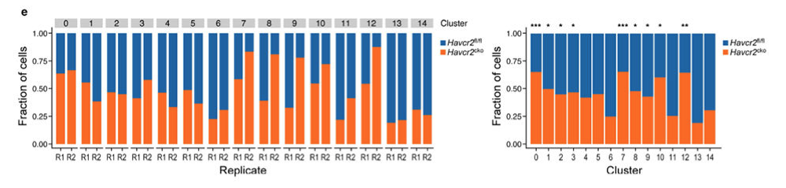

欢迎关注“小丫画图”公众号，回复“小白”，看小视频，实现点鼠标跑代码。

小丫微信: epigenomics  E-mail: figureya@126.com

作者：大鱼海棠，他的更多作品看这里<https://k.koudai.com/OFad8N0w>

单位：中国药科大学生物统计和计算药学研究中心，国家天然药物重点实验室

小丫编辑校验

```{r setup, include=FALSE}
knitr::opts_chunk$set(echo = TRUE)
```

# 需求描述

想众筹这两个柱状图，重点是不知道一个柱子的不同百分比是怎么做的统计检验。



出自<https://www.ncbi.nlm.nih.gov/pmc/articles/PMC8627694>

Extended Data Fig. 4 |. scRNA-seq of Havcr2fl/fl and Havcr2cko total CD45+ cells.
e, Bar graph showing frequency of Havcr2fl/fl (blue) and Havcr2cko (orange) cells in each cluster.

# 应用场景

对单细胞数据进行处理和分型，绘制细胞比例柱状图并做富集检验。

更多单细胞FigureYa看这里<https://k.youshop10.com/McawGY6=>

# 环境设置

使用国内镜像安装包

```{r eval=FALSE}
options("repos"= c(CRAN="https://mirrors.tuna.tsinghua.edu.cn/CRAN/"))
options(BioC_mirror="http://mirrors.tuna.tsinghua.edu.cn/bioconductor/")
remotes::install_github("mojaveazure/seurat-disk")
install.packages("hdf5r")
```

加载包

```{r}
library(ggplot2)
library(rstatix)
library(Seurat)
library(SeuratDisk)
library(Matrix)
Sys.setenv(LANGUAGE = "en") #显示英文报错信息
options(stringsAsFactors = FALSE) #禁止chr转成factor
```

# 输入文件

例文数据已上传至GEO（GSE151914），下载地址：<https://www.ncbi.nlm.nih.gov/geo/query/acc.cgi?acc=GSE151914>

```{r}
# 读取count矩阵、细胞Barcode、基因名和细胞对应的样本信息
mtx <- readMM("GSE151914_expression_matrix.mtx.gz")
cellID <- read.table("GSE151914_cellIDs.txt.gz")
geneID <- read.table("GSE151914_genes.txt.gz")
metadata <- read.table("GSE151914_metadata.txt.gz", header = T, sep = ",")

# 检查count矩阵大小是否与细胞Barcode/基因名一致
dim(mtx)
all(metadata$Index == cellID$V1)

# 修改count行列名
rownames(mtx) <- geneID$V1; colnames(mtx) = cellID$V1
summary(rowSums(mtx>0))
summary(colSums(mtx>0))

# 制作seurat对象，根据原文该分析只用到肿瘤样本(使用原文的参数 nfeatures = 1000, dim.to.use = 1:12)
seu <- CreateSeuratObject(mtx)
seu$Sample = metadata$Sample
seu <- subset(seu, Sample %in% c("Tum_963_WT", "Tum_650_KO", "Tum_877_WT", "Tum_685_KO"))
seu <- NormalizeData(seu)                             # 对数化表达值
seu <- FindVariableFeatures(seu, nfeatures = 1000)    # 寻找高变异基因
VariableFeaturePlot(seu)
seu <- ScaleData(seu)                                 # 标准化
seu <- RunPCA(seu)                                    # PCA降维
dim.to.use = 1:12
seu <- RunUMAP(seu, dims = dim.to.use)                # 计算UMAP降维坐标
DimPlot(seu)
```

# 非监督聚类

```{r}
# 进行非监督聚类
seu <- FindNeighbors(seu, dims = dim.to.use)          # 构建最近邻图
seu <- FindClusters(seu)                              # 进行聚类
DimPlot(seu)
saveRDS(seu, "seu.rds")

# 提取细胞分类信息
# Sample：由GSE151914_metadata.txt.gz提供的样本信息
# 规律为：样本组织来源_样本测序时使用通道_样本分组，如Tum_963_WT
# GSE151914 Series Matrix File(s)显示963对应R1，650对应R2
# 使用正则表达式(gsub)进行将Sample列进行分割
# 使用按位置替换(substr)或字符切割(strsplit)也可起到类似结果
cellinfo <- FetchData(seu, vars = c("Sample", "seurat_clusters"))
cellinfo$Run <- gsub("(\\w+)(_)(\\d+)(_)(\\w+)", "\\3", cellinfo$Sample)
cellinfo$Run <- ifelse(test = cellinfo$Run %in% c("963", "650"),
                       yes = "R1", no = "R2")
cellinfo$Group <- gsub("(\\w+)(_)(\\d+)(_)(\\w+)", "\\5", cellinfo$Sample)
str(cellinfo)

write.table(cellinfo, "cellinfo.txt", row.names = F, col.names = T, quote = F, sep = "\t")
```

# 开始画图

```{r}
# 读取数据，该数据可由Seurat对象导出（绘图仅使用到cellinfo.txt）
# cellinfo <- Seurat::FetchData(seu, vars = c("Sample", "seurat_clusters", "Run", "Group"))
cellinfo <- read.table("cellinfo.txt", header = T, stringsAsFactors = T)
str(cellinfo)

# 设置分组颜色
cell.col <- setNames(object = c("#1A63A8", "#FC6910"),
                     nm = c("WT", "KO"))
```

## 绘制堆叠柱状图

```{r, fig.width=12, fig.height=4}
# 制作列联表
plot.data <- as.data.frame(table(cellinfo$seurat_clusters, cellinfo$Run, cellinfo$Group))

p1 <- ggplot(plot.data, aes(x = Var2, y = Freq, fill = Var3)) +
  geom_bar(stat = "identity", position = position_fill(reverse = T)) +                    # 绘制堆叠比例柱状图，将WT和KO的顺序倒过来
  scale_fill_manual(values = cell.col) +                                                  # 设置不同组对应的颜色
  facet_wrap(~Var1, nrow = 1) +                                                           # 设置柱状图按seurat_cluster分别显示
  theme_classic() +                                                                       # 去除不必要的元素
  xlab("Replicate") +                                                                     # 修改x和y轴列名
  ylab("Fraction of Cells") +                           
  theme(strip.background = element_rect(fill="grey", color = "white", size = 1),          # 设置顶部seurat_cluster显示为白框灰底
        strip.text = element_text(size = 12, colour="black"),                             # 设置顶部seurat_cluster字号和文字颜色
        legend.title = element_blank(),                                                   # 去除图例标题
        axis.title = element_text(size = 15))                                             # 调整坐标轴标题字号
p1

ggsave("p1.pdf", width = 12, height = 4)
```

## 绘制带有显著性符号的柱状图

```{r fig.width=8, fig.height=4}
# 构建seurat_clusters和Group的列联表
tbl <- table(cellinfo$seurat_clusters, cellinfo$Group)
tbl

# 进行fisher精确检验和post hoc检验
# post hoc检验：对各组样本进行 one vs other的fisher检验，进行多重性校正，得到各组的p-adj
fisher.test(tbl, simulate.p.value = T) # fisher精确检验
post.hoc <- row_wise_fisher_test(tbl) # post hoc检验
post.hoc$sig.label <- ifelse(test = post.hoc$p.adj.signif == "ns", # 调整显著性显示标签
                             yes = "", no = post.hoc$p.adj.signif) # 不显示NS (No Significant)
str(post.hoc)
head(post.hoc)

# 绘制柱状图
plot.data <- as.data.frame(tbl)
head(plot.data)

p2 <- ggplot(plot.data, aes(x = Var1, y = Freq, fill = Var2)) + 
  geom_bar(stat = "identity", position = position_fill(reverse = T)) +  # 绘制堆叠比例柱状图，将WT和KO的顺序倒过来
  scale_fill_manual(values = cell.col) +                                # 设置不同组对应的颜色
  scale_y_continuous(breaks = seq(0, 1, by = 0.25)) +                   # 设置y坐标轴的刻度
  geom_text(data = post.hoc,                                            # 设置顶部的显著性标签
            aes(x = group, y = 1.1, label = sig.label),                 # 标签的位置和具体内容
            inherit.aes = F) +                                          
  xlab("Cluster") +                                                     # 修改x和y轴列名
  ylab("Fraction of Cells") +
  theme_classic() +                                                     # 去除不必要的元素
  theme(legend.title = element_blank(),                                 # 去除图例标题
        axis.text = element_text(size = 10),                            # 调整坐标轴刻度字号大小
        axis.title = element_text(size = 15))                           # 调整坐标轴标题字号大小
p2

ggsave(filename = "p2.pdf", width = 8, height = 4)
```

# Session Info

```{r}
sessionInfo()
```