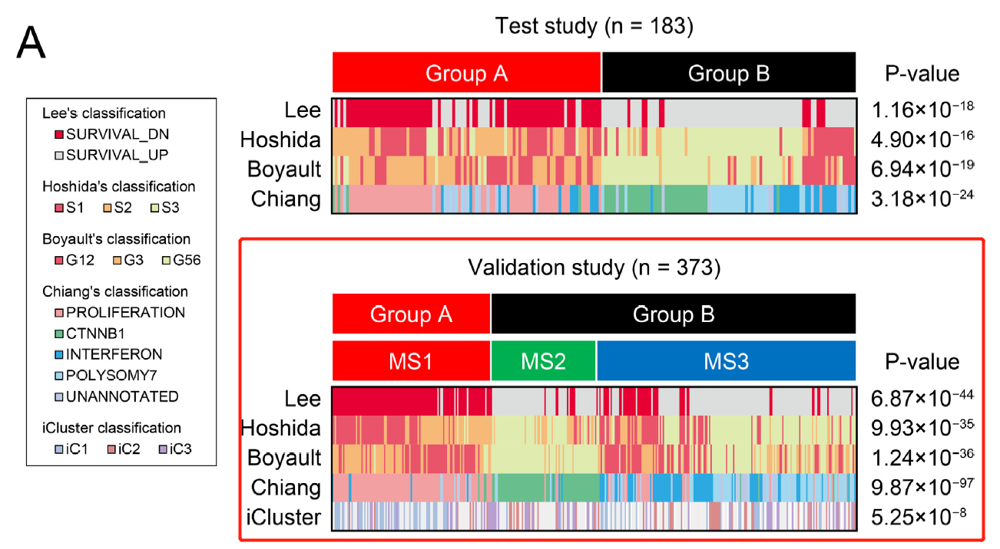
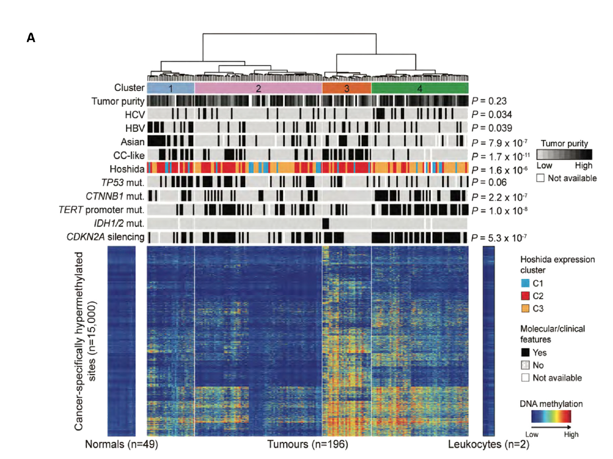

欢迎关注“小丫画图”公众号，回复“小白”，看小视频，实现点鼠标跑代码。

小丫微信: epigenomics  E-mail: figureya@126.com

作者：大鱼海棠，他的更多作品看这里<https://k.koudai.com/OFad8N0w>

单位：中国药科大学生物统计和计算药学研究中心，国家天然药物重点实验室

小丫编辑校验

```{r setup, include=FALSE}
knitr::opts_chunk$set(echo = TRUE)
```

# 需求描述

主要是红框中的图，都是公共数据和已发表的文章

We then compared our classification based on multi-platform data from the TMDU and TCGA studies

根据以往的分子分型marker预测现有样本属于哪一类，再跟当前分型比较，计算p值。



出自<https://linkinghub.elsevier.com/retrieve/pii/S2352396418306340>

Fig. 3. Summary ofmolecular classification of HCC. (a) Comparison of aggregate scores with gene sets associated with the previously definedmolecular classifications of HCC in the TMDU
test study (upper) and TCGA validation study (lower). (b) Schematic representation of molecular subtypes.

2017年的这篇Cell文章里就出现了类似的图：



出自<https://linkinghub.elsevier.com/retrieve/pii/S0092867417306396>

Figure 2. Liver Cancers Show Distinct Gene Hypermethylation Patterns
(A) Unsupervised clustering analysis of gene hypermethylation in HCC tumor relative to normal tissue reveals four distinct subgroups. Roughly 15,000 CpG sites showing significant hypermethylation in 196 HCC patients were analyzed and are shown in heatmap format with normal tissues and tumors organized in columns according to cluster designation. Intensity of methylation for each CpG site is indicated by row. Above the heatmap the four distinct hypermethylation clusters are shown, and below are bars indicating the distribution of clinical and molecular attributes of the individual tumors by cluster. To the right, p values indicate significant non-random distributions for each attribute.

# 应用场景

根据表达谱对HCC样本进行聚类，并和其他已有的分类器做比较。

# 环境设置

使用国内镜像安装包

```{r eval=FALSE}
options("repos"= c(CRAN="https://mirrors.tuna.tsinghua.edu.cn/CRAN/"))
options(BioC_mirror="http://mirrors.tuna.tsinghua.edu.cn/bioconductor/")
devtools::install_github("Lothelab/CMScaller")
```

加载包

```{r}
library(CMScaller) # 用来实现nearest template prediction(NTP)
library(tidyverse)
library(clusterProfiler)
library(org.Hs.eg.db)
library(ClassDiscovery)
library(ComplexHeatmap)
library(gplots)

Sys.setenv(LANGUAGE = "en") #显示英文报错信息
options(stringsAsFactors = FALSE) #禁止chr转成factor
```

自定义函数

```{r}
standarize.fun <- function(indata=NULL, halfwidth=NULL, centerFlag=T, scaleFlag=T) {  
  outdata=t(scale(t(indata), center=centerFlag, scale=scaleFlag))
  if (!is.null(halfwidth)) {
    outdata[outdata>halfwidth]=halfwidth
    outdata[outdata<(-halfwidth)]= -halfwidth
  }
  return(outdata)
}

fpkmToTpm <- function(fpkm)
{
  exp(log(fpkm) - log(sum(fpkm)) + log(1e6))
}
```

# 输入文件

data_mutations.txt，突变数据，下载自cBioPortal<https://www.cbioportal.org/>。

LIHC.htseq_fpkm.tsv.gz，表达谱数据FPKM，已经过`log2(fpkm+1)`转换，下载地址：<https://xenabrowser.net/datapages/?dataset=TCGA-LIHC.htseq_fpkm.tsv&host=https%3A%2F%2Fgdc.xenahubs.net&removeHub=https%3A%2F%2Fxena.treehouse.gi.ucsc.edu%3A443>

gencode.v22.annotation.gene.probeMap，ID/Gene Mapping，下载地址同上。

```{r}
# 读取突变数据
maf <- read_tsv("data_mutations.txt", comment = "#")
# 把突变数据转成01矩阵，方法跟FigureYa288MutualExclusivity一样
mut.binary <- matrix(0,nrow = length(unique(maf$Hugo_Symbol)),ncol = length(unique(maf$Tumor_Sample_Barcode)),dimnames = list(unique(maf$Hugo_Symbol),unique(maf$Tumor_Sample_Barcode)))
for (i in colnames(mut.binary)) {
  tmp <- maf[which(maf$Tumor_Sample_Barcode == i),]
  tmp <- tmp[which(tmp$Variant_Classification %in% c("Frame_Shift_Del", "Frame_Shift_Ins", "Splice_Site", "Translation_Start_Site","Nonsense_Mutation", "Nonstop_Mutation", "In_Frame_Del","In_Frame_Ins", "Missense_Mutation")),]
  for (j in tmp$Hugo_Symbol)
    mut.binary[j,i] <- 1
}
mut.binary <- as.data.frame(mut.binary)

# 读取表达谱
fpkm <- read.delim("TCGA-LIHC.htseq_fpkm.tsv.gz", sep = "\t", row.names = 1, check.names = F, stringsAsFactors = F, header = T)
fpkm <- 2^fpkm - 1
# 把fpkms转为tpm
tpm <- apply(fpkm, 2, fpkmToTpm)
tpm <- as.data.frame(log2(tpm + 1))
rm(fpkm); gc()

# 加载基因注释并对重复基因名取中位数
Ginfo <- read.delim("gencode.v22.annotation.gene.probeMap",row.names = 1,sep = "\t",check.names = F,stringsAsFactors = F,header = T)
comgene <- intersect(rownames(Ginfo), rownames(tpm))
Ginfo <- Ginfo[comgene,]
tpm <- tpm[comgene,]
identical(rownames(tpm), rownames(Ginfo))
tpm$Gene <- Ginfo[rownames(tpm),"gene"]
tpm <- as.data.frame(apply(tpm[,setdiff(colnames(tpm), "Gene")], 2, function(x) tapply(x, INDEX = factor(tpm$Gene), FUN=median, na.rm = TRUE))) # 对重复基因取表达谱中位数
colnames(tpm) <- substr(colnames(tpm),1,15)
expr <- tpm

# 提取突变和表达的共同样本
comsam <- intersect(colnames(expr), colnames(mut.binary))
mut.binary <- mut.binary[,comsam]
expr <- expr[,comsam]

# 加载原文用于聚类的差异表达基因
degs <- read.table("degs.txt",sep = "\t",row.names = NULL,header = T,check.names = F,stringsAsFactors = F)
comgene <- intersect(degs$Gene, rownames(expr))

# 从论文中获取iCluster亚型：Comprehensive and Integrative Genomic Characterization of Hepatocellular Carcinoma
icluster <- read.delim("icluster.txt",sep = "\t",row.names = 2,check.names = F,stringsAsFactors = F,header = T)
rownames(icluster) <- substr(rownames(icluster),1,15)
```

# Nearest template prediction

加载不同HCC亚型签名并制作nearest template prediction所需的模版

```{r}
boyault <- read.delim("Boyault-marker-all.txt",sep = "\t",row.names = NULL,check.names = F,stringsAsFactors = F,header = T)
tmp <- bitr(boyault$`Gene ID #1`,fromType = "ENTREZID",toType = "SYMBOL",OrgDb = org.Hs.eg.db)
boyault <- boyault[,c(2,4)]
colnames(boyault) <- c("ENTREZID","class")
boyault <- merge(tmp,boyault,by = "ENTREZID", all.x = T)
colnames(boyault)[2] <- "probe"

chiang <- read.delim("Chiang-marker-all.txt",sep = "\t",row.names = NULL,check.names = F,stringsAsFactors = F,header = T)
chiang <- chiang[,c(1,4)]
colnames(chiang) <- c("probe","class")

hoshida <- read.delim("Hoshida-genelist.txt",sep = "\t",row.names = NULL,check.names = F,stringsAsFactors = F,header = T)
hoshida <- hoshida[,c(1,2)]
colnames(hoshida) <- c("probe","class")
hoshida$class <- paste0("C",hoshida$class)

lee <- read.delim("Lee-marker-all.txt",sep = "\t",row.names = NULL,check.names = F,stringsAsFactors = F,header = T)
lee <- lee[,c(1,3)]
colnames(lee) <- c("probe","class")
```

通过nearest template prediction获取其他亚型

```{r}
tcga.boyault <- ntp(emat = t(scale(t(expr))),
                    templates = boyault,
                    doPlot = T,
                    seed = 19991018)
tcga.chiang <- ntp(emat = t(scale(t(expr))),
                   templates = chiang,
                   doPlot = T,
                   seed = 19991018)
tcga.lee <- ntp(emat = t(scale(t(expr))),
                   templates = lee,
                   doPlot = T,
                   seed = 19991018)
tcga.hoshida <- ntp(emat = t(scale(t(expr))),
                    templates = hoshida,
                    doPlot = T,
                    seed = 19991018)
```

# 开始画图

```{r}
# 构建样本注释
annCol <- data.frame(CTNNB1 = ifelse(as.numeric(mut.binary["CTNNB1",]) == 0,"WT","MT"),
                     Lee = as.character(tcga.lee$prediction),
                     Hoshida = as.character(tcga.hoshida$prediction),
                     Boyault = as.character(tcga.boyault$prediction),
                     Chiang = as.character(tcga.chiang$prediction),
                     row.names = colnames(mut.binary),
                     stringsAsFactors = F)

annCol[intersect(rownames(annCol),rownames(icluster)),"iCluster"] <- icluster[intersect(rownames(annCol),rownames(icluster)), "iCluster clusters (k=3, Ronglai Shen)"]
annCol[is.na(annCol$iCluster),"iCluster"] <- "N/A"
annCol$Hoshida <- gsub("C","S",annCol$Hoshida)
annCol$iCluster <- gsub("iCluster:","iC",annCol$iCluster)
## 替换Chiang类型的标签
annCol[which(annCol$Chiang == "interferon class"), "Chiang"] <- "INTERFERON"
annCol[which(annCol$Chiang == "proliferation class"), "Chiang"] <- "PROLIFERATION"
annCol[which(annCol$Chiang == "CTNNB1 class"), "Chiang"] <- "CTNNB1"
annCol[which(annCol$Chiang == "unannotated class"), "Chiang"] <- "UNANNOTATED"
annCol[which(annCol$Chiang == "chromosome 7 polysomy class"), "Chiang"] <- "POLYSOMY7"

## 设置标签的因子顺序
annCol$CTNNB1 <- factor(annCol$CTNNB1, levels = c("MT","WT"))
annCol$Lee <- factor(annCol$Lee, levels = c("SURVIVAL_DN","SURVIVAL_UP"))
annCol$Hoshida <- factor(annCol$Hoshida, levels = c("S1","S2","S3"))
annCol$Boyault <- factor(annCol$Boyault, levels = c("G12","G3","G56"))
annCol$Chiang <- factor(annCol$Chiang, levels = c("PROLIFERATION","CTNNB1","INTERFERON","POLYSOMY7","UNANNOTATED"))
annCol$iCluster <- factor(annCol$iCluster, levels = c("iC1","iC2","iC3","N/A"))

# 构建样本注释所对应的颜色
annColors <- list()
annColors[["CTNNB1"]] <- c("WT" = "white","MT" = "black")
annColors[["Lee"]] <- c("SURVIVAL_DN" = "#E80035","SURVIVAL_UP" = "#DBDEDD")
annColors[["Hoshida"]] <- c("S1" = "#E8536B","S2" = "#F6B879","S3" = "#DFEBAF")
annColors[["Boyault"]] <- c("G12" = "#E8536B","G3" = "#F6B879","G56" = "#DFEBAF")
annColors[["Chiang"]] <- c("PROLIFERATION" = "#F2A1A2","CTNNB1" = "#68BE8B","INTERFERON" = "#2CA8E1","POLYSOMY7" = "#A2D9F1","UNANNOTATED" = "#BAC8E5")
annColors[["iCluster"]] <- c("iC1" = "#A8BFDE","iC2" = "#DA8A88","iC3" = "#BCA3D6","N/A" = "white")
annColors[["Group"]] <- c("A" = "#FE0000","B" = "black")
annColors[["MS"]] <- c("MS1" = "#FE0000", "MS2" = "#00AF50","MS3" = "#0071C0")

# 对表达谱进行无监督聚类
indata <- expr[comgene,]
indata <- indata[rowSums(indata) > 0,]
hcs <- hclust(distanceMatrix(as.matrix(indata), "euclidean"), "ward.D")
hcg <- hclust(distanceMatrix(as.matrix(t(indata)), "euclidean"), "ward.D")

group <- cutree(hcs, k = 3)
table(group, annCol$CTNNB1) # 查看一下样本量以及CTNNB1突变情况来确定以下的类型命名

annCol$MS <- ifelse(group == 1, "MS2", ifelse(group == 3, "MS1","MS3")) # 由于1组有更多CTNNB1，所以是MS2，由于3组样本更少，所以是MS1
annCol$Group <- ifelse(group == 3, "A", "B") # 由于3组是MS1所以为Group A

plotdata <- standarize.fun(indata, halfwidth = 2) # 数据标准化用于绘图
hm <- pheatmap(plotdata,
         color = bluered(64),
         border_color = NA,
         cluster_rows = hcg,
         cluster_cols = hcs,
         treeheight_row = 30,
         treeheight_col = 30,
         #cutree_cols = 3,
         show_rownames = F,
         show_colnames = F,
         annotation_col = annCol[,c("iCluster","Chiang","Boyault","Hoshida","Lee","CTNNB1","MS","Group")],
         annotation_colors = annColors,
         cellwidth = 0.6,
         cellheight = 0.2)

pdf("heatmap.pdf", width = 8,height = 6)
draw(hm, heatmap_legend_side = "left", annotation_legend_side = "left")
invisible(dev.off())
```

# 计算group和其他类型的独立性

```{r}
outTabGroup <- outTabMS <- NULL
for (i in c("iCluster","Chiang","Boyault","Hoshida","Lee","CTNNB1")) {
  tmp <- annCol[,c(i,"Group")]
  set.seed(123)
  p <- fisher.test(table(tmp[,1],tmp[,2]), 
                   simulate.p.value = T)$p.value # 由于可能存在比较复杂的列联表，所以这里直接使用模拟的p值
  outTabGroup <- rbind.data.frame(outTabGroup,
                                  data.frame(VarA = "Group",
                                             VarB = i,
                                             p = p),
                                  stringsAsFactors = F)
  
  tmp <- annCol[,c(i,"MS")]
  set.seed(123)
  p <- fisher.test(table(tmp[,1],tmp[,2]),simulate.p.value = T)$p.value
  outTabMS <- rbind.data.frame(outTabMS,
                               data.frame(VarA = "MS",
                                          VarB = i,
                                          p = p),
                               stringsAsFactors = F)
}

# 把p value保存到文件
write.table(outTabGroup, file = "independent test between group and other classification.txt",sep = "\t",row.names = F,col.names = T,quote = F)
write.table(outTabMS, file = "independent test between ms and other classification.txt",sep = "\t",row.names = F,col.names = T,quote = F)

# 保存镜像
#save.image(file = "LIHC.RData")
```

# 后期加工

输出的PDF文件是矢量图，可以用Illustrator等矢量图编辑工具打开，添加p value。如果想用代码添加p value，可参考FigureYa165heatmapPvalue或FigureYa280TMEofSTS

# Session Info

```{r}
sessionInfo()
```