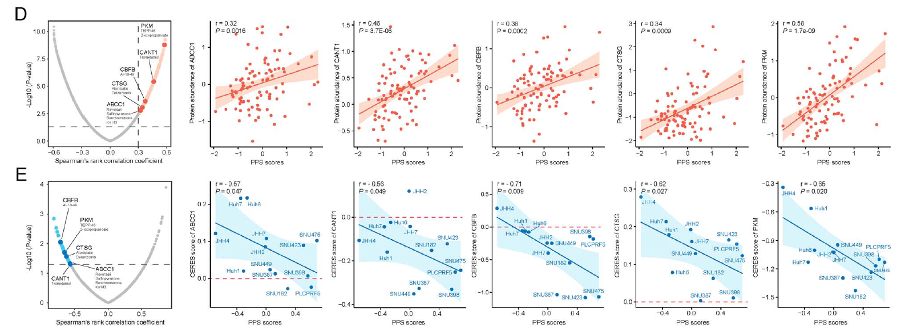
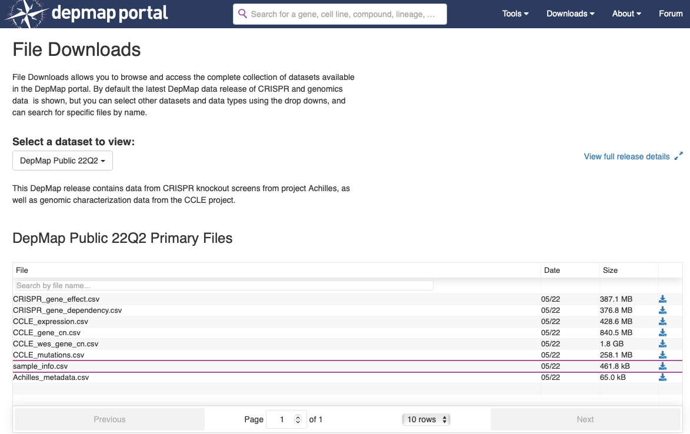

欢迎关注“小丫画图”公众号，回复“小白”，看小视频，实现点鼠标跑代码。

小丫微信: epigenomics  E-mail: figureya@126.com

作者：大鱼海棠，他的更多作品看这里<https://k.koudai.com/OFad8N0w>

单位：中国药科大学生物统计和计算药学研究中心，国家天然药物重点实验室

小丫编辑校验

```{r setup, include=FALSE}
knitr::opts_chunk$set(echo = TRUE)
```

# 需求描述

希望复现这篇文章的Figure 4DE



出自<https://academic.oup.com/bib/article-abstract/22/3/bbaa164/5891146?redirectedFrom=fulltext&login=false>

Figure 4. Identification of PPS-related biological processes and drug targets.
(D) Volcano plot (left) and scatter plots (right) of Spearman’s correlations and significance between PPS scores and protein expression of drug targets (see also Table S11 available online at https://academic.oup.com/bib). Red dots indicate the significant positive correlations (P < 0.05, and Spearman’s r > 0.3). 
(E) Volcano plot (left) and scatter plots (right) of Spearman’s correlations and significance between PPS score and CERES score of drug targets (see also Table S11 available online at https://academic.oup.com/bib). Blue dots indicate the significant negative correlations (P < 0.05, and Spearman’s r < −0.5). TP53-mutant hepatoma cell lines are labeled on the scatter plots.

复现方法：Yang C, Huang X, Li Y, Chen J, Lv Y, Dai S. Prognosis and personalized treatment prediction in TP53-mutant hepatocellular carcinoma: an in silico strategy towards precision oncology. Brief Bioinform. 2021 May 20;22(3):bbaa164. doi: 10.1093/bib/bbaa164.

开源数据：Gao Q, Zhu H, Dong L, Shi W, Chen R, Song Z, Huang C, Li J, Dong X, Zhou Y, Liu Q, Ma L, Wang X, Zhou J, Liu Y, Boja E, Robles AI, Ma W, Wang P, Li Y, Ding L, Wen B, Zhang B, Rodriguez H, Gao D, Zhou H, Fan J. Integrated Proteogenomic Characterization of HBV-Related Hepatocellular Carcinoma. Cell. 2019 Nov 14;179(5):1240. doi: 10.1016/j.cell.2019.10.038. Erratum for: Cell. 2019 Oct 3;179(2):561-577.e22.

# 应用场景

Identification of potential drug targets for high PPS score HCCs
例文前面筛选出PPS genes做分子分型，然后想找high PPS score病人的潜在药物。
自己的数据，可以用感兴趣的基因集替换PPS genes。

例文几个Figure的画法可参考相应的FigureYa：

- Figure 2DE、Fig. S6和Fig. S8C，可参考FigureYa85timeROC<https://k.youshop10.com/4fJSKDPh>
- Figure 3ABC，可参考FigureYa161stemness<https://k.youshop10.com/RS8tccc6>
- Figure 5BC，可参考FigureYa59volcano<https://k.youshop10.com/spa8oEli>
- Fig. S3，可参考FigureYa141risk<https://k.youshop10.com/AV2klAIh>
- Fig. S4B，可参考FigureYa92immune_gene<https://k.youshop10.com/vTNicJZs>，C可参考FigureYa68friends<https://k.youshop10.com/q6wMD-0q>，D可参考FigureYa165heatmapPvalue<https://k.youshop10.com/XxLAKutg>
- Fig. S5，可参考FigureYa30nomogram<https://k.youshop10.com/oBlq8jMz>，FigureYa138NiceCalibration<https://k.youshop10.com/Yyz4NqZl>

- FigureYa227boxdensity<https://k.youshop10.com/C2UZUXzD>复现了Figure 5D，展示两组之间对于索拉菲尼药物治疗敏感性的差异。
- FigureYa212drugTarget<https://k.youshop10.com/gYOKpSA5>复现了Figure 5FG，利用细胞系表达谱（CCLE）及药敏结果（PRISM和CTRP），预测癌症样本的药敏结果。
- FigureYa213customizeHeatmap<https://k.youshop10.com/ERfoCk=->复现了Figure 6，实现CMap analysis及画图。

# 环境设置

使用国内镜像安装包

```{r}
options("repos"= c(CRAN="https://mirrors.tuna.tsinghua.edu.cn/CRAN/"))
options(BioC_mirror="http://mirrors.tuna.tsinghua.edu.cn/bioconductor/")

```

加载包

```{r}
library(readr)
library(ggplot2)
library(ggrepel)
library(cowplot)
Sys.setenv(LANGUAGE = "en") #显示英文报错信息
options(stringsAsFactors = FALSE) #禁止chr转成factor
```

# 输入文件

例文补充材料中的特征已整理到txt文件中，便于套用。

## 药物靶点信息

来自例文补充材料Table S10，是例文作收集的target information of 6125 compounds。用到自己的文章里，记得引用例文哦～

```{r}
Tinfo <- read.delim("table s10 target.txt",sep = "\t",row.names = NULL,header = T,check.names = F,stringsAsFactors = F)
```

## 特征基因集（以例文的PPS genes为例）

实际应用时，替换为自己感兴趣的基因集。

```{r}
# PPS相关的基因和对应系数，来自例文补充材料Table S3
pps.coef <- read.table("table s3 pps.txt",sep = "\t",row.names = NULL,header = T,check.names = F,stringsAsFactors = F)
```

## 临床肿瘤数据


```{r}
# CHCC队列HCC的表达谱（仅保留了所需的基因）
tpm <- read.table("LIHC-CN-TPM.subset.txt",sep = "\t",row.names = 1,check.names = F,stringsAsFactors = F,header = T)
is.element(pps.coef$Symbol, rownames(tpm))

# CHCC队列HCC的突变信息（仅保留了TP53基因的突变信息）
maf <- read_tsv("LIHC-CN-MAF.subset.txt", comment = "#")

# CHCC队列HCC的临床信息
sinfo <- read.delim("LIHC-CN-Sinfo.txt",sep = "\t",row.names = NULL,check.names = F,stringsAsFactors = F,header = T)
# 修正表达谱列名，前159个样本为正常，后159个样本为肿瘤
colnames(tpm) <- c(sinfo$`Adjacent liver tissue (N) sample ID`, sinfo$`Tumor (T) sample ID`)

# 取出TP53突变的样本以及对应的表达谱
mutsam <- unique(maf$Tumor_Sample_Barcode)
tpm <- tpm[,mutsam]
# 计算CHCC队列的PPS得分
pps <- apply(tpm, 2, function(x) {x %*% pps.coef$Coefficient})
range(pps)

# 加载CHCC队列蛋白组学数据（仅保留了和药物靶点有交集的蛋白）
proteome <- read.table("LIHC-CN-Proteome.subset.txt",sep = "\t",row.names = 1,check.names = F,stringsAsFactors = F,header = T)
compro <- intersect(rownames(proteome), Tinfo$`Target genes`)
proteome <- proteome[compro, names(pps)]
```

## 细胞系数据

原版细胞系数据下载地址：<https://depmap.org/portal/download/all/>。我下载好的挂在了语雀：<https://www.yuque.com/figureya/figureyaplus/easyinput>



```{r}
# 加载细胞系信息（文件名：sample_info.csv）
Cinfo <- read.csv("sample_info.csv", row.names = 1,check.names = F,stringsAsFactors = F,header = T)

# 加载细胞系表达谱（文件名：CCLE_expression.csv）
expr.ccle <- read.csv("CCLE_expression.csv", row.names = 1, check.names = F, stringsAsFactors = F, header = T)

# 加载CERES score（文件名：CRISPR_gene_effect.csv）
ceres <- read.csv("CRISPR_gene_effect.csv", row.names = 1,check.names = F, stringsAsFactors = F, header = T)

# 加载细胞系突变（文件名：CCLE_mutations.csv）
maf.ccle <- read.csv("CCLE_mutations.csv", row.names = NULL,check.names = F, stringsAsFactors = F, header = T)

# 提取HCC相关携带TP53突变的细胞系，并且具有对应的表达谱和CERES值
Cinfo.hcc <- Cinfo[which(Cinfo$primary_disease == "Liver Cancer"),]
maf.hcc <- maf.ccle[which(maf.ccle$DepMap_ID %in% rownames(Cinfo.hcc)),]
maf.hcc <- maf.hcc[which(maf.hcc$Hugo_Symbol == "TP53"),]
mutsam.ccle <- unique(maf.hcc$DepMap_ID)
is.element(mutsam.ccle, rownames(expr.ccle))
is.element(mutsam.ccle, rownames(ceres))
mutsam.ccle <- intersect(mutsam.ccle, rownames(expr.ccle))
mutsam.ccle <- intersect(mutsam.ccle, rownames(ceres))

# 处理表达谱并计算PPS得分
expr.ccle <- expr.ccle[mutsam.ccle,]
colnames(expr.ccle) <- sapply(strsplit(colnames(expr.ccle), " (", fixed = T), "[", 1) # 修改列名
expr.ccle <- as.data.frame(t(expr.ccle))
is.element(pps.coef$Symbol, rownames(expr.ccle)) # 发现VARS未匹配到，GeneCards检查一下发现有同名为VARS1
is.element("VARS1", rownames(expr.ccle)) # 发现存在VARS1
rownames(expr.ccle)[which(rownames(expr.ccle) == "VARS1")] <- "VARS" # 将VARS1替换为VARS
is.element(pps.coef$Symbol, rownames(expr.ccle)) # 此时全部匹配
pps.ccle <- apply(expr.ccle[pps.coef$Symbol,], 2, function(x) {x %*% pps.coef$Coefficient}) # 计算PPS得分
range(pps.ccle)

# 处理CERES得分矩阵并提取共享的药物靶点
ceres <- ceres[mutsam.ccle,]
colnames(ceres) <- sapply(strsplit(colnames(ceres), " (", fixed = T), "[", 1) # 修改列名
ceres <- as.data.frame(t(ceres))
comtarget <- intersect(Tinfo$`Target genes`, rownames(ceres)) # 提取和CERES矩阵共享的靶点
comtarget <- intersect(comtarget, rownames(proteome)) # 提取同时又共享CHCC蛋白谱的靶点

# 将DepMapID修正为细胞系名称
mapID <- Cinfo.hcc[mutsam.ccle, "stripped_cell_line_name"]
colnames(expr.ccle) <- mapID
colnames(ceres) <- mapID
names(pps.ccle) <- mapID
```

# 相关性分析及筛选

对每个药物靶点，计算蛋白谱表达和临床样本的PPS相关性，以及CERES矩阵和细胞系的PPS相关性，设定阈值筛选候选药物靶点。原文：

- First, the **correlation coefficient between the expression level of druggable proteins and PPS** was calculated, and 163 protein targets were identified with correlation coefficient more than 0.30 (P < 0.05). 
- Next, through conducting **correlation analysis between CERES score and PPS score** based on TP53-mutant hepatoma cell lines, we further identified 43 poor prognosis-dependent targets (Spearman’s r < −0.5 and P < 0.05) 

```{r}
corProteome <- corCERES <- NULL
for (i in comtarget) {
  
  drug <- paste(Tinfo[which(Tinfo$`Target genes` == i), "Agent names"], collapse = " | ") # 确定该靶点所对应的药物
  
  ## 蛋白谱表达和临床样本的PPS相关性分析
  cor <- cor.test(as.numeric(proteome[i, names(pps)]),
                  as.numeric(pps),
                  method = "spearman") # 原文采用spearman相关性
  corProteome <- rbind.data.frame(corProteome,
                                  data.frame(target = i,
                                             r = cor$estimate,
                                             p = cor$p.value,
                                             drug = drug,
                                             row.names = i,
                                             stringsAsFactors = F),
                                  stringsAsFactors = F)
  
  ## CERES矩阵和细胞系的PPS相关性分析
  cor <- cor.test(as.numeric(ceres[i, names(pps.ccle)]),
                  as.numeric(pps.ccle),
                  method = "spearman")
  corCERES <- rbind.data.frame(corCERES,
                               data.frame(target = i,
                                          r = cor$estimate,
                                          p = cor$p.value,
                                          drug = drug,
                                          row.names = i,
                                          stringsAsFactors = F),
                               stringsAsFactors = F)
  
}

# 保存到文件
write.table(corProteome, file = "output_correlation between proteome and pps in china cohort.txt", sep = "\t",row.names = F, col.names = T, quote = F)
write.table(corCERES, file = "output_correlation between ceres and pps in ccle dataset.txt", sep = "\t", row.names = F, col.names = T, quote = F)

# 根据原文阈值筛选对应的候选靶点
candidate.proteome <- corProteome[which(corProteome$r > 0.3 & corProteome$p < 0.05),] # 蛋白谱靶点值与PPS需正相关
candidate.CERES <- corCERES[which(corCERES$r < -0.5 & corCERES$p < 0.05),] # CERES靶点值与PPS需负相关
candidate.target <- intersect(candidate.proteome$target, candidate.CERES$target) # 匹配上了原文中的3个，也许还存在数据标准化问题导致结果不完全一致

# 把筛选出的药物靶点保存到文件
write.table(candidate.target, "output_candidate.target.txt", quote = F, row.names = F)
```

# 开始画图

```{r}
# 设置颜色
grey <- "#BFBFBF"
lightred <- "#FDC9B5"
red <- "#E9583A"
lightblue <- "#37D3FF"
blue <- "#137BCD"
```

## 蛋白谱相关性

```{r}
corProteome$color <- "A" # 给颜色做编号，基础为A
corProteome[which(corProteome$r > 0.3 & corProteome$p < 0.05), "color"] <- "B" # 显著的为B
corProteome[candidate.target,"color"] <- "C" # 感兴趣的为C
corProteome$size <- "A" # 同理给大小做编号
corProteome[which(corProteome$r > 0.3 & corProteome$p < 0.05), "size"] <- "B"
corProteome[candidate.target,"size"] <- "C"
corProteome <- corProteome[order(corProteome$color),] # 让想突出的靶点出现在列表的末尾，这样绘图时不会被其他点所遮挡

selecttargets <- corProteome[candidate.target,]
selecttargets$label <- rownames(selecttargets)

p1 <- ggplot(corProteome, aes(r, -log10(p))) + 
  geom_point(aes(color = color, size = size)) + 
  scale_color_manual(values = c(grey, lightred, red))+ # 将编号映射到对应颜色
  scale_size_manual(values = c(1,2,3)) +  # 将编号映射到对应大小
  xlab("Spearman's rank correlation coefficient") + 
  ylab("-log10(P-value)") +
  scale_x_continuous(
    breaks = c(-0.6,-0.3,0,0.3,0.6), # x轴的一些修饰
    labels = c(-0.6,-0.3,0,0.3,0.6),
    limits = c(-0.6, 0.6)) + 
  geom_vline(xintercept = 0.3, color="grey70", # 添加垂直相关性阈值线
             linetype = "longdash", lwd = 0.6) + 
  geom_hline(yintercept = -log10(0.05), color = "grey70", # 添加水平P值阈值线
             linetype = "longdash", lwd = 0.6) +
  theme_bw() +
  theme(axis.ticks = element_line(size = 0.2, color = "black"),
        axis.ticks.length = unit(0.2, "cm"),
        axis.text = element_text(size = 10, color = "black"),
        axis.title = element_text(size = 10, color = "black"),
        panel.background = element_blank(),
        panel.grid = element_blank(),
        legend.position = "none")
p1
p2 <- p1 + 
  geom_text_repel(data = selecttargets, # 将感兴趣的靶点信息添加上文字标签
                  aes(x = r, y = -log10(p), 
                      label = label),
                  colour="black", 
                  size = 4, 
                  box.padding = unit(1, "lines"), 
                  point.padding = unit(2, "lines"))

p2 # 原图中靶点下方的对应药物是后期AI的，这里建议参照生成的txt文件，将对应药物AI修饰上去
ggsave(filename = "correlation between proteome and pps in china cohort.pdf", width = 5,height = 5)
p.proteome <- p2
```

## CERES相关性

```{r}
corCERES$color <- "A"
corCERES[which(corCERES$r < -0.5 & corCERES$p < 0.05), "color"] <- "B"
corCERES[candidate.target, "color"] <- "C"
corCERES$size <- "A"
corCERES[which(corCERES$r < -0.5 & corCERES$p < 0.05), "size"] <- "B"
corCERES[candidate.target, "size"] <- "C"
corCERES <- corCERES[order(corCERES$color),] # 让想突出的靶点出现在列表的末尾，这样绘图时不会被其他点所遮挡

selecttargets <- corCERES[candidate.target,]
selecttargets$label <- rownames(selecttargets)

p1 <- ggplot(corCERES, aes(r, -log10(p))) + 
  geom_point(aes(color = color, size = size)) + 
  scale_color_manual(values = c(grey, lightblue, blue))+
  scale_size_manual(values = c(1,2,3)) + 
  xlab("Spearman's rank correlation coefficient") + 
  ylab("-log10(P-value)") +
  scale_x_continuous(
    breaks = c(-0.8,-0.5,0,0.5,0.8), 
    labels = c(-0.8,-0.5,0,0.5,0.8),
    limits = c(-0.8, 0.8)) + 
  geom_vline(xintercept = -0.5, color = "grey70", 
             linetype = "longdash", lwd = 0.6) + 
  geom_hline(yintercept = -log10(0.05), color = "grey70", 
             linetype = "longdash", lwd = 0.6) +
  theme_bw() +
  theme(axis.ticks = element_line(size = 0.2, color = "black"),
        axis.ticks.length = unit(0.2, "cm"),
        axis.text = element_text(size = 10, color = "black"),
        axis.title = element_text(size = 10, color = "black"),
        panel.background = element_blank(),
        panel.grid = element_blank(),
        legend.position = "none")
p1
p2 <- p1 + 
  geom_text_repel(data = selecttargets,
                  aes(x = r, y = -log10(p), 
                      label = label),
                  colour="black", 
                  size = 4, 
                  box.padding = unit(1, "lines"), 
                  point.padding = unit(2, "lines"))

p2 # 原图中靶点下方的对应药物是后期AI的，这里建议参照生成的txt文件，将对应药物AI修饰上去
ggsave(filename = "correlation between ceres and pps in ccle dataset.pdf", width = 5,height = 5)
p.ccle <- p2
```

## 相关性子图

```{r}
scatterProteome <- scatterCERES <- list()
for (i in candidate.target) {
  tmp <- data.frame(var = as.numeric(proteome[i, names(pps)]), pps = as.numeric(pps))
  cor <- cor.test(tmp$var,
                  tmp$pps,
                  method = "spearman")
  txt <- paste0("r = ", round(cor$estimate,2), "\n", "P = ", round(cor$p.value,4)) # 构建相关性值的文字标签
  scatterProteome[[i]] <- 
    ggplot(tmp, aes(pps, var)) + 
    geom_ribbon(stat = "smooth", method = "lm", se = TRUE, # 先画置信区间的彩带以免遮挡散点
                fill = alpha(lightred, 0.6)) + 
    geom_smooth(span = 2, method = lm, color = red, fill = NA) + # 绘制回归线
    geom_point(color = red, size = 2) + 
    xlab("PPS scores") + 
    ylab(paste0("Protein abundance of ", i)) +
    theme_bw() +
    theme(axis.ticks = element_line(size = 0.2, color = "black"),
          axis.ticks.length = unit(0.2, "cm"),
          axis.text = element_text(size = 10, color = "black"),
          axis.title = element_text(size = 10, color = "black"),
          axis.line = element_line(colour = "black"),
          panel.grid.major = element_blank(),
          panel.grid.minor = element_blank(),
          panel.border = element_blank(),
          panel.background = element_blank()) +
    annotate("text", # 添加相关性的文字标签
             x = min(tmp$pps), 
             y = max(tmp$var), 
             hjust = 0, fontface = 4, 
             label = txt)
  scatterProteome[[i]]
  ggsave(filename = paste0("scatter plot between pps and protein abundance of ", i, ".pdf"), width = 5, height = 5)
  
  tmp <- data.frame(var = as.numeric(ceres[i, names(pps.ccle)]), pps = as.numeric(pps.ccle))
  cor <- cor.test(tmp$var,
                  tmp$pps,
                  method = "spearman")
  txt <- paste0("r = ", round(cor$estimate,2), "\n", "P = ", round(cor$p.value, 4))
  scatterCERES[[i]] <- 
    ggplot(tmp, aes(pps, var)) + 
    geom_ribbon(stat = "smooth", method = "lm", se = TRUE,
                fill = alpha(lightblue, 0.6)) + 
    geom_smooth(span = 2, method = lm, color = blue, fill = NA) +
    geom_point(color = blue, size = 2) + 
    geom_hline(yintercept = 0, color=red, # 添加CERES的0值水平线
               linetype="longdash", lwd = 0.6) +
    xlab("PPS scores") + 
    ylab(paste0("CERES score of ", i)) +
    theme_bw() +
    theme(axis.ticks = element_line(size = 0.2, color = "black"),
          axis.ticks.length = unit(0.2, "cm"),
          axis.text = element_text(size = 10, color = "black"),
          axis.title = element_text(size = 10, color = "black"),
          axis.line = element_line(colour = "black"),
          panel.grid.major = element_blank(),
          panel.grid.minor = element_blank(),
          panel.border = element_blank(),
          panel.background = element_blank()) +
    annotate("text", 
             x = min(tmp$pps), 
             y = max(tmp$var), 
             hjust = 0, fontface = 4, 
             label = txt)
  scatterCERES[[i]]
  ggsave(filename = paste0("scatter plot between pps and ceres score of ", i, ".pdf"), width = 5, height = 5)
}
```

## 组图

```{r}
p <- 
  plot_grid(p.proteome, scatterProteome[[1]], scatterProteome[[2]], scatterProteome[[3]], scatterProteome[[4]], 
          p.ccle, scatterCERES[[1]], scatterCERES[[2]], scatterCERES[[3]], scatterCERES[[4]],
          nrow = 2)
ggsave(filename = "combined plot.pdf", width = 12, height = 5)
```


# Session Info

```{r}
sessionInfo()
```