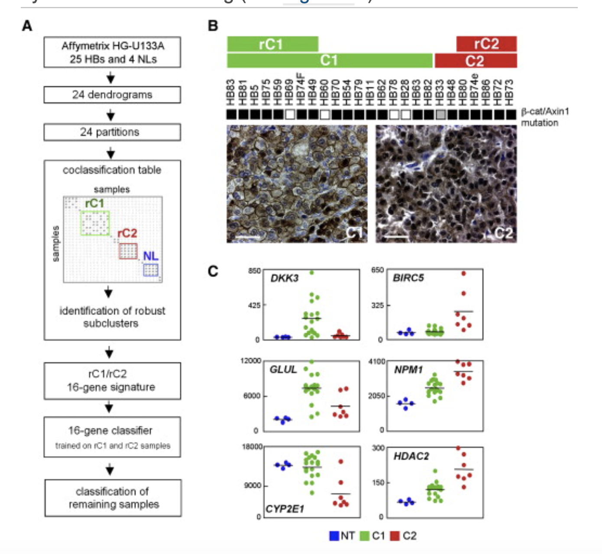

欢迎关注“小丫画图”公众号，回复“小白”，看小视频，实现点鼠标跑代码。

小丫微信: epigenomics  E-mail: figureya@126.com

作者：大鱼海棠，他的更多作品看这里<https://k.koudai.com/OFad8N0w>

单位：中国药科大学生物统计和计算药学研究中心，国家天然药物重点实验室

小丫编辑校验

```{r setup, include=FALSE}
knitr::opts_chunk$set(echo = TRUE)
```

# 需求描述

想众筹一个聚类分析的方法，主要是重现本文的方法，然后在自己的数据中进行分组，方法可能比较麻烦，但是个人感觉这种聚类的方法更加的新颖，可以适用于更多的疾病。最主要的是在第一篇文章的基础上衍生出的第二篇文章的分组（C1，C2A，C2B）



出自<https://europepmc.org/article/med/19061838>

Figure 1. Identification of Two Hepatoblas- toma Subclasses by Expression Profiling 
(A) Schematic overview of the approach used to identify robust clusters of samples, including two tumor clusters (rC1 and rC2) and one nontumor cluster (NL), and to classify hepatoblastoma (HB) samples using six different algorithms (CCP, LDA, 1NN, 3NN, NC, and SVM) and leave-one- out cross-validation.
(B) Top: molecular classification of 25 HB samples and CTNNB1 gene status. Black and gray squares indicate mutations of the CTNNB1 and AXIN1 genes. Bottom: immunohistochemical analysis of b-catenin for representative C1 and C2 cases. Scale bars = 50 mm.
(C) Expression of representative Wnt-related and b-catenin target genes (p < 0.005) in HB sub- classes and nontumor livers (NT). Horizontal bars indicate mean values.

# 应用场景

类似一种共识聚类吧，只是太复杂了。算法流程写在`Readme.txt`文件里，这是我和一个计算机专业的师弟写的，非常偏统计+计算机。

# 环境设置

运行classpredict包，需要用**windows系统**

使用国内镜像安装包

```{r eval=FALSE}
options("repos"= c(CRAN="https://mirrors.tuna.tsinghua.edu.cn/CRAN/"))
options(BioC_mirror="http://mirrors.tuna.tsinghua.edu.cn/bioconductor/")
devtools::install_url("https://brb.nci.nih.gov/BRB-ArrayTools/RPackagesAndManuals/classpredict_0.2.tar.gz") # 或下载后本地安装
BiocManager::install("ConsensusClusterPlus")
```

加载包

```{r}
library(cluster)
library(phangorn) 
library(ape)
library(reshape2)
library(ComplexHeatmap)
library(limma)
library(classpredict) #an R version of BRB ArrayTools software，需要windows系统
Sys.setenv(LANGUAGE = "en") #显示英文报错信息
options(stringsAsFactors = FALSE) #禁止chr转成factor
```

# 输入文件

HB-29samples-RMA-renormData19k.txt，表达矩阵。放在InputData文件夹里。

```{r}
work.path <- "."
data.path <- file.path(work.path, "InputData") # 输入文件所在文件夹
res.path <- file.path(work.path, "Results") # 结果文件所在文件夹
invisible(lapply(ls()[grep("path", ls())], function(x){
  if (!dir.exists(get(x))) dir.create(get(x))
}))

# 加载表达矩阵
mtx <- read.table(file.path(data.path, "HB-29samples-RMA-renormData19k.txt"), 
                  header = T, row.names = 1, sep = "\t")
mtx <- mtx[-1, ]
tmp <- rownames(mtx)
mtx <- data.frame(lapply(mtx, as.numeric))
rownames(mtx) <- tmp
mtx <- as.matrix(mtx)
```

# 聚类分析

```{r}
probe.stat <- list()
probe.stat$probe <- rownames(mtx)
nsample <- ncol(mtx)

## 1: Variance test  -----------------------------------------------------------------
### 
probe.stat$var <- apply(mtx, 1, var) # calculate variance for each probe
probe.stat$statistic <- (nsample-1)*probe.stat$var/median(probe.stat$var) # calculate chi statistic
probe.stat$pvalue <- 1-pchisq(probe.stat$statistic, df = nsample-1) # calculate single tail p value

### Robust coefficient of variation (rCV)
probe.stat$rCV <- apply(mtx, 1, function(x){
  x = sort(x)
  x = x[2:(ncol(mtx)-1)]
  sd(x)/mean(x)
})

### Unsupervised probe sets selection 
thresholds <- c(0.6, 0.7, 0.8, 0.9, 0.95, 0.975, 0.99, 0.995)
probe.stat$sets <- lapply(thresholds, function(threshold){ # filter probe set for each threshold
  probe.stat$probe[probe.stat$pvalue < 0.01 & 
                     probe.stat$rCV < 10 & 
                     probe.stat$rCV > quantile(probe.stat$rCV, threshold)]
})
names(probe.stat$sets) <- thresholds
unlist(lapply(probe.stat$sets, length)) # list the number of probe set
lapply(probe.stat$sets, function(x) summary(probe.stat$pvalue[x])) # summary the pvalue of the probe set
lapply(probe.stat$sets, function(x) summary(probe.stat$rCV[x])) # summary the rCV of the probe set


## 2: Generation of a series of 24 dendrograms  -----------------------------------------------------

linkages <- c("average", "complete", "ward")
Dends <- list()

for (linkage in linkages){ # for three linkages
  for (threshold in thresholds){ # for 8 thresholds
    cat("Parameter: linkage =", linkage, "; threshold =", threshold, "; ")
    probeset <- probe.stat$sets[[as.character(threshold)]] # extract probe set
    cat("Number of Probes :", length(probeset), "\n")
    d = as.dist(1-cor(mtx[probeset, ], method = "pearson")) # calculate distance
    Dends[[paste0(linkage, "_", threshold)]] = as.hclust(agnes(x = d, diss = T, method = linkage)) # clutering
  }
}

pdf(file.path(res.path, "Dendrograms.pdf"))
lapply(Dends, plot)
invisible(dev.off())

## 3: Stability assessment -----------------------------------------------------------------

### intrinsic stability 
#### perturbation
noise <- matrix(rnorm(n = nrow(mtx)*ncol(mtx), mean = 0, sd = sqrt(1.5 * median(probe.stat$var))),
                nrow = nrow(mtx), ncol = ncol(mtx))

#### resampleing
newsample <- sample(1:ncol(mtx), size = 5, replace = T)
newsample <- (mtx + noise)[, newsample]
colnames(newsample) <- paste0("test", 1:ncol(newsample))
# mtx <- cbind(mtx, newsample)

### Similarity Score between dendrograms
#### tree partition distance (also called symmetric difference metric and Robinson-Foulds distance)
phylos <- lapply(Dends, as.phylo) # turn 24 Dendrogram as multiphylo object
class(phylos) <- "multiPhylo"
RF.dist(phylos) # calculate RF distance for each dendrogram pair

## 4: Identification of robust cluster  -----------------------------------------------------------------
#### judge whether two sample is co-classfied in a dendrogram
#### group.size: if the size of the group including sample A and B is smaller, ignore it
IsCoClass <- function(dend, sampleA, sampleB, k, group.size = 4){
  coclass = F
  tmp = cutree(dend, k)
  if (tmp[sampleA] == tmp[sampleB] & sum(tmp == tmp[sampleA]) >= group.size)
    coclass = T
  return(coclass)
}

mat.list <- lapply(2:8, function(k){ # for each k, calculate a consensus matrix
  CoClassification <- lapply(Dends, function(dend){
    Coc <- lapply(colnames(mtx), function(A){
      sapply(colnames(mtx), function(B) IsCoClass(dend, A, B, k = k, group.size = 4))
    })
    Coc <- do.call(rbind, Coc)
    rownames(Coc) <- colnames(mtx)
    return(Coc)
  })
  Reduce(`+`, CoClassification)
})
names(mat.list) <- 2:8
# lapply(mat.list, function(x) table(as.vector(x)))

#### determine k by Consensus Heatmap
pdf(file.path(res.path, "ConsensusMatrix.pdf"))
for (tk in as.character(2:8)) {
  cat(tk, "\t")
  pheatmap(24-mat.list[[tk]], 
           clustering_method = "complete", 
           color = rev(ConsensusClusterPlus:::myPal()), 
           border_color = NA,
           cellheight = 12, cellwidth = 12,
           main = paste("consensus matrix k=", tk, sep = ""),
           legend = F,
           run_draw = T)
}
invisible(dev.off())

#### set k as 3
#### cut the dendrogrom using h=24-22
#### identified groups in which any pair of samples was co-classified in at least 22 of the 24 partitions
k = "3"; 
sampleInfo <- data.frame("Sample" = colnames(mtx))
mat = mat.list[[k]]
hcl = hclust(as.dist(24-mat))
gp <- cutree(tree = hcl, h = 24-22)
sampleInfo$PrimaryCluster = as.factor(gp[match(sampleInfo$Sample, names(gp))])

#### merge clusters whose mean co-classification score is more than 20
#### cut the hcl2 using h=24-18
num.gps = length(levels(sampleInfo$PrimaryCluster))
gps.coc.mat <- matrix(nrow = num.gps, ncol = num.gps)
rownames(gps.coc.mat) = colnames(gps.coc.mat) = levels(sampleInfo$PrimaryCluster)
for (i in levels(sampleInfo$PrimaryCluster)){
  for (j in 1:num.gps){
    sampleA = names(gp)[gp == i]
    sampleB = names(gp)[gp == j]
    gps.coc.mat[i, j] = mean(mat[sampleA, sampleB]) # compute mean co-classification score for each group pair
  }
}
hcl2 <- hclust(as.dist(gps.coc.mat))
gp2 <- cutree(hclust(as.dist(24-gps.coc.mat)), h = 24-18)

#### switch the PrimaryCluster label to final label
sampleInfo$FinalCluster <- plyr::mapvalues(x = sampleInfo$PrimaryCluster,
                                           from = names(gp2),
                                           to = gp2)
table(sampleInfo$FinalCluster)
split(sampleInfo$Sample, sampleInfo$FinalCluster)
write.table(sampleInfo, file.path(res.path, "output_sampleInfo.txt"), 
            row.names = F, col.names = T, quote = F, sep = "\t")

## 5: 16 gene signature  -----------------------------------------------------------------
### use limma to find signature
### take the group label from article as example

group <- setNames(object = c(rep("rC1", 8), rep("rC2", 5)), 
                  nm = c("HB83", "HB81", "HB5", "HB75", "HB59", "HB69", "HB74F", "HB49",
                         "HB80", "HB74e", "HB86", "HB72", "HB73"))
design <- model.matrix(~0+factor(group))
colnames(design) = levels(factor(group))
rownames(design) = names(group)
design

contrast.matrix <- makeContrasts(paste0(unique(group),collapse = "-"), levels = design)
fit <- lmFit(mtx[, names(group)], design)
fit2 <- contrasts.fit(fit, contrast.matrix)
fit2 <- eBayes(fit2) 
DEGs = topTable(fit2, coef=1, n=Inf)
sig = rownames(DEGs)[DEGs$adj.P.Val<1e-3]

## 16 gene classifier
### use classpredict, an R version of BRB ArrayTools software

## 6: cluster prediction -----------------------------------------------------------------

all.data <- mtx[sig, ]
train.data <- all.data[, names(group)] # train set
train.label <- as.factor(group) # label of train set
# train.data$Group <- as.factor(group)
test.data <- all.data[, setdiff(colnames(all.data), names(group))] # test set
geneId <- data.frame("UniqueID" = rownames(train.data))

resList <- classPredict(exprTrain = train.data, exprTest = test.data, isPaired = FALSE,
                        pairVar.train = NULL, pairVar.test = NULL, geneId = geneId, 
                        cls = as.character(train.label), projectPath = res.path,
                        pmethod = c("ccp", "bcc", "dlda", "knn", "nc", "svm"),
                        geneSelect = "igenes.univAlpha",
                        univAlpha = 0.001, univMcr = 0, foldDiff = 0, rvm = TRUE,
                        filter = rep(1, length(geneId)), ngenePairs = 25, nfrvm = 10, cvMethod = 1,
                        kfoldValue = 10, bccPrior = 1, bccThresh = 0.8, nperm = 0,
                        svmCost = 1, svmWeight =1, fixseed = 1, prevalence = NULL, 
                        outputName = "ClassPrediction", generateHTML = T)
View(resList$predNewSamples)
View(resList$performClass)
write.table(resList$predNewSamples, file.path(res.path, "output_ClassPrediction.txt"),
            row.names = F, col.names = T, sep = "\t", quote = F)
```

# Session Info

```{r}
sessionInfo()
```