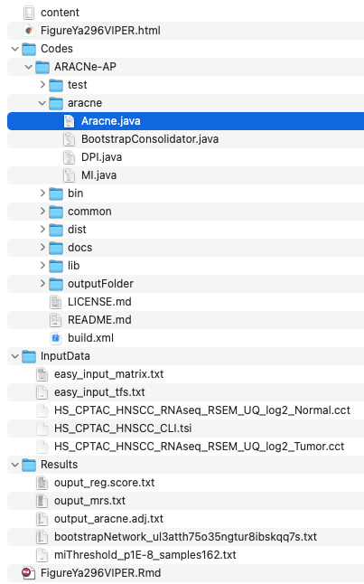

欢迎关注“小丫画图”公众号，回复“小白”，看小视频，实现点鼠标跑代码。

小丫微信: epigenomics  E-mail: figureya@126.com

作者：大鱼海棠，他的更多作品看这里<https://k.koudai.com/OFad8N0w>

单位：中国药科大学生物统计和计算药学研究中心，国家天然药物重点实验室

小丫编辑校验

```{r setup, include=FALSE}
knitr::opts_chunk$set(echo = TRUE)
```

# 需求描述

转录因子活性计算方法。

**Transcription factor activity inference**

Transcription factor activity for each sample was inferred using the VIPER package (Alvarez et al., 2016) on z-score transformed RNA data. The transcription factor targets were collected from DoRothEA (Garcia-Alonso et al., 2019) and the medium confidence targets were used for analysis. Activity scores for tumor and normal samples were compared using Student’s t-test and the p values were adjusted using the Benjamini-Hochberg method. Transcription factors with an adjusted p value < 0.05 were considered significant.

We also used the ARACNe algorithm (Lachmann et al., 2016) in VIPER to construct gene regulatory networks and infer transcription factor targets based on correlation to the transcription factor protein abundance. This allows for cancer-specific transcription factor gene regulation. We correlated the normalized enrichment protein activity scores with immune scores.

出自<https://linkinghub.elsevier.com/retrieve/pii/S1535610820306553>

# 应用场景

将转录组表达矩阵转换为调控因子活性矩阵，并画图。

这里用VIPER包计算转录因子活性（Protein-activity by Enriched Regulon analysis）。另外，如果要分析**转录调控网络regulon的活性**（注意：并非转录因子活性），可参考FigureYa249Regulon。

例文METHOD DETAILS的Integrated analysis部分描述了挖掘生物学意义时用到的整合分析方法，我们曾众筹过其中一些算法：

- ESTIMATE，可参考FigureYa211multiCohortImmSubtype
- ssGSEA，可参考FigureYa71ssGSEA
- NMF，可参考FigureYa110mutationSignature，FigureYa158MutationPattern，FigureYa169sigHeatmap。

# 环境设置

使用国内镜像安装包

```{r eval=FALSE}
options("repos"= c(CRAN="https://mirrors.tuna.tsinghua.edu.cn/CRAN/"))
options(BioC_mirror="http://mirrors.tuna.tsinghua.edu.cn/bioconductor/")
BiocManager::install("dorothea")
BiocManager::install("mixtools")
BiocManager::install("viper")
```

加载包

```{r}
library(mixtools)
library(dorothea)
library(viper)

Sys.setenv(LANGUAGE = "en") #显示英文报错信息
options(stringsAsFactors = FALSE) #禁止chr转成factor
```

# 输入文件

viper/ARACNe需要txt格式的转录因子列表和表达矩阵作为输入数据，输入文件保存在InputData文件夹中。

- tfs.txt，转录因子列表，这里是从dorothea包中提取的。
- HS_CPTAC_HNSCC_RNAseq_RSEM_UQ_log2_Normal.cct，HS_CPTAC_HNSCC_RNAseq_RSEM_UQ_log2_Tumor.cct，表达矩阵，下载自<http://linkedomics.org/data_download/CPTAC-HNSCC>。整理成easy_input_matrix.txt。

文件较大，请到语雀下载<https://www.yuque.com/figureya/figureyaplus/easyinput>，如图保存到相应文件夹内：



```{r}
work.path <- "."
data.path <- file.path(work.path, "InputData")
res.path <- file.path(work.path, "Results")
code.path <- file.path(work.path, "Codes")
fig.path <- file.path(work.path, "Figures")

if (!dir.exists(data.path)) dir.create(data.path)
if (!dir.exists(res.path)) dir.create(res.path)
if (!dir.exists(code.path)) dir.create(code.path)
if (!dir.exists(fig.path)) dir.create(fig.path)

# 从dorothea包中提取转录因子列表
net <- dorothea::dorothea_hs
tfs <- unique(net$tf)
write.table(tfs, file.path(data.path, "easy_input_tfs.txt"), row.names = F, col.names = F, quote = F)

# 读取原文提供的转录组数据，并保存到InputData/matrix.txt中
tmp1 <- read.table(file.path(data.path, "HS_CPTAC_HNSCC_RNAseq_RSEM_UQ_log2_Normal.cct"), 
                   header = T, row.names = 1, check.names = F)
colnames(tmp1) <- paste0("Normal", "_", colnames(tmp1))

tmp2 <- read.table(file.path(data.path, "HS_CPTAC_HNSCC_RNAseq_RSEM_UQ_log2_Tumor.cct"), 
                   header = T, row.names = 1, check.names = F)
colnames(tmp2) <- paste0("Tumor", "_", colnames(tmp2))
expr <- cbind(tmp1, tmp2)
## 去除在过多样本(>10%)中表达值为0的基因，以避免在bootstrap过程中出现报错
expr <- expr[rowSums(expr>0) >= 0.1*ncol(expr), ]

## 整理样本分组信息
clin <- data.frame(
  row.names = colnames(expr),
  "IsTumor" = c(rep("Normal", ncol(tmp1)), rep("Tumor", ncol(tmp2))),
  "Patient" = gsub("Tumor_|Normal_", "", colnames(expr))
)
# 也可以直接读取样本分组信息文件
# clin <- read.delim(file.path(data.path, "HS_CPTAC_HNSCC_CLI.tsi"))
# clin <- clin[-1, ]; rownames(clin) <- clin$case_id
# expr <- expr[, c("Idx", clin$case_id)]

write.table(data.frame("gene" = rownames(expr), expr), file.path(data.path, "easy_input_matrix.txt"), 
            row.names = F, col.names = T, quote = F, sep = "\t")
```

# 重建基因调控网络 - ARACNe-AP

ARACNe-AP是基于java的程序，需要安装1.8以上的java。java下载地址<https://www.java.com/>

ARACNe-AP可以从GitHub上下载后自行编译，存放在`Code/ARACNe-AP`文件夹里。具体过程参考GitHub指南。git clone <https://github.com/califano-lab/ARACNe-AP.git>，或者使用已经编译好的可执行文件：dist/aracne.jar。

```{r}
## 在R中调用java需要确定java位置
## 在Windows中直接为java，在linux系统中需要通过"which java"命令查询java位置
java.path <- ifelse(test = Sys.info()['sysname'] == "Windows",
                    yes = "java",
                    no = system("which java", intern = T))
aracne.path <- file.path(code.path, "ARACNe-AP")
# fs::dir_tree(aracne.path)

## 编写调用ARACNe的语句
aracne.cmd <- paste(java.path, "-Xmx5G",                               # 调用java
                    "-jar", file.path(aracne.path, "dist/aracne.jar"), # ARACNe可执行文件位置
                    "-e", file.path(data.path, "easy_input_matrix.txt"),           # 表达矩阵位置
                    "--tfs", file.path(data.path, "easy_input_tfs.txt"),           # 转录因子列表位置
                    "-o", file.path(res.path),                         # ARACNe结果输出位置
                    "--pvalue 1E-8 --seed 1",                          # 指定显著性阈值和随机种子
                    "--threads 2")                                     # 指定所用线程

## ARACNe需要运行两次，第一次计算阈值，第二次计算邻接权重
system(paste(aracne.cmd, "--calculateThreshold"))
system(aracne.cmd)
```

# 计算转录因子活性 - VIPER

输入转录因子列表和表达矩阵，推断主要调控因子，获得各转录因子的主要调控靶标，寻找调控网络间的阴影对，预测调控子间的协同作用。

参考VIPER的文档<https://www.bioconductor.org/packages/release/bioc/vignettes/viper/inst/doc/viper.pdf>

```{r}
## Generate the regulon object from ARACNe-AP --------------------------------------------------

### 使用aracne2regulon函数读取ARACNe的输出文件，生成regulon对象
### 需要ARACNE生成的邻接权重文件，和一个储存原始表达矩阵的ExpressionSet对象
### 需要删除ARACNe输出文件（bootstrap开头的文件）的列名
adjfile <- list.files(res.path, pattern = "^bootstrap", full.names = T)
adj <- read.table(adjfile, header = T)
write.table(adj, file.path(res.path, "output_aracne.adj.txt"), sep = "\t", row.names = F, col.names = F, quote = F)

### 新建ExpressionSet对象
eset <- ExpressionSet(assayData = as.matrix(expr),                         # 表达矩阵
                      phenoData = new("AnnotatedDataFrame", data = clin))  # 样本信息
regulon <- aracne2regulon(afile = file.path(res.path, "output_aracne.adj.txt"),  # 邻接权重文件
                          eset = eset,                                # ExpressionSet对象
                          verbose = T, format = "3col")               # ARACNe-AP需要设置format为3col
### regulon的读取需要大量时间，读完可以保存在Result/文件夹下
#saveRDS(regulon, file.path(res.path, "regulon.rds"))


## Master Regulator Analysis performed by msVIPER  ----------------------------------------------

## 主要调控因子分析
## 使用T检验，提取不同分组间的差异基因
## group1可以设置为多个组别，如 c("Tumor1", "Tumor2")
signature <- rowTtest(x = eset,                                   # ExpressionSet对象
                      pheno = "IsTumor",                          # 分组变量
                      group1 = c("Tumor"), group2 = "Normal")     # 用于比较的组别标签
signature <- (qnorm(signature$p.value/2, lower.tail = FALSE) *
                sign(signature$statistic))[, 1]

## 通过permutation构建零假设
nullmodel <- ttestNull(eset, "IsTumor", c("Tumor"), "Normal", per = 1000,
                       repos = TRUE, verbose = T)
regulon

## msVIPER (a multiple sample version)
## 推断主要调控因子
mrs <- msviper(ges = signature, 
               regulon = regulon, 
               nullmodel = nullmodel, 
               verbose = TRUE)
summary(mrs)

pdf(file.path(fig.path, "Target for each TF.pdf"))
plot(mrs, cex = .7)
invisible(dev.off())
# VIPER plot showing the projection of the negative and positive targets for each TF.

## Leading-edge analysis
### 获得各转录因子的主要调控靶标
mrs <- ledge(mrs)
summary(mrs)
mrs.tab <- as.data.frame(mrs$es[c("nes", "size", "p.value")])
mrs.tab <- mrs.tab[order(mrs.tab$p.value), ]
mrs.tab$p.adj <- p.adjust(mrs.tab$p.value, method = "BH")
# mrs.tab$leadingEdge <- mrs$ledge # 主要调控靶标无法写入txt中，可选择xlsx或rds格式
write.table(mrs.tab, file = file.path(res.path, "ouput_mrs.txt"), quote = F)

## Beyond msVIPER  ------------------------------------------------------------------

### Bootstrap msVIPER
signature <- bootstrapTtest(eset, "IsTumor", c("Tumor"), "Normal", verbose = TRUE)
mrs.boot <- msviper(signature, regulon, nullmodel, verbose = TRUE)
mrs.boot <- bootstrapmsviper(mrs.boot, "mode")

pdf(file.path(fig.path, "Target for each TF (bootstap).pdf"))
plot(mrs.boot, cex = .7)
invisible(dev.off())
# msVIPER plot showing the enrichment of transcription factor regulons on the germinal center reaction gene expression signature using 100 bootstrap iterations.

### Shadow analysis
### 寻找调控网络间的阴影对
### 阴影对MR1−>MR2，表示计算的MR2转录因子活性部分由于MR1的共调控作用
mrs.shadow <- shadow(mrs, regulators = 25, verbose = TRUE) # 选取最显著的25个转录因子
summary(mrs.shadow)
mrs.shadow$shadow

### Synergy analysis
### 预测调控子间的协同作用
### 如果两个调控因子的共调控活性明显高于简单的活性加和，则认为这两个调控子可能协同调控一个基因的表达
mrs.synergy <- msviperCombinatorial(mrs, regulators = 25, verbose = TRUE)# 选取最显著的25个转录因子
mrs.synergy <- msviperSynergy(mrs.synergy, verbose = TRUE)
summary(mrs.synergy)
mrs.synergy$es$synergy

pdf(file.path(fig.path, "Target for each TF(Co-regulon).pdf"))
plot(mrs.synergy, mrs = 25, cex = .7)
invisible(dev.off())
# msVIPER plot showing the results for the enrichment of co-regulons on the germinal center reaction gene expression signature.

## Activity Score ------------------------------------------------------------------
### 将转录组表达矩阵转换为调控因子活性矩阵
vpsig <- viperSignature(eset, "IsTumor", "Normal", verbose = TRUE)
vpres <- viper(vpsig, regulon, verbose = TRUE)
reg.score <- exprs(vpres)
#saveRDS(reg.score, file.path(res.path, "reg.score.rds"))
write.table(reg.score, file = file.path(res.path,"ouput_reg.score.txt"),sep = "\t",row.names = T,col.names = NA,quote = F)
```

# Session Info

```{r}
sessionInfo()
```