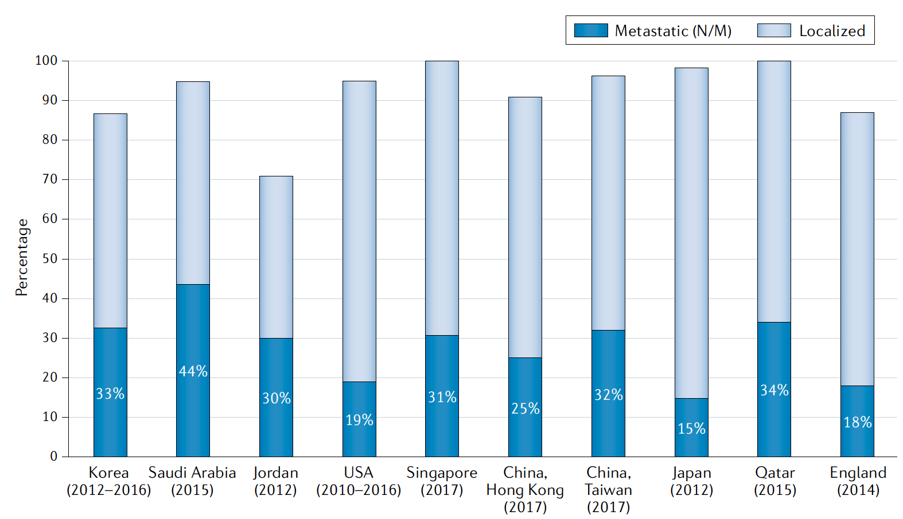

欢迎关注“小丫画图”公众号，回复“小白”，看小视频，实现点鼠标跑代码。

小丫微信: epigenomics  E-mail: figureya@126.com

作者：古潇，他的更多作品看这里<https://k.koudai.com/uH4zuEWC>

小丫编辑校验

```{r setup, include=FALSE}
knitr::opts_chunk$set(echo = TRUE)
```

# 需求描述

我想从形式上众筹这个图，这个柱状图是填充色的，看上去比较好看。想看看大神们是怎么复现出来的，学习一下，想学习用R实现。



出自<https://www.nature.com/articles/s41585-021-00442-8>

Fig. 4 | The prevalence of metastatic prostate cancer in selected Asian countries, England and the USA. Except for Japan, many Asian countries have higher rates (25–44%) of advanced-stage disease than the USA (19%). The widespread PSA screening programme in Japan has been associated with a significant decrease in national mortality rate during this time period.

# 应用场景

R默认的简约严肃版柱形图就挺好看了。不过，如果你（或许是你老板）喜欢办公软件的审美，不妨试一下本文档的操作。

我们也画过花哨一点的柱状图：

- FigureYa39bar <https://k.youshop10.com/P75DHMrs>
- FigureYa170ImmuLncRNA <https://k.youshop10.com/Zkj985gv>
- FigureYa173fancybar <https://k.youshop10.com/wCHBYmko>
- FigureYa180FGAplot <https://k.youshop10.com/FdC5u=Yd>
- FigureYa209batchEnrich <https://k.youshop10.com/dXk-kWCX>

# 环境设置

使用国内镜像安装包

```{r eval=FALSE}
options("repos"= c(CRAN="https://mirrors.tuna.tsinghua.edu.cn/CRAN/"))
options(BioC_mirror="http://mirrors.tuna.tsinghua.edu.cn/bioconductor/")
# 渐变柱状图用到了ggpattern包中的pattern_fill参数，共两个参数
# pattern_fill和pattern_fill2，只能设置两个渐变色
install.packages("remotes")
remotes::install_github("coolbutuseless/ggpattern")
install.packages("magick")
```

加载包

```{r}
library(ggpattern)
library(ggplot2)

Sys.setenv(LANGUAGE = "en") #显示英文报错信息
options(stringsAsFactors = FALSE) #禁止chr转成factor
```

# 输入文件

easy_input.csv，the prevalence of metastatic prostate cancer。第一列对应图中横坐标，第二、三列是图中每个bar的两部分，第四列是二三列之和。

```{r}
df <- read.csv("easy_input.csv")
maxID <- nrow(df)
df$ID <- 1:maxID
```

# 开始画图

```{r}
plot.df.all <- reshape2::melt(df, id.var = c("Country", "ID"), value.name = "Percentage", variable.name = "Type")

plot.df <- subset(plot.df.all,Type %in% c("Metastatic", "Localized"))

# 这里取Metastatic数据，后续进行图层叠加和文字注释
plot.df1 <- subset(plot.df, Type == "Metastatic") 

### 设置填充颜色 ---------------
type.color.1 <- c('#dbeffc','#7bb8e5') # 第一组数据的渐变色
type.color.2 <- c('#a7d7f3','#0079bb') # 第二组数据的渐变色（图中靠下那组，覆盖在前一组之上）
```

这里提供两种方案：渐变模式是横向和中心辐射。

## 方案一： 中心辐射渐变

```{r}
barwidth <- 0.44 # 柱子宽度

plot1 <- ggplot() +
  # 画第一组
  geom_col_pattern(
    data = plot.df,
    mapping = aes(ID, Percentage),
    width = barwidth,
    position = "stack",
    pattern = 'gradient',
    pattern_orientation = "radial", # 渐变模式，纵向、横向和辐射三种'vertical', 'horizontal', 'radial'
    pattern_fill = type.color.1[1], # 填充渐变色1
    pattern_fill2 = type.color.1[2], # 填充渐变色2
    fill = NA) + 
  
  # 画第二组，覆盖在前面画出的bar之上
  geom_col_pattern(
    data = plot.df1,
    mapping = aes(ID, Percentage),
    width = barwidth,
    pattern = 'gradient',
    pattern_orientation = "radial",
    pattern_fill = type.color.2[1], # 填充渐变色1
    pattern_fill2 = type.color.2[2], # 填充渐变色2
    fill = NA) + 
  
  # 添加文字
  geom_text(data = plot.df1, mapping = aes(x = ID, y = (Percentage/2), label = paste0(Percentage, " %")),
            size = 2.5, color = "white") + # size 调节文字大小，color调节文字颜色
  scale_x_continuous(breaks = seq(1, maxID, 1), labels = stringr::str_wrap(plot.df1$Country, 9)) + # stringr::str_wrap x轴文字换行
  scale_y_continuous(limits = c(0,100), breaks = seq(0, 100, 10), expand = c(0, 0)) +
  labs(x = "") +
  theme_bw() +
  theme(aspect.ratio = 0.5) +
  theme(panel.grid.major.x = element_blank(), # 移除网格线
        panel.grid.minor.x = element_blank(), 
        panel.grid.minor.y = element_blank(), 
        legend.text = element_text(colour = 'black', size = 9),
        axis.text = element_text(colour = 'black', size = 9),
        axis.line = element_line(colour = 'black'),
        panel.background = element_rect(fill = "white"),
        panel.border = element_blank())
plot1

ggsave("bar_radial.pdf", width = 7, height = 5)
```

## 方案二： 横向渐变

```{r}
barwidth <- 0.22 # 柱子宽度，左右分开画，一次画一半

plot2 <- ggplot() +
  # 填充左侧一半
  geom_col_pattern(
    data = plot.df,
    mapping = aes( (ID-(barwidth/2)), Percentage),
    width = barwidth,
    position = "stack",
    pattern = 'gradient',
    pattern_orientation = "horizontal", # 渐变模式，纵向、横向和辐射三种'vertical', 'horizontal', 'radial'
    pattern_fill = type.color.1[2], # 填充渐变色2
    pattern_fill2 = type.color.1[1], # 填充渐变色1
    fill = NA) + 
  # 填充右侧一半
  geom_col_pattern(
    data = plot.df,
    mapping = aes( (ID+(barwidth/2)), Percentage),
    width = barwidth,
    position = "stack",
    pattern = 'gradient',
    pattern_orientation = "horizontal", # 渐变模式，纵向、横向和辐射三种'vertical', 'horizontal', 'radial'
    pattern_fill = type.color.1[1], # 填充渐变色1
    pattern_fill2 = type.color.1[2], # 填充渐变色2
    fill = NA) + 
  
  # 填充左侧一半，覆盖在前面画的bar之上
  geom_col_pattern(
    data = plot.df1,
    mapping = aes( (ID-(barwidth/2)), Percentage),
    width = barwidth,
    pattern = 'gradient',
    pattern_orientation = "horizontal",
    pattern_fill = type.color.2[2], # 填充渐变色2
    pattern_fill2 = type.color.2[1], # 填充渐变色1
    fill = NA) + 
  # 填充右侧一半，覆盖在前面画的bar之上
  geom_col_pattern(
    data = plot.df1,
    mapping = aes( (ID+(barwidth/2)), Percentage),
    width = barwidth,
    pattern = 'gradient',
    pattern_orientation = "horizontal",
    pattern_fill = type.color.2[1], # 填充渐变色1
    pattern_fill2 = type.color.2[2], # 填充渐变色2
    fill = NA) +
  
  # geom_rect 添加黑色边框，不想要可以注释掉
  geom_rect(
    data = plot.df1,
    mapping = aes(xmin = ID - barwidth, xmax = ID + barwidth, ymin = 0, ymax = Percentage),
    size = 0.3,
    fill = NA,
    color = "black")+
  geom_rect(
    data = df,
    mapping = aes(xmin = ID-barwidth, xmax = ID + barwidth, 
                  ymin = Metastatic, # 需要成自己的数据的列名
                  ymax = Total),
    size = 0.3,
    fill = NA,
    color = "black") + 
  
  # 添加文字
  geom_text(data = plot.df1, mapping = aes(x = ID, y = (Percentage/2), label = paste0(Percentage, " %")),
            size = 2.5, color = "white") + # size 调节文字大小，color调节文字颜色
  scale_x_continuous(breaks = seq(1, maxID, 1), labels = stringr::str_wrap(plot.df1$Country, 9)) + # stringr::str_wrap x轴文字换行
  scale_y_continuous(limits = c(0,100), breaks = seq(0,100,10), expand = c(0,0)) +
  labs(x = "") +
  theme_bw() +
  theme(aspect.ratio = 0.5) +
  theme(panel.grid.major.x = element_blank(), #移除网格线
        panel.grid.minor.x = element_blank(), 
        panel.grid.minor.y = element_blank(), 
        legend.text = element_text(colour = 'black', size = 9),
        axis.text = element_text(colour = 'black', size = 9),
        axis.line = element_line(colour = 'black'),
        panel.background = element_rect(fill = "white"),
        panel.border = element_blank())

plot2

ggsave("bar_horizontal.pdf", width = 7, height = 5)
```

# Session Info

```{r}
sessionInfo()
```