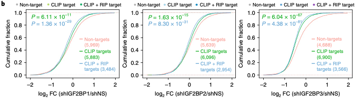
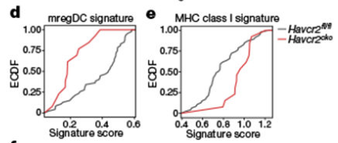

欢迎关注“小丫画图”公众号，回复“小白”，看小视频，实现点鼠标跑代码。

小丫微信: epigenomics  E-mail: figureya@126.com

作者：qliu，他的更多作品看这里<https://k.youshop10.com/=TSn5GjE>

小丫编辑校验

```{r setup, include=FALSE}
knitr::opts_chunk$set(echo = TRUE)
```

# 需求描述

重点是p值如何算出来的



出自<https://www.nature.com/articles/s41556-018-0045-z>

Fig. 2 | IGF2BPs regulate transcriptome-wide mRNA levels.
b, Cumulative frequency of mRNA log2 FC in non-target, CLIP target and CLIP + RIP target genes upon IGF2BP silencing. P values were calculated using **two-sided Wilcoxon and Mann–Whitney test**. 

我们众筹过的FigureYa290BarGraph所在的文章里也用到了类似的图：



出自<https://www.nature.com/articles/s41586-021-03626-9>

Fig. 3 |. TIM-3 deficiency promotes DC functionality and enhances antigen-specific anti-tumour immunity.
d, Empirical cumulative distribution function (ECDF) plot of enrichment score for mregDC signature in Havcr2fl/fl (grey) or Havcr2cko (red) migDCs, (P = 9.4 × 10−4). e, ECDF plot of MHC class I presentation signature (P = 1.01 × 10−3).
The difference in gene signature score activity levels between Havcr2fl/fl and Havcr2cko was examined using **Wilcoxon rank-sum test** and visualized using violin or ECDF plots.

以上两篇文章用到的检验方法`two-sided Wilcoxon and Mann–Whitney test`和`Wilcoxon rank-sum test`是一回事。

# 应用场景

用经验累积分布函数empirical cumulative distribution function(ECDF)对比分布，并计算两种分布的p value。

The ECDF plot has two key advantages.

- Unlike the histogram or KDE, it directly represents each datapoint. That means there is no bin size or smoothing parameter to consider. 
- Additionally, because the curve is monotonically increasing, it is well-suited for comparing multiple distributions.
出自<https://seaborn.pydata.org/tutorial/distributions.html#tutorial-ecdf>，里面有关于其他分布的介绍，推荐扩展阅读。

我们在FigureYa278heatmapPoints<https://k.youshop10.com/IZWXWn32>中也有类似的一个需求，用的是 `kruskal.test`，这种统计方法也可用来计算两种分布的P值。

# 环境设置

使用国内镜像安装包

```{r}
options("repos"= c(CRAN="https://mirrors.tuna.tsinghua.edu.cn/CRAN/"))
options(BioC_mirror="http://mirrors.tuna.tsinghua.edu.cn/bioconductor/")

```

加载包

```{r}
library(tidyverse)
library(rstatix) # 用于统计分析
library(glue)
library(ggtext) # 用于文本注释，Y叔出品，非常强大

Sys.setenv(LANGUAGE = "en") #显示英文报错信息
options(stringsAsFactors = FALSE) #禁止chr转成factor
```

# 输入文件

easy_input.csv，包含两列，第一列是数值，第二列是分组信息（a、b、c三组）。

```{r}
# 生成输入文件
# 设置随机数种子，以便我们都能复现结果
# 在所有涉及到随机数据的产生，大家一定都要记得设置随机数种子
set.seed(2022)

df <- data.frame(
  x = c(rnorm(100, 0, 3), rnorm(100, 0, 10), rnorm(100, 0, 10)),
  g = gl(3, 100, labels = c("a", "b", "c"))
)

write.csv(df, "easy_input.csv", quote = F, row.names = F)
```


```{r}
# 加载输入文件
df <- read.csv("easy_input.csv")
# 指定线条颜色：
cols = c("red", 
         "forestgreen", 
         "darkblue")

# 图中文字都是带有颜色的，而且与所对应的组别颜色都是一致的，这里我们利用 Y 叔的 ggtext 巧妙的构建组别：
df1 <- df %>%
  mutate(
    col = rep(cols, each = 100),
    Group = glue("<i style='color:{col}'>{g}</i>"),
    Group = factor(
      Group, 
      
      levels = c(
        "<i style='color:red'>a</i>", 
        "<i style='color:forestgreen'>b</i>", 
        "<i style='color:darkblue'>c</i>"),
      
      labels = c(
        "<i style='color:red'>Non-targets\n(100)\n</i>", 
        "<i style='color:forestgreen'>CLIP targets\n(100)\n</i>", 
        "<i style='color:darkblue'>CLIP + RIP targets\n(100)\n</i>"
        )
      )
  )

head(df1)
```

# 计算P值

## 原文的方法：two-sided Wilcoxon and Mann–Whitney test

这里大家有兴趣一定要去get到统计包 `rstatix` 的精髓<https://rdrr.io/cran/rstatix/man/>，对于批量进行统计分析太方便了。

```{r}
Pvalue_data <- df %>% 
  rstatix::wilcox_test(x ~ g, alternative = "two.sided") 

(CLIP_P <- Pvalue_data$p[1])
(CLIP.RIP_P <- Pvalue_data$p[2])
```

## kruskal-wallis rank sum statistic

我们在 `FigureYa278heatmapPoints` 中也有类似的一个需求，用的是 `kruskal.test`，这种统计方法也可用来计算两种分布的P值。

```{r}
# kruskal-wallis rank sum statistic used to compute the p-value.
kruskal_Pvalue_data <- df %>% 
  filter(g %in% c("a", "b")) %>%
  kruskal_test(x ~ g) 
(CLIP_P <- kruskal_Pvalue_data$p)

kruskal_Pvalue_data <- df %>% 
  filter(g %in% c("a", "c")) %>%
  kruskal_test(x ~ g)
(CLIP.RIP_P <- kruskal_Pvalue_data$p)
```

两种方法得到的 p value 都是一样的。

# 开始画图

首先绘制不标 `P` 值的图

```{r}
p1 <- ggplot(df1, aes(x, color = Group)) +
  stat_ecdf(geom = "step", size = 1) + # 或geom = "point"
  scale_color_manual(
    values = cols,
    # labels = c("Non-targets\n(100)\n", "CLIP targets\n(100)\n", "CLIP + RIP targets\n(100)\n"),
    name = ""
  ) +
  labs(
    x = expression(~log[2]~FC (shIGF2BP1/shNS)),
    y = "Cumulative fraction"
  ) +
  theme_bw() +
  theme(
    legend.position = c(0.8, 0.4),
    legend.background = element_blank(),
    panel.grid = element_blank(),
    legend.text = element_markdown()
  )

p1
```

在图中标注 `P` 值，用 `annotate()` 函数实现

```{r}
p2 <- p1 +
  annotate(
    geom = "text",
    x = -20, y = 0.7,
    label = bquote(italic(P) == .(CLIP_P)),
    color = cols[2],
    size = 6
  ) +
  annotate(
    geom = "text",
    x = -20, y = 0.6,
    label = bquote(italic(P) == .(CLIP.RIP_P)),
#    parse = TRUE,
    color = cols[3],
    size = 6
  )
p2

# 保存图片
ggsave("ecdf_add_Pvalue.pdf", p2, height = 7, width = 7, device = "pdf")
```


# Session Info

```{r}
sessionInfo()
```