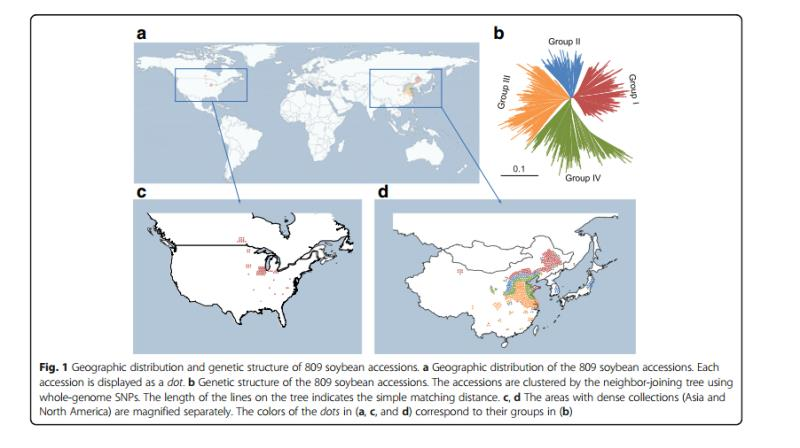

微信ID: epigenomics  E-mail: figureya@126.com

作者：Kevin，邮箱：15776658849@163.com

小丫编辑校验

```{r setup, include=FALSE}
knitr::opts_chunk$set(echo = TRUE)
```

## 需求描述

用R画出种质资源分布图，在地图上用不同颜色展示各个group的地理分布，中国的省用饼图展示。



出自<https://genomebiology.biomedcentral.com/articles/10.1186/s13059-017-1289-9>

## 应用场景

在地图上展示特征的地理分布。

场景一：种质资源的地理分布

场景二：疾病在不同地区的发病情况

## 输入数据预处理

如果你的数据像`easy_input.csv`那样，已经有经纬度，就可以跳过这步，直接进入“开始画图”。

输入数据来源：<https://static-content.springer.com/esm/art%3A10.1186%2Fs13059-017-1289-9/MediaObjects/13059_2017_1289_MOESM1_ESM.xlsx>

输入数据没有提供点的经纬度，只有省和直辖市名，我们需要根据省份的名字提取经纬度。

```{r}
df=read.csv("not_easy_input.csv", sep = ";", stringsAsFactors=F)
head(df)
dim(df)
table(df$Type)
```

后面将用两种颜色，分别展示两种`type`的地理分布

### 提取有用的列

```{r}
area <- df$Origin
l <- strsplit(area,", ")

# 下面三个list分别对应输入文件中的省、国家和type（顺序对应）
province <- c()
country <- c()
type <- c()

j=1
for(i in 1:length(l)){
  #删掉缺失省或国家信息的行
  if(length(l[[i]]) == 2) {
    province[j] = l[[i]][1]
    country[j] = l[[i]][2]
    type[j] = df$Type[j]
    j = j+1
    }
}

#cpt为整理后的输入文件（包含国家、省、type）
cpt <- cbind(country, province, type)
cpt <- as.data.frame(cpt)
head(cpt)
dim(cpt)
```

### 提取经纬度

`province.csv`文件是世界各国省市的经纬度对照关系表，已经把省市经纬度处理成省市的中心位置。也可以用你有自己的对照表替换这个文件。

获得`province.csv`过程描述：

1. 从simplemaps.com下载国家省市城市经纬度表(包括一些无用列)；

2. 用perl提取相关5列(国家省市城市经纬度)；

3. 将每个省市的城市的经纬度做了取平均处理(保证得到省市中心位置的经纬度)；

4. 最后得到`province.csv`

```{r}
pro <- read.csv("province.csv", header=T, stringsAsFactors=F)
head(pro)

# 提取输入文件中的省市的经纬度
cpll <- pro[pro$country == country[1]&pro$province == province[1],]
for(i in 2:length(province)){
  cpll = rbind(cpll, pro[pro$country == country[i]&pro$province == province[i],])
}

cpll$type<-cpt$type

#输出到文件
write.csv(cpll, "easy_input.csv", quote = F, row.names = F)
```

## 开始画图

提供三种类型的画图代码，分别画世界、美国和中国地图，挑选自己喜欢的类型画感兴趣的地区即可。

```{r}
#install.packages(c("maps","mapproj","maptools","ggsn"))
library(ggplot2)
library(maps)
library(mapproj)
library(maptools)

#输入数据必须包含这三列：类型、经度和纬度。
cpll<-read.csv("easy_input.csv")
head(cpll)
summary(cpll)
```

此处的输入文件只精确到省，每个省有多行。

### 各省每种type的数量作为点的size，以世界地图为例

```{r,message=FALSE,warning=FALSE}
library(plyr)
library(dplyr)

# type的unique行计数
cpllt<-read.csv("easy_input.csv")
dim(cpllt)

cpllt_uni <- ddply(cpllt,.(country,province,lng,lat,type),nrow)
dim(cpllt_uni)
names(cpllt_uni)[6] <- "type_num"
head(cpllt_uni)

world_map <- map_data("world")
pa <- ggplot() +
  geom_polygon(data=world_map,
               aes(x=long,y=lat,group=group),
               fill="white",
               colour = "#B1C5D4") + #蓝色国家边界
  theme(panel.background = element_rect(fill = "#B1C5D4")) + #蓝色海洋
  geom_point(data = cpllt_uni, aes(x = lng, y = lat, 
                                  size = type_num, #点的大小代表type的数量
                                  colour = type, #type用不同颜色展示
                                  alpha = I(0.5))) + #点的透明度
  scale_size_continuous(range = c(0.1,2)) + #点的大小范围
  scale_color_brewer(palette = "Set1") + 
  
  xlab("") + ylab("") +
  theme(panel.grid =element_blank()) + #去除网格线
  theme(panel.border = element_blank()) + #去除外层边框
  theme(axis.line = element_blank(), axis.ticks = element_blank(), axis.text = element_blank()) + #去除x轴
  coord_map(xlim=c(-180, 180), ylim=c(-60, 80)) 
pa

ggsave("world_size.pdf")
```

### 分散画出省内所有的点，以美国为例

前面从`province.csv`文件提取了省市中心位置的经纬度，我们把同一个省的点分散显示。

```{r}
#随机移动点，获得新的经纬度
set.seed(1)
lat_random <- sample(seq(-0.5,0.5,0.1),nrow(cpllt),replace=T)
lng_random <- sample(seq(-0.5,0.5,0.1),nrow(cpllt),replace=T)
cpllt_random <- cbind(cpllt[,1:2], lng = cpllt[,3] + lng_random,lat = cpllt[,4] + lat_random, type = cpllt$type)
head(cpllt_random)

#查询某单独地区的名称
#sort(unique(world_map$region)) #一共有252个地区

USA_map <- map_data("world",region = c("USA","canada"))
pc <- ggplot() +
  geom_polygon(data = USA_map,
               aes(x = long, y = lat,group = group),
               fill = "white",
               colour = "black") + #黑色国家边界
  theme(panel.background = element_rect(fill = "#B1C5D4")) + 
  geom_point(data = cpllt_random[cpllt_random$country == c("United States","Canada"),], aes(x = lng, y = lat, colour = type), size = 0.1, alpha = I(0.4)) +
  scale_color_brewer(palette = "Set1") + 

  xlab("") + ylab("") +
  theme(panel.grid =element_blank()) + 
  theme(panel.border = element_blank()) + 
  theme(axis.line = element_blank(), axis.ticks = element_blank(), axis.text = element_blank()) + 
  guides(colour = FALSE) +
  coord_map(xlim=c(-140, -50), ylim=c(15, 55))
pc

ggsave("US_points.pdf")
```

### 饼图展示各省type的占比，以中国为例

先计算各省type的百分比

```{r,message=FALSE,warning=FALSE}
library(plyr)
library(dplyr)

#type的unique行计数
cpllt<-read.csv("easy_input.csv")
cpllt_uni <- ddply(cpllt,.(country,province,lng,lat,type),nrow)
names(cpllt_uni)[6] <- "type_num"
llt<-cpllt_uni[,c(-1,-2)]
head(llt)

#提取不同type的个数，此处有两个type，根据实际需要增加
llt1<-llt[llt$type=="Improved cultivar",]
colnames(llt1)[4]<-"cultivar"
llt2<-llt[llt$type=="Landrace",]
colnames(llt2)[4]<-"Landrace"

lltall<-merge(llt1, llt2, by = c("lng","lat"))
lltall<-lltall[,c(-3,-5)]

#计算该省的数量在全世界所占的百分比，用来画pie的半径
type_sum <- sum(cpllt_uni$type_num)
lltall$total<-lltall$`cultivar` + lltall$Landrace
lltall$radius<-log10(lltall$total / type_sum * 1000)

lltall$region<-seq(1:nrow(lltall))
head(lltall)
```

用到了Y叔的`scatterpie`包，<https://mp.weixin.qq.com/s/Jca8BqGFCLTa0aaLrQFNHA>

```{r,message=FALSE,warning=FALSE,fig.width=10,fig.height=8}
#install.packages("scatterpie")
library(scatterpie)

China_map <- map_data("world",region=c("China","Taiwan","Japan","South Korea","North Korea","Mongolia","Russia"))
pd <- ggplot() +
  geom_polygon(data=China_map,
               aes(x=long,y=lat,group=group),
               fill="white",
               colour="black") + 
  theme(panel.background = element_rect(fill = "#B1C5D4")) + 

  geom_scatterpie(aes(x=lng, y=lat, group=region, r=radius),
                  data=lltall, cols=c("cultivar","Landrace"), 
                  color=NA, #不画pie的边界
                  alpha=.7) + #透明度
  #pie半径的图例，展示该省所有数据占全世界的百分比
  geom_scatterpie_legend(lltall$radius, x=65, y=20, 
                         n = 3, #图例里画几个圈
                         labeller = function(x) round(0.1*10^x,2)) + 
  scale_fill_brewer(palette = "Set1") + #设置pie里的颜色
  guides(fill = FALSE) + #不显示图例
  
  xlab("") + ylab("") +
  theme(panel.grid =element_blank()) + 
  theme(panel.border = element_blank()) + 
  theme(axis.line = element_blank(), axis.ticks = element_blank(), axis.text = element_blank()) + 
  coord_map(xlim=c(60, 155), ylim=c(15, 55))
pd

ggsave("China_pie.pdf",width = 10,height = 8)
```

### 组图

```{r,fig.width=16,fig.height=12}
library(cowplot)
plot_grid(pa, ncol = 1, labels = c("a", "b"),
  plot_grid(pc, pd, ncol = 2, labels = c("c","d")),
  rel_heights = c(1.5, 1))

ggsave("map.pdf",width = 16,height = 12)
```

```{r}
sessionInfo()
```