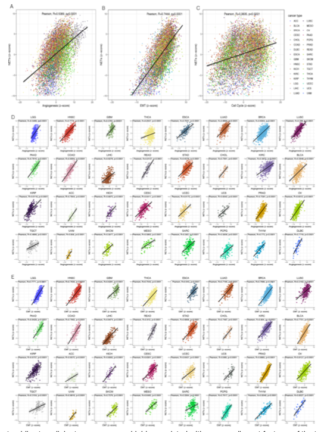

欢迎关注“小丫画图”公众号，回复“小白”，看小视频，实现点鼠标跑代码。

小丫微信: epigenomics  E-mail: figureya@126.com

大鱼海棠，他的更多作品看这里<https://k.koudai.com/OFad8N0w>

单位：中国药科大学国家天然药物重点实验室，生物统计与计算药学研究中心
      法国斯特拉斯堡遗传与分子生物研究所，癌症功能基因组研究室

小丫编辑校验

```{r setup, include=FALSE}
knitr::opts_chunk$set(echo = TRUE)
```

# 需求描述

输入数据是Table S4中基因名称，使用z-score打分画出Figure 5中在不同癌症中与表型的相关性



出自<https://jitc.bmj.com/content/10/6/e004210>

Figure 5 The neutrophil extracellular traps score was highly correlated with many malignant features of the tumor.

# 应用场景

在泛癌中计算某感兴趣得分并计算该得分与几种致癌通路的相关性。

更多泛癌FigureYa看这里<https://k.youshop10.com/C8RkTgR3>

相关性展示的8种情况<https://mp.weixin.qq.com/s/D9wheY5QdnOh4JrjIc8-Cg>，相关FigureYa看这里<https://k.youshop10.com/Eig1YOB4>

可以用FigureYa实现例文多个Figure，例如：

- Figure 1A，可参考FigureYa31lasso<https://k.youshop10.com/BflugKvZ>
- Figure 2，FigureYa291PancanProgSigature<https://k.youshop10.com/OH-gnWgI>已复现。泛癌中计算某感兴趣得分并计算该得分与预后的相关性；绘制得分分布于预后散点图。
- Figure 2CDE、3、6BCDE，可参考FigureYa35batch_bestSeparation<https://k.youshop10.com/nesUttBS>
- Figure 4AB，可参考FigureYa30<https://k.youshop10.com/oBlq8jMz>
- Figure 4C，可参考FigureYa85timeROC<https://k.youshop10.com/oBlq8jMz>
- Figure 4D，可参考FigureYa33DCA<https://k.youshop10.com/XWimaUSt>
- Figure 5相关性结果展示，可参考<https://k.youshop10.com/Eig1YOB4>
- Figure 2B、6FGH森林图，可参考<https://k.youshop10.com/Bc4bKvk3>

# 环境设置

使用国内镜像安装包

```{r}
options("repos"= c(CRAN="https://mirrors.tuna.tsinghua.edu.cn/CRAN/"))
options(BioC_mirror="http://mirrors.tuna.tsinghua.edu.cn/bioconductor/")

```

加载包

```{r}
library(ggplot2)
library(data.table)
library(cowplot)
library(ggpubr)
library(GSVA)
library(SimDesign)
library(tidyr)
Sys.setenv(LANGUAGE = "en") #显示英文报错信息
options(stringsAsFactors = FALSE) #禁止chr转成factor
```

自定义函数将gmt文件读取为list

```{r}
gmt2list <- function(annofile){
  if (!file.exists(annofile)) {
    stop("There is no such gmt file.")
  }
  
  if (tools::file_ext(annofile) == "xz") {
    annofile <- xzfile(annofile)
    x <- scan(annofile, what="", sep="\n", quiet=TRUE)
    close(annofile)
  } else if (tools::file_ext(annofile) == "gmt") {
    x <- scan(annofile, what="", sep="\n", quiet=TRUE)
  } else {
    stop ("Only gmt and gmt.xz are accepted for gmt2list")
  }
  
  y <- strsplit(x, "\t")
  names(y) <- sapply(y, `[[`, 1)
  
  annoList <- lapply(y, `[`, c(-1,-2))
}
```

# 输入文件

跟FigureYa291PancanProgSigature<https://k.youshop10.com/OH-gnWgI>的输入文件相同，不用重复下载。

table s6 risk coefficients.txt，风险基因以及对应系数，来自原文补充材料表格Table S6。

merged_sample_quality_annotations.tsv，肿瘤注释文件。下载自<https://gdc.cancer.gov/about-data/publications/pancanatlas>，下载地址<http://api.gdc.cancer.gov/data/1a7d7be8-675d-4e60-a105-19d4121bdebf>。

EBPlusPlusAdjustPANCAN_IlluminaHiSeq_RNASeqV2.geneExp.tsv，表达矩阵，第一列是基因，之后是其在每个样本中的表达量。下载自<http://api.gdc.cancer.gov/data/3586c0da-64d0-4b74-a449-5ff4d9136611>。

Survival_SupplementalTable_S1_20171025_xena_sp，生存数据。来自<https://xenabrowser.net/datapages/?dataset=Survival_SupplementalTable_S1_20171025_xena_sp&host=https%3A%2F%2Fpancanatlas.xenahubs.net&removeHub=https%3A%2F%2Fxena.treehouse.gi.ucsc.edu%3A443>

```{r}
# 读取风险基因以及对应系数（来自原文补充材料表格Table S6）
risk.coeff <- read.table("table s6 risk coefficients.txt",sep = "\t", row.names = NULL,check.names = F,stringsAsFactors = F,header = T)

# 读取肿瘤注释文件
rawAnno <- read.delim("merged_sample_quality_annotations.tsv",sep = "\t",row.names = NULL,check.names = F,stringsAsFactors = F,header = T)
rawAnno$simple_barcode <- substr(rawAnno$aliquot_barcode,1,15)
samAnno <- rawAnno[!duplicated(rawAnno$simple_barcode),c("cancer type", "simple_barcode")]
samAnno <- samAnno[which(samAnno$`cancer type` != ""),]
write.table(samAnno,"output_simple_sample_annotation.txt",sep = "\t",row.names = F,col.names = T,quote = F)

# 快速读取表达谱数据并做数据预处理
expr <- fread("EBPlusPlusAdjustPANCAN_IlluminaHiSeq_RNASeqV2.geneExp.tsv",sep = "\t",stringsAsFactors = F,check.names = F,header = T)
expr <- as.data.frame(expr); rownames(expr) <- expr[,1]; expr <- expr[,-1]
gene <- sapply(strsplit(rownames(expr),"|",fixed = T), "[",1)
expr$gene <- gene
expr <- expr[!duplicated(expr$gene),]
rownames(expr) <- expr$gene; expr <- expr[,-ncol(expr)]
expr[expr < 0] <- 0 # 对于这份泛癌数据，将略小于0的数值拉到0，否则不能取log（其他途径下载的泛癌数据可能不需要此操作）
colnames(expr) <- substr(colnames(expr),1,15)
gc()

# 去掉对于风险基因存在NA值的样本
expr.sub <- expr[risk.coeff$Gene, ] # 提取仅有风险相关基因的表达谱子集
expr.sub <- as.data.frame(t(na.omit(t(expr.sub)))) # 对列做去空值，而非对行做
keepSam <- colnames(expr.sub) # 提取被保留的样本
expr <- expr[,keepSam] # 重构表达谱

# 读取生存数据(虽然在本代码中没有用到，但是原文使用的样本是具有生存数据的)
surv <- read.delim("Survival_SupplementalTable_S1_20171025_xena_sp", sep = "\t",row.names = 1,check.names = F,stringsAsFactors = F,header = T) 

# 确定肿瘤样本以及对应肿瘤类型
sam <- samAnno[which(samAnno$`cancer type` != "LAML"),"simple_barcode"] # 去掉白血病样本
comsam <- intersect(intersect(colnames(expr), sam), rownames(surv)) # 得到与表达谱以及生存的共有样本
tumsam <- comsam[substr(comsam,14,14) == "0"] # 仅提取肿瘤样本
tumAnno <- samAnno[which(samAnno$simple_barcode %in% tumsam),] # 获取这些肿瘤样本的注释信息
tumAnno <- tumAnno[order(tumAnno$`cancer type`),] # 根据肿瘤类型排序
tumors <- unique(tumAnno$`cancer type`) # 得到32个肿瘤
```

# 计算NETs得分

oncogenic.gmt，将原文补充材料S4以及S6的基因制作成的gmt文件。Table S4: Gene sets related to angiogenesis, cell proliferation, and epithelial to mesenchymal transition. Table S6: 19-gene NETs-characteristic signature with the risk coefficients

```{r}
# 在所有样本中计算NETs得分(在本代码中仅仅是为了确定根据cox-based nets score确定肿瘤的level)
nets.score <- list() # 初始化列表
nets.mean <- c() # 初始化得分均值向量
outTab <- NULL
for (i in tumors) {
  sam <- tumAnno[which(tumAnno$`cancer type` == i),"simple_barcode"] # 提取当前肿瘤类型的肿瘤样本
  expr.sub <- log2(expr[risk.coeff$Gene,sam] + 1) # 提取表达谱子集并对数化
  nets <- scale(apply(expr.sub,2,function(x) {x %*% risk.coeff$Coefficient})) # 计算经过z-score的NETs得分
  nets.score[[i]] <- nets
  nets.mean <- c(nets.mean, mean(nets))
  outTab <- rbind.data.frame(outTab, # 保存得分的计算结果
                             data.frame(tumor = i, # 肿瘤类型
                                        NETs = as.numeric(nets), # 当前得分
                                        row.names = sam,
                                        stringsAsFactors = F),
                             stringsAsFactors = F)
}
sapply(nets.score, range) # 不存在空值
write.table(outTab, file = "output_nets score of all tumor sample across 32 tumor types.txt",sep = "\t",row.names = T,col.names = F,quote = F)
names(nets.mean) <- tumors
nets.mean <- sort(nets.mean, decreasing = T) # 根据均值对肿瘤进行排序
tumor.level <- names(nets.mean) # 将排序结果作为肿瘤因子的等级

# 在所有样本中通过z-score计算致癌通路以及NETs得分（注意此时NETs得分不再是由cox系数计算，而是由zscore算法下的单样本富集得到）
oncosig <- gmt2list("oncogenic.gmt") # 将原文补充材料S4以及S6的基因制作成gmt文件，并将gmt文件读取为list
oncosig <- sapply(oncosig, function(x) setdiff(x,"")) # 去掉list中的空值
zscore.list <- list()
outSig <- NULL
for (i in tumors) {
  message(i)
  sam <- tumAnno[which(tumAnno$`cancer type` == i),"simple_barcode"] # 提取当前肿瘤类型的肿瘤样本
  expr.sub <- log2(expr[,sam] + 1) # 提取表达谱子集并对数化
  zscore.list[[i]] <- quiet(gsva(as.matrix(expr.sub), gset.idx.list = oncosig, method = "zscore")) # 方法选择zscore
  outSig <- rbind.data.frame(outSig, # 保存得分的计算结果
                             cbind.data.frame(tumor = i,
                                              as.data.frame(t(zscore.list[[i]]))),
                             stringsAsFactors = F)
}
write.table(outSig, file = "output_oncogenic and nets score of all tumor sample across 32 tumor types.txt",sep = "\t",row.names = T,col.names = F,quote = F)
```

# 开始画图

```{r}
# 设置颜色
mycol <- c("#A6CEE3",
           "#1F78B4",
           "#B2DF8A",
           "#33A02C",
           "#FB9A99",
           "#E31A1C",
           "#FDBF6F",
           "#FF7F00",
           "#CAB2D6",
           "#6A3D9A",
           "#B15928",
           "#8DD3C7",
           "#BEBADA",
           "#FB8072",
           "#80B1D3",
           "#FDB462",
           "#B3DE69",
           "#FCCDE5",
           "#D9D9D9",
           "#BC80BD",
           "#CCEBC5",
           "#FFED6F",
           "#8C510A",
           "#BF812D",
           "#DFC27D",
           "#F6E8C3",
           "#80CDC1",
           "#35978F",
           "#01665E",
           "#003C30",
           "#8E0152",
           "#C51B7D")

# 制作绘图数据并绘图
plotdata <- outSig
plotdata <- gather(plotdata, oncogenic, zscore, Angiogenesis:`Cell cycle`, factor_key=TRUE)
plotdata$tumor <- factor(plotdata$tumor, levels = tumor.level)

p1 <- ggplot(data = plotdata, aes(x = zscore, y = NETs)) + 
  geom_point(aes(color=tumor),size=1.5,alpha = 0.5) +
  scale_color_manual(values = mycol) + 
  geom_smooth(method = "lm", se = FALSE) +
  geom_ribbon(stat = "smooth",method = "lm",se = TRUE,alpha = 0,linetype = "dashed") + 
  xlab("Oncogenic (z-score)") + ylab("NETs (z-score)") + 
  stat_cor(method = "pearson", label.x = -40, label.y = 10) + 
  facet_wrap(.~oncogenic, nrow = 1) + 
  theme_bw() + 
  theme(axis.text.x = element_text(vjust = 0.5, size = 12, color = "black"),
        axis.ticks = element_line(size=0.2, color="black"),
        axis.ticks.length = unit(0.2, "cm"),
        legend.position = "right",
        axis.title = element_text(size = 12),
        axis.text = element_text(size = 12))
ggsave(filename = "correlation scatter plot of zscored oncogenic and NETs in pancancer.pdf", width = 15,height = 5)

tmp1 <- plotdata[which(plotdata$oncogenic == "Angiogenesis"),]
p2 <- ggplot(data = tmp1, aes(x = zscore, y = NETs)) + 
  geom_point(aes(color=tumor),size=1.2,alpha = 0.5) +
  scale_color_manual(values = mycol) + 
  geom_smooth(method = "lm", se = FALSE) +
  geom_ribbon(stat = "smooth",method = "lm",se = TRUE,alpha = 0,linetype = "dashed") + 
  stat_cor(method = "pearson", label.x = -40, label.y = 10) + 
  xlab("Angiogenesis (z-score)") + ylab("NETs (z-score)") + 
  facet_wrap(.~tumor, ncol = 8) + 
  theme_bw() + 
  theme(axis.text.x = element_text(vjust = 0.5, size = 12, color = "black"),
        axis.ticks = element_line(size=0.2, color="black"),
        axis.ticks.length = unit(0.2, "cm"),
        legend.position = "none",
        axis.title = element_text(size = 12),
        axis.text = element_text(size = 12))
ggsave(filename = "correlation scatter plot of zscored Angiogenesis and NETs in pancancer.pdf", width = 15,height = 8)

tmp2 <- plotdata[which(plotdata$oncogenic == "EMT"),]
p3 <- ggplot(data = tmp2, aes(x = zscore, y = NETs)) + 
  geom_point(aes(color=tumor),size=1.2,alpha = 0.5) +
  scale_color_manual(values = mycol) + 
  geom_smooth(method = "lm", se = FALSE) +
  geom_ribbon(stat = "smooth",method = "lm",se = TRUE,alpha = 0,linetype = "dashed") + 
  stat_cor(method = "pearson", label.x = -40, label.y = 10) + 
  xlab("EMT (z-score)") + ylab("NETs (z-score)") + 
  facet_wrap(.~tumor, ncol = 8) + 
  theme_bw() + 
  theme(axis.text.x = element_text(vjust = 0.5, size = 12, color = "black"),
        axis.ticks = element_line(size=0.2, color="black"),
        axis.ticks.length = unit(0.2, "cm"),
        legend.position = "none",
        axis.title = element_text(size = 12),
        axis.text = element_text(size = 12))
ggsave(filename = "correlation scatter plot of zscored EMT and NETs in pancancer.pdf", width = 15,height = 8)

p <- plot_grid(p1,p2,p3, align = "v", ncol = 1)
ggsave(filename = "combined correlation scatter plot of zscored oncogenic and NETs in pancancer.pdf", width = 15,height = 18)
```

# Session Info

```{r}
sessionInfo()
```