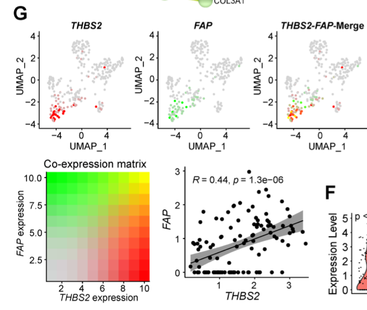

欢迎关注“小丫画图”公众号，回复“小白”，看小视频，实现点鼠标跑代码。

小丫微信: epigenomics  E-mail: figureya@126.com

作者：古潇，他的更多作品看这里<https://k.koudai.com/uH4zuEWC>

小丫编辑校验

```{r setup, include=FALSE}
knitr::opts_chunk$set(echo = TRUE)
```

# 需求描述

用来展示单细胞的基因共表达。用2种颜色分别映射2个基因的表达量/连续变量，然后merge展示，有点像免疫荧光实验的merge效果，颜色不是固定值，映射到连续性表达量的也是渐变色。



出自<https://www.thno.org/v12p3104.htm>

Figure 5. scRNA-seq analysis reveals subsets of CAFs as the major source of THBS2 production. 

G, UMAP plots showing the co-expression of THBS2 and FAP across individual single CAFs. 
Red/green dots represent CAFs expressing THBS2+ only/FAP+ only (upper left/middle panels), respectively, and yellow dots indicate CAFs co-expressing THBS2 and FAP only (upper right panel); 
lower left panel showing the **co-expression matrix** across CAFs with different expression of FAP and THBS2; 
lower right panels showing the **correlation (Pearson)** between THBS2 and FAP across THBS2+ CAFs. 
(1) Strong correlation: Pearson`s r ≥ 0.8; 
(2) Moderate: 0.5 ≤ Pearson`s r < 0.8; 
(3) Weak: 0.3 ≤ Pearson`s r < 0.5; 
(4) No correlation: Pearson`s r < 0.3). 
The darker the color, the higher the expression level of the indicated markers. Of note, only a minority of CAFs co-express high THBS2 and FAP.

# 应用场景

展示单细胞的基因共表达，以及共表达基因相关性。

更多单细胞FigureYa看这里<https://k.youshop10.com/McawGY6=>

相关性展示FigureYa看这里<https://k.youshop10.com/Eig1YOB4>

# 环境设置

使用国内镜像安装包

```{r}
options("repos"= c(CRAN="https://mirrors.tuna.tsinghua.edu.cn/CRAN/"))
options(BioC_mirror="http://mirrors.tuna.tsinghua.edu.cn/bioconductor/")
# devtools::install_github('satijalab/seurat-data')
```

加载包

```{r}
library(Seurat)
library(SeuratData)
library(ggplot2)
library(ggpubr)
library(patchwork)
library(magrittr)
Sys.setenv(LANGUAGE = "en") #显示英文报错信息
options(stringsAsFactors = FALSE) #禁止chr转成factor
```

# 输入文件

使用最常用的SeuratData中的pbmc3k进行演示。

```{r}
# 下载pbmc3k数据作为示例数据
# InstallData("pbmc3k")

# load dataset
LoadData("pbmc3k")
```

# 数据前期预处理

```{r}
# pbmc3k包含2700个细胞
pbmc3k

# 计算线粒体基因比例
pbmc3k[["percent.mt"]] <- PercentageFeatureSet(pbmc3k, pattern = "^MT-")

# 质控数据可视化
VlnPlot(pbmc3k, features = c("nFeature_RNA", "nCount_RNA", "percent.mt"), ncol = 3)

plot1 <- FeatureScatter(pbmc3k, feature1 = "nCount_RNA", feature2 = "percent.mt")
plot2 <- FeatureScatter(pbmc3k, feature1 = "nCount_RNA", feature2 = "nFeature_RNA")
plot1 + plot2

# 通过控制基因数和线粒体基因比例过滤掉低质量细胞，过滤完后剩余2638
pbmc3k <- subset(pbmc3k, subset = nFeature_RNA > 200 & nFeature_RNA < 2500 & percent.mt < 5)
pbmc3k

# 进行normalize并计算高变异基因
pbmc3k <- NormalizeData(pbmc3k, normalization.method = "LogNormalize", scale.factor = 10000)
pbmc3k <- FindVariableFeatures(pbmc3k, selection.method = "vst", nfeatures = 2000)

# Scale数据
all.genes <- rownames(pbmc3k)
pbmc3k <- ScaleData(pbmc3k, features = all.genes)

# PCA
pbmc3k <- RunPCA(pbmc3k, features = VariableFeatures(object = pbmc3k))


#DimHeatmap(pbmc3k, dims = 1:30, cells = 500, balanced = TRUE)
pbmc3k <- JackStraw(pbmc3k, num.replicate = 100)
pbmc3k <- ScoreJackStraw(pbmc3k,dims = 1:20)
JackStrawPlot(pbmc3k, dims = 1:20)
ElbowPlot(pbmc3k)

# 选择前10个pc基因降维
npcs = 1:10
pbmc3k <- FindNeighbors(pbmc3k, dims = npcs)
pbmc3k <- FindClusters(pbmc3k, resolution = 0.5)
pbmc3k <- RunUMAP(pbmc3k, dims = 1:10)

DimPlot(pbmc3k, reduction = "umap", label = T, pt.size = 1,raster = F)+
  theme(aspect.ratio = 1)

DimPlot(pbmc3k, reduction = "umap", group.by = "seurat_annotations",label = T, pt.size = 1,raster = F)+
  theme(aspect.ratio = 1)+
  NoLegend()

#save(pbmc3k, file = "./pbmc3k_anno_CellType.rdata")
```

# 开始画图

选择CD3G和CD247这两个T细胞marker基因进行基因共表达可视化

```{r, fig.width=12, fig.height=4}
# FeaturePlot绘制UMAP图上共表达基因展示，blend设置为TRUE
FeaturePlot(pbmc3k.final, features = c("CD3G", "CD247"), 
            blend = TRUE, 
            cols = c("gray80","red", "green"), 
            pt.size = 0.5, raster = F) +  
  theme(aspect.ratio = 1)

ggsave("UMAP_co-expression matrix.pdf", width = 12, height = 4)
```

自定义函数，用于计算共表达基因相关性并可视化

```{r}
# object对seurat对象，gene1和gene2为两个共表达基因名，cor.method为计算各相关性方法，可选spearman或pearson,
# 为了防止所有数据聚集在一起，这是jitter.num使数据进行轻微抖动，设置为0则为原始数据绘图，
# pos若为TRUE，怎只使用两个基因都表达的细胞计算相关性，可避免好多细胞中对其中一个细胞表达量为0

getScatterplot <- function(object, gene1, gene2, cor.method = "spearman",
                           jitter.num = 0.15, pos = TRUE){
  if (!gene1 %in% rownames(object)) {
    print("gene1 was not found")
    if (!gene2 %in% rownames(object)) {
      print("gene2 was not found")
    }
  }else{
    exp.mat <- GetAssayData(object = object, assay = "RNA") %>% .[c(gene1,gene2),] %>% 
      as.matrix() %>% t() %>% as.data.frame()
    if (pos) {
      exp.mat <- exp.mat[which(exp.mat[,1] > 0 & exp.mat[,2] > 0),]
    }
    plots <- ggplot(data=exp.mat, mapping = aes_string(x = gene1, y = gene2)) + 
      geom_smooth(method = 'lm', se = T, color='red', size=1)+
      stat_cor(method = cor.method)+ 
      geom_jitter(width = jitter.num, height = jitter.num, color = "black", size = 1, alpha=1)+
      theme_bw()+
      theme(panel.grid=element_blank(),
            legend.text=element_text(colour= 'black',size=10),
            axis.text= element_text(colour= 'black',size=10),
            axis.line= element_line(colour= 'black'),
            panel.border = element_rect(size = 1, linetype = "solid", colour = "black"),
            panel.background=element_rect(fill="white"))
    return(plots)
  }
}
```

计算共表达基因相关性，并可视化

```{r}
getScatterplot(pbmc3k, gene1 = "CD3G", gene2 = "CD247", 
               jitter.num = 0.15, pos = TRUE) +
  theme(aspect.ratio = 1)
ggsave("correlation_dotplot.pdf")

getScatterplot(pbmc3k, gene1 = "CD3G", gene2 = "CD247", 
               jitter.num = 0, pos = FALSE) +
  theme(aspect.ratio = 1)
```

# Session Info

```{r}
sessionInfo()
```