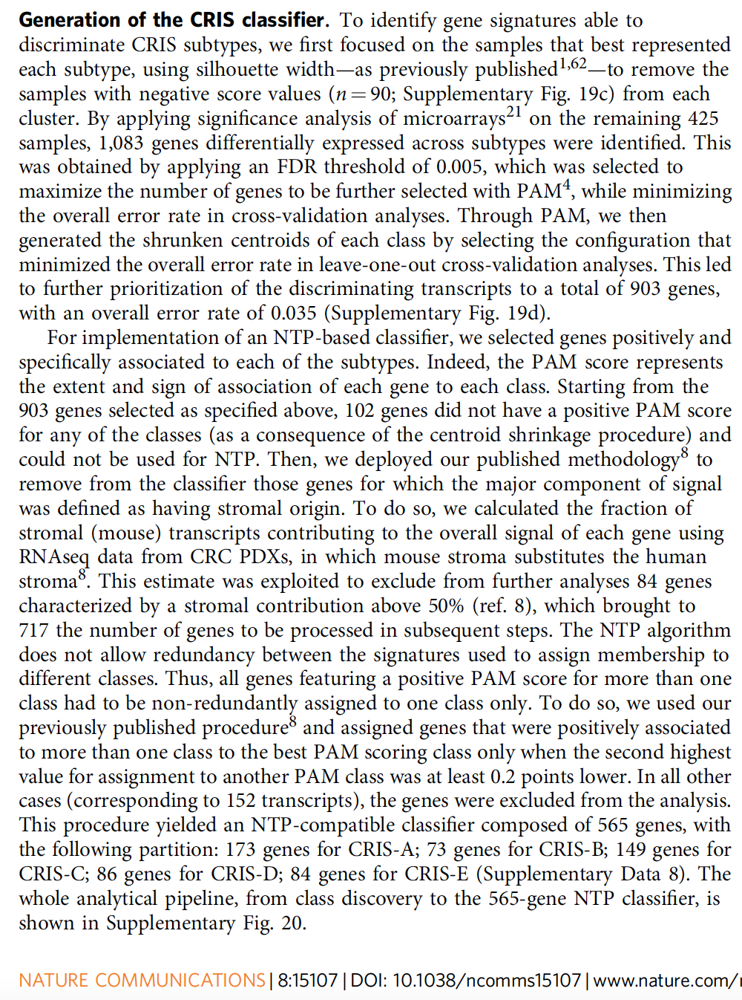
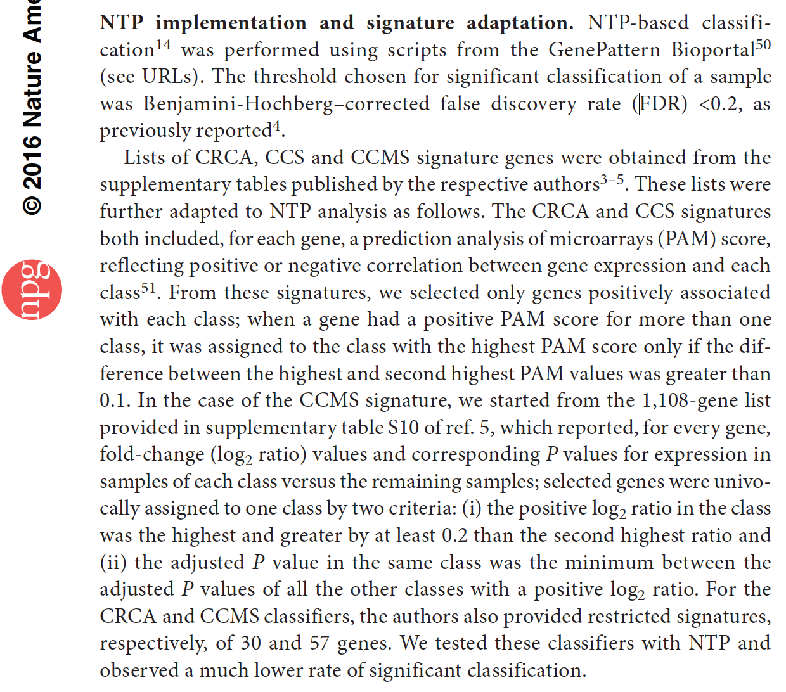
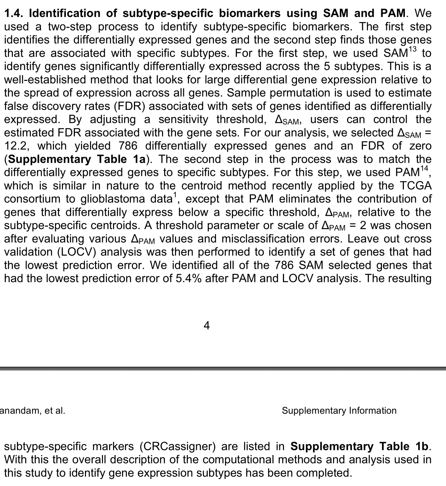

欢迎关注“小丫画图”公众号，回复“小白”，看小视频，实现点鼠标跑代码。

小丫微信: epigenomics  E-mail: figureya@126.com

作者：大鱼海棠，他的更多作品看这里<https://k.koudai.com/OFad8N0w>

单位：中国药科大学国家天然药物重点实验室，生物统计与计算药学研究中心
      法国斯特拉斯堡遗传与分子生物研究所，癌症功能基因组研究室

小丫编辑校验

```{r setup, include=FALSE}
knitr::opts_chunk$set(echo = TRUE)
```

# 需求描述

我想众筹个找出分子亚型中的特异marker并用NTP预测外部数据亚型的，分别是这两篇文章中的方法，作者是同一个人。



出自<https://www.nature.com/articles/ncomms15107>



出自<https://www.nature.com/articles/ng.3224>

就是从表达谱数据已知样本分型情况下，找出每个亚型特异的marker，再用NTP预测亚型，其中的PAM过程不懂。

这篇文章也是差不多的方法，方法写在文章附件里：



出自<https://www.nature.com/articles/nm.3175>

大鱼海棠的MOVICS包其实有NTP预测亚型的，但是他是直接选亚型特异表达的靠前的基因，没有用PAM这些筛选方法。这里将实现用PAM筛选。

# 应用场景

利用PAM算法根据某感兴趣分类筛选特异性marker，生成模版后利用NTP算法进行分类预测。

问题挺好的，用模型的方式找marker再预测，而不是直接定义前多少位高表达或低表达来构建marker。

参考资料见Literatures文件夹。

# 环境设置

使用国内镜像安装包

```{r}
options("repos"= c(CRAN="https://mirrors.tuna.tsinghua.edu.cn/CRAN/"))
options(BioC_mirror="http://mirrors.tuna.tsinghua.edu.cn/bioconductor/")
BiocManager::install("pamr")
```

加载包

```{r}
library(CMScaller)
library(pamr)
library(cluster)

Sys.setenv(LANGUAGE = "en") #显示英文报错信息
options(stringsAsFactors = FALSE) #禁止chr转成factor
```

# 输入文件

gse17536.expr.txt，GEO结直肠癌表达谱文件。可前往语雀下载<https://www.yuque.com/figureya/figureyaplus/easyinput>

```{r}
# 读取GEO结直肠癌表达谱文件
expr <- read.delim(file = "gse17536.expr.txt",sep = "\t",row.names = 1,check.names = F,stringsAsFactors = F,header = T)

# 对行名进行标准化，重复基因取均值
expr$gene <- sapply(strsplit(rownames(expr)," /// "), "[",1)
expr <- apply(expr[,setdiff(colnames(expr), "gene")], 2, function(x) tapply(x, INDEX=factor(expr$gene), FUN=mean, na.rm=TRUE))
expr <- as.data.frame(expr)
```

# 利用PAM算法筛选特异性marker

```{r}
# 先使用CMScaller算法内置的模版来确定该结直肠癌的分型（默认为金标准）
cms.true <- CMScaller(
  emat = t(scale(t(expr), center = T, scale = T)), # 表达谱，需要进行标准化
  templates = CMScaller::templates.CMS, # 已发表的结直肠癌共识亚型模版
  rowNames = "symbol", # 表达谱行名类型
  RNAseq = FALSE, # 表达谱非RNAseq
  nPerm = 1000, # 扰动次数
  seed = 123456, # 种子
  FDR = 1, # 不筛选，给出所有样本的可能预测
  doPlot = TRUE, # 绘图
  verbose = TRUE
)
cms.df <- data.frame(samID = colnames(expr),
                     CMS.true = as.character(cms.true$prediction),
                     row.names = colnames(expr))

# 构建PAM算法所需要的输入
mydata <- list(x = as.matrix(expr),     # 表达矩阵
               y = cms.df$CMS,          # 样本分类
               geneid = rownames(expr)) # 特征名称

# 生成pam score
pam.res <- pamr.train(mydata) # 训练模型
pam.res.cv <- pamr.cv(fit = pam.res, data = mydata)  # 交叉验证选择最优阈值
pam.score <- pamr.listgenes(fit = pam.res, data = mydata,  # 计算各特征的pam score
                            threshold = pam.res.cv$threshold[which.min(pam.res.cv$error)])

# 保存到文件
write.table(pam.score, "output_pam.score.txt", row.names = F, sep = "\t", quote = F)
```

# 利用NTP算法进行分类预测

自定义函数以读取pam矩阵，生成NTP模板。

```{r fig.width=7, fig.height=7}
FilterPAM <- function(pam.df, probeCol = "id"){ 
  # pam.df：pamr生成的pam数据框,应当只保留特征名列和各类的pam得分
  # probeCol：pam.df中表征特征名称的列
  pamCol <- match(setdiff(colnames(pam.df), probeCol), colnames(pam.df)) 
  keepGene <- apply(pam.df[, pamCol], 1, function(x){  # 基因的筛选标准
    x = sort(x, decreasing = T)
    if (sum(x>0) == 1) return(T)                          # 保留只在一个类里pam得分为正的特征
    else if (sum(x>0) > 1 & (x[1]-x[2])>0.1) return(T)    # 保留即使有在多个类别里pam得分为正，但是最大值比第二大的值多超过0.1的特征
    else return(F)                                        # 除此之外剔除
  })
  message(sum(keepGene), " genes are identified as predictors")
  
  pam.df <- pam.df[keepGene, ]                            # 剔除不保留的特征
  pam.df <- reshape2::melt(pam.df, id.vars = probeCol)    # 重整为基因-特征-pam得分列表
  pam.df <- dplyr::arrange(pam.df, -pam.df$value)
  pam.df <- pam.df[!duplicated(pam.df[[probeCol[1]]]), -ncol(pam.df)] # 保留各基因pam得分最高的类别
  colnames(pam.df) <- c("probe", "class")
  return(pam.df)
}
```

使用FilterPAM函数将pam score转化为NTP模板

```{r}
pam.score <- read.table("output_pam.score.txt", sep = "\t", header = T) # 读取pam.score（不读取可能导致数据存在双引号，运行函数会报错）

# 将pam score转化为NTP模板
templates <- FilterPAM(pam.df = pam.score, probeCol = c("id"))
table(templates$class)
```

应用此时构建的模版，再次利用NTP进行预测

```{r fig.width=7, fig.height=7}
cms.pred <- ntp(emat = t(scale(t(expr), center = T, scale = T)), # emat的行名，应当与模板的probe列为同一类型
                templates = templates, # 构建的NTP模板
                nPerm = 1000,
                seed = 123456,
                doPlot = TRUE,
                verbose = TRUE
)
dev.copy2pdf(file = "ntpheatmap using pam selected template.pdf", width = 5,height = 5)

cms.df$CMS.pred <- as.character(cms.pred$prediction)
table(cms.df$CMS.true, cms.df$CMS.pred) # 基因完美预测
```

# Session Info

```{r}
sessionInfo()
```