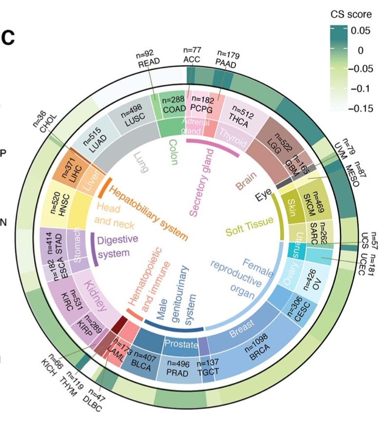

欢迎关注“小丫画图”公众号，回复“小白”，看小视频，实现点鼠标跑代码。

小丫微信: epigenomics  E-mail: figureya@126.com

作者：大鱼海棠，他的更多作品看这里<https://k.koudai.com/OFad8N0w>

单位：中国药科大学国家天然药物重点实验室，生物统计与计算药学研究中心

小丫编辑校验

```{r setup, include=FALSE}
knitr::opts_chunk$set(echo = TRUE)
```

# 需求描述

想知道这个图是怎么画的。



出自<https://academic.oup.com/bib/article/23/3/bbac118/6567704?login=true>

Figure1. Comprehensive quantification of senescence levels in cancers and tissues.
(C) Average CS scores in individual cancer types. Tissue types, cancer types and average CS scores are shown from the inner circle to the outer circle.

# 应用场景

在泛癌中根据组织类别、特定评分，绘制弦图。

文中多个图可以用我们众筹过的FigureYa来实现：

- Figure 4F ligand–receptorinteractions，可参考FigureYa178ReceptorLigand <https://k.youshop10.com/BWjYsgX=>
- Figure 6B，可参考FigureYa35批量bestSeparation <https://k.youshop10.com/nesUttBS>
- Figure 6E Consensus clustering，可参考FigureYa202consensusGene <https://k.youshop10.com/dNHdlWen>
- FigureYa 6G Sankey diagram，可参考FigureYa25sankey <https://k.youshop10.com/1vm3In-4>
- FigureYa 6H Hierarchical clustering of GSEA scores，可参考FigureYa71ssGSEA <https://k.youshop10.com/hhH631te>
- 更多pancancer数据分析展示可参考<https://k.youshop10.com/C8RkTgR3>
- 更多单细胞分析及展示可参考<https://k.youshop10.com/McawGY6=>
- 更多圆圈图画法可参考<https://k.youshop10.com/Ch9kUjuR>

# 环境设置

使用国内镜像安装包

```{r}
options("repos"= c(CRAN="https://mirrors.tuna.tsinghua.edu.cn/CRAN/"))
options(BioC_mirror="http://mirrors.tuna.tsinghua.edu.cn/bioconductor/")

```

加载包

```{r}
library(circlize)
library(ComplexHeatmap)

Sys.setenv(LANGUAGE = "en") #显示英文报错信息
options(stringsAsFactors = FALSE) #禁止chr转成factor
```

# 输入文件的生成

easy_input.xlsx，这里随机生成图中的得分CS.score，可替换成你自己感兴趣的其他数值。
如果还是画pancancer图，前面各列可以保持不变，只改变最后一列CS.score里的数值。
不限于展示pancancer数据，读懂画图部分的代码，就可以灵活运用。

```{r eval=FALSE}
## 输入队列信息（队列名称、各队列样本数、需要绘制的得分）
CohortInfo <- data.frame(
  "Cohort" = c("ACC", "PCPG", "PAAD", "THCA", "LGG", "GBM", "UVM", "MESO",
               "SKCM", "SARC", "UCS", "UCEC", "OV", "CESC", "BRCA", "TGCT",
               "PRAD", "BLCA", "LAML", "DLBC", "THYM", "KICH", "KIRP", "KIRC",
               "ESCA", "STAD", "HNSC", "LIHC", "CHOL", "LUAD", "LUSC", "READ", "COAD"),
  "Number" = c(77, 182, 179, 512, 522, 165, 79, 87,
               469, 262, 57, 181, 426, 306, 1098, 137,
               496, 407, 173, 47, 119, 66, 289, 531,
               182, 414, 520, 371, 36, 515, 498, 92, 288),
  "CS.score" = runif(33) # 随机生成的CS得分
)
Class1 <- c("ACC" = "Secretory gland", "PCPG" = "Secretory gland", "PAAD" = "Secretory gland", "THCA" = "Secretory gland",
            "MESO" = "Soft Tissue", "SKCM" = "Soft Tissue", "SARC" = "Soft Tissue", 
            "UCS" = "Female\nreproductive\norgan", "UCEC" = "Female\nreproductive\norgan",
            "OV" = "Female\nreproductive\norgan", "CESC" = "Female reproductive\norgan",
            "BRCA" = "Female\nreproductive organ", "TGCT" = "Male genitourinary system",
            "PRAD" = "Male genitourinary system", "BLCA" = "Male genitourinary system",
            "LAML" = "Hematopoietic\nand immune", "DLBC" = "Hematopoietic\nand immune", 
            "THYM" = "Hematopoietic\nand immune", "ESCA" = "Digestive\nsystem", 
            "STAD" = "Digestive\nsystem", "HNSC" = "Head and neck", "LIHC" = "Hepatobiliary system")
Class2 <- c("ACC" = "Adrenal\ngland", "PCPG" = "Adrenal\ngland", "THCA" = "Thyroid",
            "LGG" = "Brain", "GBM" = "Brain", "UVM" = "Eye", "SKCM" = "Skin", 
            "UCS" = "Uterus", "UCEC" = "Uterus", "OV" = "Ovary", 
            "BRCA" = "Breast", "PRAD" = "Prostate", "KIRP" = "Kidney", "KIRC" = "Kidney",
            "ESCA" = "Stomach", "STAD" = "Stomach", "HNSC" = "Head\nand neck", "LIHC" = "Liver",
            "LUAD" = "Lung", "LUSC" = "Lung", "READ" = "Colon", "COAD" = "Colon")

## 转换为样本信息（每个样本为一行）
## 注意安排好队列顺序，保证同类队列相邻
## Cohort、Class1和Class2用于区分不同分区
## CohortLabel、Class1Label和Class2Label用于绘制标识文字
SampleInfo <- data.frame("Cohort" = rep(CohortInfo$Cohort, CohortInfo$Number))
rownames(SampleInfo) = paste0("Sample", 1:nrow(SampleInfo))
SampleInfo$Class1 <- plyr::mapvalues(x = SampleInfo$Cohort, from = names(Class1), to = Class1)
SampleInfo$Class1 <- ifelse(test = SampleInfo$Class1%in%Class1, yes = SampleInfo$Class1, no = NA)
SampleInfo$Class2 <- plyr::mapvalues(x = SampleInfo$Cohort, from = names(Class2), to = Class2)
SampleInfo$CohortLabel <- paste0("n=", CohortInfo$Number[match(SampleInfo$Cohort, CohortInfo$Cohort)], "\n", SampleInfo$Cohort)
SampleInfo$Class1Label <- ifelse(test = SampleInfo$Class1%in%Class1, yes = SampleInfo$Class1, no = NA)
SampleInfo$Class2Label <- ifelse(test = SampleInfo$Class2%in%Class2, yes = SampleInfo$Class2, no = NA)
SampleInfo$CS.score <- CohortInfo$CS.score[match(SampleInfo$Cohort, CohortInfo$Cohort)]
openxlsx::write.xlsx(SampleInfo, "easy_input.xlsx")
```

读取输入文件

```{r}
SampleInfo <- openxlsx::read.xlsx("easy_input.xlsx")
head(SampleInfo)
```

# 开始画图

颜色配置

```{r}
## 指示各环对应颜色
Cohort.Col <- c("ACC" = "#F5CCDC", "PCPG" = "#FED9EA", "PAAD" = "#F6B5B6", "THCA" = "#EEDEED",
                "LGG" = "#AE8780", "GBM" = "#C59B95", "UVM" = "#7B7C75", "MESO" = "#F7F7BC",
                "SKCM" = "#D0D36F", "SARC" = "#E5E6AB", "UCS" = "#88C4A8", "UCEC" = "#79D9E4",
                "OV" = "#D8F3FA", "CESC" = "#83C3E4", "BRCA" = "#91BBE5", "TGCT" = "#71A5D0",
                "PRAD" = "#76A3CC", "BLCA" = "#A0C2DD", "LAML" = "#F7908F", "DLBC" = "#ED5C64", 
                "THYM" = "#A55A5E", "KICH" = "#CE8BC0", "KIRP" = "#D2ACD1", "KIRC" = "#D8B4D5",
                "ESCA" = "#DECEE8", "STAD" = "#CAB4D8", "HNSC" = "#FBF7B8", "LIHC" = "#F0A363",
                "CHOL" = "#AA5F39", "LUAD" = "#D7E7E7", "LUSC" = "#CCD4D6", "READ" = "#98D38F",
                "COAD" = "#8BCF9D")

Class1.Col <- c("Secretory gland" = "#D079AB",
                "Soft Tissue" = "#B4B350",
                "Female\nreproductive\norgan" = "#A3C4E3",
                "Male genitourinary system" = "#38679A",
                "Hematopoietic\nand immune" = "#EA7C67",
                "Digestive\nsystem" = "#8F65A9",
                "Hepatobiliary system" = "#EC7F29")

Class2.Col <- c("Adrenal\ngland" = "#F6B7D0", "Thyroid" = "#E6CEE0",
                "Brain" = "#C28C83", "Eye" = "#585D5B",
                "Skin" = "#BCBD30", "Uterus" = "#21C2CE",
                "Ovary" = "#B6EDF9", "Breast" = "#7FA7D4",
                "Prostate" = "#5193BF", "Kidney" = "#EDD5EB",
                "Stomach" = "#C6B0D6", "Head\nand neck" = "#FDEA7E",
                "Liver" = '#FCC88F', "Lung" = "#BBC0C3",
                "Colon" = "#76C48A")

Col = c(Cohort.Col, Class1.Col, Class2.Col)
CS.Col = colorRamp2(breaks = c(0, 0.5, 1), c("#F7FBFC", "#CFE5A4", "#358988"))#连续变量所使用的颜色
```

自定义函数，用于批量标注颜色和标签

```{r}
## 用于批量标注颜色和标签的函数
SectorColor <- function(sector, col, track.index, sampleInfo, currentCol, standardCol = "Cohort", ...){
  ## sector：需要绘制的区域（可为多个区域）
  ## col：区域所绘制的颜色
  ## track.index：在第几环（从外向内数）绘制
  ## sampleInfo：样本信息
  ## currentCol：绘制区域（sector）使用的哪一列的分类方法
  ## standardCol：样本最基础的分类列（通常即为队列来源）
  cohorts.to.plot = unique(SampleInfo[[standardCol]][SampleInfo[[currentCol]] %in% sector])
  st.degree = max(unlist(lapply(cohorts.to.plot, get.cell.meta.data, name = "cell.start.degree")))
  ed.degree = min(unlist(lapply(cohorts.to.plot, get.cell.meta.data, name = "cell.end.degree")))
  
  draw.sector(start.degree = st.degree, end.degree = ed.degree,
              rou1 = get.cell.meta.data("cell.top.radius", track.index = track.index),
              rou2 = get.cell.meta.data("cell.bottom.radius", track.index = track.index),
              col = col[sector], ...)
}

SectorLabel <- function(sector, col, track.index, sampleInfo, currentCol, standardCol = "Cohort", niceFacing = T, ...){
  ## sector：需要绘制的区域（可为多个区域）
  ## col：区域所绘制的颜色
  ## track.index：在第几环（从外向内数）绘制
  ## sampleInfo：样本信息
  ## currentCol：绘制区域（sector）使用的哪一列的分类方法
  ## standardCol：样本最基础的分类列（通常即为队列来源）
  ## niceFacing：是否自动调整样本角度
  plot.data = sampleInfo[sampleInfo[[currentCol]] %in% sector, ]
  plot.data = plot.data[round(0.5*nrow(plot.data)), ]
  circos.text(x = plot.data$ID, y = 0.5, labels = sector, sector.index = plot.data$Cohort, track.index = track.index, col = col, niceFacing = niceFacing, ...)
}
```

绘制图

```{r fig.width=10, fig.height=10}
SampleInfo$Cohort <- factor(SampleInfo$Cohort, levels = unique(SampleInfo$Cohort)) # 将Cohort转为因子变量，保证顺序不乱
SampleInfo$ID <- 1:nrow(SampleInfo) # 手动编序号，以便后续打标签时确定位置

### 初始化
circos.par("cell.padding" = c(0.02, 0.00, 0.02, 0.00), "start.degree" = 90) # 设置起始角度
circos.initialize(sectors = SampleInfo$Cohort, x = SampleInfo$ID) # 设置弦图分区

### 第一环：连续变量，对每一个样本分别绘制热图，通过col参数调整所绘制的列和需要的配色
circos.trackPlotRegion(ylim = c(0, 1), track.height = 0.05, cell.padding = c(0, 1))
for (i in 1:nrow(SampleInfo)) circos.rect(xleft = SampleInfo$ID[i], xright = SampleInfo$ID[i]+1, ybottom = 0, ytop = 1, 
                                          sector.index = SampleInfo$Cohort[i], track.index = 1, border = NA, col = CS.Col(SampleInfo$CS.score[i]))

### 第二环：分类变量，为最基础的队列信息，所使用的颜色存储在Col中
circos.trackPlotRegion(ylim = c(0, 1), track.height = 0.2)
for (i in unique(SampleInfo$Cohort)) SectorColor(sector = i, col = Col, track.index = 2, sampleInfo = SampleInfo, currentCol = "Cohort") #绘制队列颜色
for (i in unique(SampleInfo$CohortLabel)) SectorLabel(sector = i, col = "black", track.index = 2, sampleInfo = SampleInfo, currentCol = "CohortLabel") # 绘制队列标签

### 第三环：分类变量，所使用的颜色存储在Col中
circos.trackPlotRegion(ylim = c(0, 1), track.height = 0.2)
for (i in unique(SampleInfo$Class2)) SectorColor(sector = i, col = Col, track.index = 3, sampleInfo = SampleInfo, currentCol = "Class2") #绘制队列颜色
for (i in unique(SampleInfo$Class2Label)) SectorLabel(sector = i, col = "white", track.index = 3, sampleInfo = SampleInfo, currentCol = "Class2Label") # 绘制队列标签

### 第四环：分类变量，所使用的颜色存储在Col中
#### 此处仿照原图对文字进行了调整
#### niceFacing = F：不自动调整文字角度（自动调整会使得部分文字向环外延申）
#### facing = "clockwise"：使文字垂直于环形
#### pos = 2：文字右对齐
circos.trackPlotRegion(ylim = c(0, 1), track.height = 0.05, bg.lty = "blank")
for (i in unique(SampleInfo$Class1)) SectorColor(sector = i, col = Col, track.index = 4, sampleInfo = SampleInfo, currentCol = "Class1", lty = "blank") #绘制队列颜色
for (i in unique(SampleInfo$Class1Label)) SectorLabel(sector = i, col = "black", track.index = 4, sampleInfo = SampleInfo, currentCol = "Class1Label", niceFacing = F, facing = "clockwise", pos = 2) # 绘制队列标签
circos.clear()

#### 添加连续变量的图例
lgd = Legend(col_fun = CS.Col, title = "CS.score")
draw(lgd, x = unit(0.9, "npc"), y = unit(0.1, "npc"))
dev.copy2pdf(file = "pancircos.pdf", width = 10, height = 10)
```

# 后期加工

有些type的样本量较少，文字会重叠，可参考例文的方式调整。输出的pdf文件是矢量图，可以用Illustrator等矢量图编辑器打开，编辑文字的位置，增加指示线。

# Session Info

```{r}
sessionInfo()
```