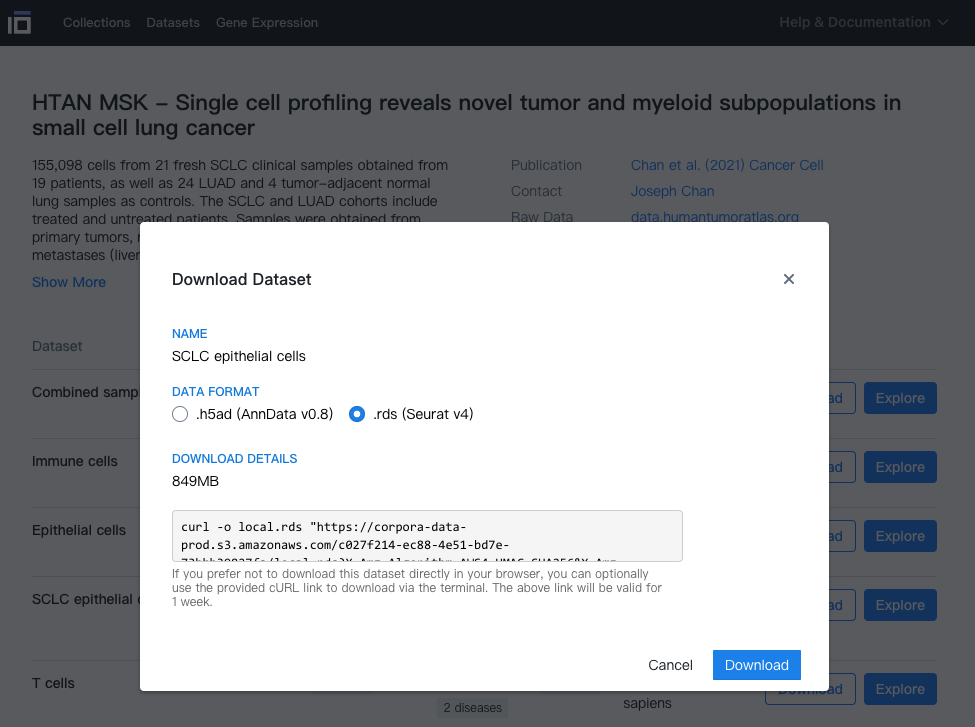

欢迎关注“小丫画图”公众号，回复“小白”，看小视频，实现点鼠标跑代码。

小丫微信: epigenomics  E-mail: figureya@126.com

作者：Jarning，他的更多作品看这里<https://k.koudai.com/BXEtOldY>

小丫编辑校验

```{r setup, include=FALSE}
knitr::opts_chunk$set(echo = TRUE)
```

# 需求描述

对于单细胞数据，使用MAGIC-knnDREMI计算与某个基因协同表达的基因模块，这篇文章通篇都用了MAGIC，将MAGIC结果在umap图上展示等。


出自<https://linkinghub.elsevier.com/retrieve/pii/S1535610821004979>

Figure S3. Related to Figures 3 and 4 and to Table S2.
(E) Scaled expression (z-score, imputed by MAGIC with k = 30, t = 3) of genes with high knnDREMI conditioned on PLCG2 > 1 (rows), with cells ordered by PLCG2 expression (columns). 
For visualization, expression was smoothed over the ordered cells with a rolling window of 100 cells. 
Hierarchical clustering of genes on the unsmoothed, imputed expression was performed with complete linkage and Pearson correlation as a distance metric, identifying 3 gene modules that predict low, medium, and high PLCG2 (purple, gray, and yellow respectively) (Table S13). 
Top annotations include PLCG2 expression and SCLC subtype.

# 应用场景

MAGIC特别有利于找时序变化基因、度量基因间的关系。发表MAGIC算法的Cell是更加高级的应用，可参考FigureYa177RNAvelocity <https://k.youshop10.com/RNHFyO4a>，有讲解视频。强烈推荐拖到视频的32分，听Jarning讲解那篇Cell文章使用MAGIC的思路，帮你找单细胞的时序变化基因、度量基因间的关系<https://mp.weixin.qq.com/s/2HRXZicyzHmrsFWUJ9JKdQ>。

# 环境设置

使用国内镜像安装包

```{r eval=FALSE}
options("repos"= c(CRAN="https://mirrors.tuna.tsinghua.edu.cn/CRAN/"))
options(BioC_mirror="http://mirrors.tuna.tsinghua.edu.cn/bioconductor/")
BiocManager::install("biomaRt")
install.packages("arrow") # for store large matrix, data.frame or data.table

# 
install.packages("reticulate")
reticulate::install_miniconda() # if no conda env in your PC or server
reticulate::py_install("magic-impute") # this will install py packages: `magic` and `scprep`
install.packages("Rmagic") # R interface for magic package
```

加载包

```{r}
library(biomaRt)
library(Seurat)
library(tidyverse)
library(ComplexHeatmap)

Sys.setenv(LANGUAGE = "en") #显示英文报错信息
options(stringsAsFactors = FALSE) #禁止chr转成factor
```

# 输入文件

SCLC_epithelial_cells.rds，Seurat对象。作者已将例文的数据上传至<https://data.humantumoratlas.org/>，点击链接下载<https://cellxgene.cziscience.com/collections/62e8f058-9c37-48bc-9200-e767f318a8ec>，然后保存至data文件夹。




1. 将ENSEMBL GENE ID转换为GENE NAME

2. 读取Seurat对象，将基因表达矩阵转存为arrow-feather格式，作为MAGIC的输入

```{r}
seu <- readRDS("data/SCLC_epithelial_cells.rds")
dir.create("tmp.data")
saveRDS(seu@meta.data, "tmp.data/SCLC_epithelial_cells.cellmeta.rds")
```

```{r eval=FALSE}
ensembl <- useEnsembl(biomart = "ENSEMBL_MART_ENSEMBL", version = 98)
hg38.ens <- useDataset(dataset = "hsapiens_gene_ensembl", mart = ensembl, verbose = 98)

results <- getBM(attributes = c('ensembl_gene_id', "external_gene_name", 'gene_biotype', 'chromosome_name'),
                 filters = 'ensembl_gene_id',
                 values = rownames(seu), 
                 mart = hg38.ens)

results$uniq.name <- ifelse(duplicated(results$external_gene_name), 
                            paste(results$ensembl_gene_id, results$external_gene_name, sep = "-"),
                            results$external_gene_name)
rownames(results) <- results$ensembl_gene_id
results <- results[rownames(seu), ]

saveRDS(results, "data/gene.info.rds")
```

```{r}
results <- readRDS("data/gene.info.rds")
all(results$ensembl_gene_id == rownames(seu)) # should be TRUE

counts <- seu[["RNA"]]@counts
rownames(counts) <- results$uniq.name

# !important: the unexpressed genes should be removed.
expr.in.cells <- Matrix::rowSums(counts > 0)
summary(expr.in.cells)
selected.genes <- expr.in.cells > 500 # only genes expressed > 500 cells were kept.
table(selected.genes)
counts <- counts[selected.genes, ]

seu <- CreateSeuratObject(counts, meta.data = seu@meta.data)
rm("counts")
gc()
```

# MAGIC-knnDREMI

```{r}
# 参数说明
# knn = 30 (Default: 30)
# t = 3    (Default：3)
# npca = 56 (Default：100) 作者提供的Seurat中包含有56 PCs
# n.jobs = 20 依据自己的机器配置灵活调整

# Imputation.
seu <- Rmagic::magic(seu, knn = 30, t = 3, npca = 56, n.jobs = 20)

target.file <- "tmp.data/SCLC_epithelial_cells.MAGIC_RNA.feather"

if (!file.exists(target.file)) {
  imputed.matrix <- t(as.data.frame(seu[["MAGIC_RNA"]]@data))
  imputed.matrix <- as_tibble(imputed.matrix)
  arrow::write_feather(imputed.matrix, target.file)
  writeLines(colnames(seu), "tmp.data/SCLC_epithelial_cells.MAGIC_RNA.feather.cellnames.txt")
}

# Calculate DREMI scores
source("R/magic_utils.R")
if (!exists("imputed.matrix")) {
  imputed.matrix <- arrow::read_feather(target.file)
}

# test: PLCG2 & MTRNR2L12
dremi.res.1 <- CalculateKnnDREMI(imputed.matrix = imputed.matrix, 
                                 source.gene = "PLCG2", 
                                 target.genes = "MTRNR2L12", 
                                 return.drevi = T,
                                 n.cores = 1)

DREVIPlot(dremi.res.1$drevi$MTRNR2L12, bins = 20) + labs(x = "PLCG2", y = "MTRNR2L12")

# run KnnDREMI: all genes
dremi.res <- CalculateKnnDREMI(imputed.matrix = imputed.matrix, 
                               source.gene = "PLCG2", 
                               target.genes = NULL, # all genes
                               return.drevi = F,
                               n.cores = 20)
write.table(dremi.res$dremi, "tmp.data/PLCG2.DREMI.tsv", row.names = F, sep = "\t", quote = F)
```


# 开始画图

复现文中的S3E

```{r, fig.width=5, fig.height=4}
dremi <- read.table("tmp.data/PLCG2.DREMI.tsv", header = T, sep = "\t")

dremi <- arrange(dremi, desc(dremi_score))

ggplot(dremi, aes(dremi_score)) + 
  geom_density(color = "red", fill = "red", alpha = .3) + 
  geom_vline(xintercept = 1, linetype = "dashed", color = "blue") + 
  theme_classic(base_size = 14)
```

TableS12.csv，来自例文Supplemental information. Gene modules with high knnDREMI conditioned on PLCG2, divided by low, medium, and high PLCG2 expression, related to Figure S3

```{r}
PLCG2.related.genes <- dremi %>% 
  subset(dremi_score > 1)

# 文章一共鉴定出了78个和PLCG2表达相关的基因
PLCG2.module <- read.csv("data/TableS12.csv", header = F, col.names = c("gene", "module"))

sapply(unique(PLCG2.module$module), function(m) {
  xx <- subset(PLCG2.module, module == m)$gene
  length(intersect(xx, PLCG2.related.genes$gene_name)) / length(xx)
})
```

> 值得注意的是，MAGIC得到的PLCG2 related genes的重复性并不是很高。由于作者在文章中没有说明其在做imputation时候的详细步骤，因此我们无法判断问题在哪。

```{r}
PLCG2.expr <- imputed.matrix[["PLCG2"]]
names(PLCG2.expr) <- readLines("tmp.data/SCLC_epithelial_cells.MAGIC_RNA.feather.cellnames.txt")

genes.use <- PLCG2.related.genes$gene_name %>% head(100) # 我们使用前100个和PLCG2最相关的基因

data.ht <- imputed.matrix[, genes.use] %>% as.data.frame()
rownames(data.ht) <- names(PLCG2.expr)
data.ht <- scale(data.ht) %>% t()

# 构建热图所用的矩阵，行为基因，列为细胞(按照PLCG2的表达排列)
ordered.cells <- names(sort(PLCG2.expr))
data.ht <- data.ht[, ordered.cells]

# 聚类，距离=1-PCC
cor.mat <- cor(t(data.ht), method = "pearson")
hc <- hclust(d = as.dist(1-cor.mat), method = "complete")
clusters <- dendextend::cutree(hc, k = 3) # dendextend::cutree()
hc <- dendextend::color_branches(hc, k = 3, col = ggsci::pal_d3("category20")(20))
plot(hc)
```


自定义函数，Hanning filter function

```{r}
hanning.flt <- function(n = 100) {
  # Hanning filter function
  #
  # Arguments
  #   n: hanning filter window size (cells)
  
  if (n == 1)
    c <- 1
  else {
    n <- n - 1
    c <- 0.5 - 0.5 * cos(2 * pi * (0:n)/n)
  }
  return(c/sum(c))
}
```

```{r, fig.width=7, fig.height=14}
# 基因表达的平滑（仅用于可视化）
data.ht.smooth <- apply(data.ht, 1, function(xx) stats::filter(xx, hanning.flt(100)))
data.ht.smooth <- t(data.ht.smooth)

subtype.col <- ggsci::pal_d3()(3)
names(subtype.col) <- levels(seu$SCLC_major_subtype_of_sample)
col_fun = circlize::colorRamp2(c(-1, 0, 1), c("blue", "white", "red"))

column_ha = HeatmapAnnotation(
  "SCLC subtype" = seu$SCLC_major_subtype_of_sample[ordered.cells],
  PLCG2 = sort(imputed.matrix[["PLCG2"]]) %>% scale(), 
  col = list(
    "SCLC subtype" = subtype.col,
    PLCG2 = col_fun
  )
)

cluster.col <- ggsci::pal_aaas()(3)
names(cluster.col) <- unique(clusters)

row_ha = rowAnnotation(
  module = clusters,
  col = list(
    module = cluster.col
  )
)

#pdf("MAGICHeatmap.pdf", width = 7, height = 14)
Heatmap(matrix = data.ht.smooth, 
        cluster_rows = F, cluster_columns = F, 
        show_row_names = T, show_column_names = F, 
        row_names_side = "right",
        top_annotation = column_ha,
        left_annotation = row_ha,
        split = clusters,
        col = col_fun, show_heatmap_legend = F)
#dev.off()
```

# Session Info

```{r}
sessionInfo()
```
