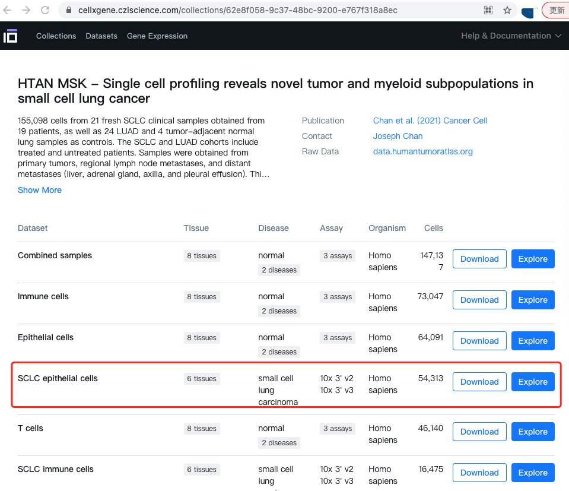
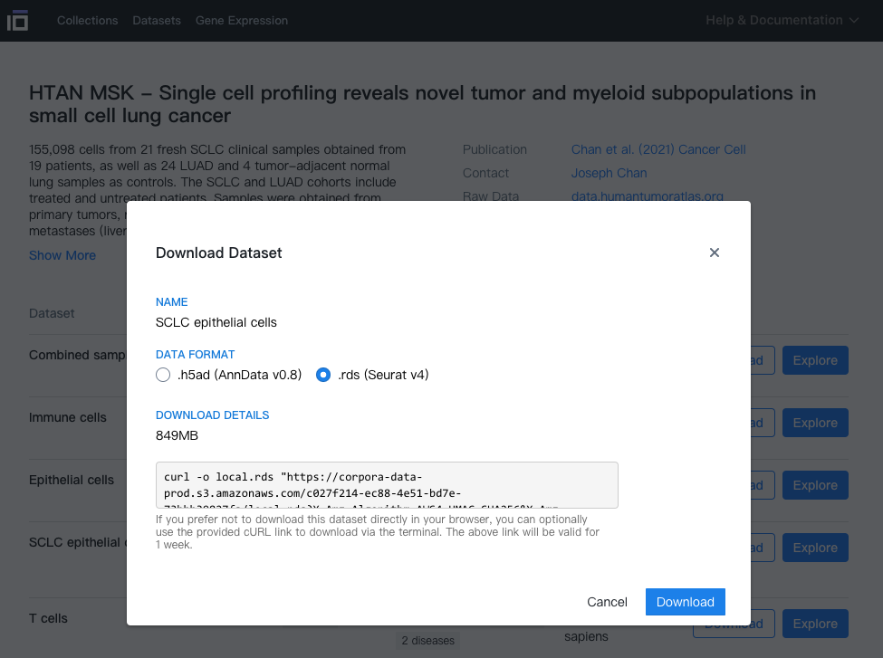

```{r setup, include=FALSE}
knitr::opts_chunk$set(echo = TRUE)
```

# 需求描述

运行FigureYa304MAGIC.rmd文档的“MAGIC-knnDREMI”可能遇到内存不足的问题。这里通过Feather格式提高硬盘IO效率，通过切分大矩阵的方式减小内存使用。峰值内存占用大约12G，能得到与“FigureYa304MAGIC.rmd”相似的结果。

# 环境设置

在终端(Terminal)安装Rmagic

```{bash}
git clone https://github.com/KrishnaswamyLab/MAGIC
cd MAGIC/python
python setup.py install --user
cd ../Rmagic
R CMD INSTALL .

pip install python-libmagic
```

加载R包

```{r}
library(Seurat)
library(tidyverse)
library(ComplexHeatmap)

Sys.setenv(LANGUAGE = "en") #显示英文报错信息
options(stringsAsFactors = FALSE) #禁止chr转成factor
```

# 输入文件

SCLC_epithelial_cells.rds，Seurat对象。作者已将例文的数据上传至<https://data.humantumoratlas.org/>，点击链接下载<https://cellxgene.cziscience.com/collections/62e8f058-9c37-48bc-9200-e767f318a8ec>，然后保存至data文件夹。






1. 将ENSEMBL GENE ID转换为GENE NAME

2. 读取Seurat对象，将基因表达矩阵转存为arrow-feather格式，作为MAGIC的输入

```{r}
seu <- readRDS("data/SCLC_epithelial_cells.rds")
dir.create("tmp.data2")
```

```{r eval=FALSE}
ensembl <- useEnsembl(biomart = "ENSEMBL_MART_ENSEMBL", version = 98)
hg38.ens <- useDataset(dataset = "hsapiens_gene_ensembl", mart = ensembl, verbose = 98)

results <- getBM(attributes = c('ensembl_gene_id', "external_gene_name", 'gene_biotype', 'chromosome_name'),
                 filters = 'ensembl_gene_id',
                 values = rownames(seu), 
                 mart = hg38.ens)

results$uniq.name <- ifelse(duplicated(results$external_gene_name), 
                            paste(results$ensembl_gene_id, results$external_gene_name, sep = "-"),
                            results$external_gene_name)
rownames(results) <- results$ensembl_gene_id
results <- results[rownames(seu), ]

saveRDS(results, "data/gene.info.rds")
```

```{r}
results <- readRDS("data/gene.info.rds")
all(results$ensembl_gene_id == rownames(seu)) # should be TRUE

counts <- seu[["RNA"]]@counts
rownames(counts) <- results$uniq.name

# !important: the unexpressed genes should be removed.
expr.in.cells <- Matrix::rowSums(counts > 0)
summary(expr.in.cells)
selected.genes <- expr.in.cells > 500 # only genes expressed > 500 cells were kept.
table(selected.genes)
counts <- counts[selected.genes, ]

seu <- CreateSeuratObject(counts, meta.data = seu@meta.data)
rm("counts")
gc()
```

# MAGIC-knnDREMI

> 我们通过Feather格式提高硬盘IO效率，通过切分大矩阵的方式减小内存使用

```{r}
# 按数据批次进行任务分割
seu.list <- SplitObject(seu, split.by = "batch")
rm("seu")
gc()

# MAGIC Imputation
source("R/low_memory_utils.R")
MagicImpute_LowMemory(seu.list, tmp.dir = "tmp.data2/magic", knn = 30, t = 3, npca = 56, n.jobs = 4)
rm(list=ls())
gc()

# Calculate DREMI scores
source("R/low_memory_utils.R")
# split tasks
SplitBucketsByFeatures(data.dir = "tmp.data2/magic/", target.dir = "tmp.data2/dremi", n.buckets = 20) # 将矩阵按照基因分割为20个子矩阵
gc()
# calculation
# test: PLCG2 & MTRNR2L12
source("R/magic_utils.R")
source("R/low_memory_utils.R")
dremi.res.1 <- CalculateKnnDREMI_LowMemory(data.dir = "tmp.data2/dremi/", 
                                           source.gene = "PLCG2", 
                                           target.genes = c("MTRNR2L12", "EXD3"), 
                                           return.drevi = T,
                                           n.cores = 1)
DREVIPlot(dremi.res.1$drevi$MTRNR2L12, bins = 20) + labs(x = "PLCG2", y = "MTRNR2L12")

# run: all genes
dremi.res <- CalculateKnnDREMI_LowMemory(data.dir = "tmp.data2/dremi/", 
                                         source.gene = "PLCG2", 
                                         target.genes = NULL, 
                                         return.drevi = F,
                                         n.cores = 10)
write.table(dremi.res$dremi, "tmp.data2/PLCG2.DREMI.tsv", row.names = F, sep = "\t", quote = F)
```

# Compare with the original codes in FigureYa304MAGIC.Rmd

```{r eval=FALSE}
# 加载FigureYa304MAGIC.Rmd生成的PLCG2.DREMI.tsv
dremi.ori <- read.table("tmp.data/PLCG2.DREMI.tsv", sep = "\t", header = T)
# 加载本文档生成的PLCG2.DREMI.tsv
dremi.lm <- read.table("tmp.data2/PLCG2.DREMI.tsv", sep = "\t", header = T)

data.plot <- left_join(dremi.ori, dremi.lm, by = "gene_name")
colnames(data.plot) <- c("gene_name", "dremi_score.ori", "dremi_score.lm")

ggplot(data.plot, aes(dremi_score.ori, dremi_score.lm)) + 
  geom_point(size = .2, alpha = .2) + 
  labs(x = "Original DREMI", y = "Low memory DREMI") + 
  coord_equal() + 
  theme_bw(base_size = 15)
```
