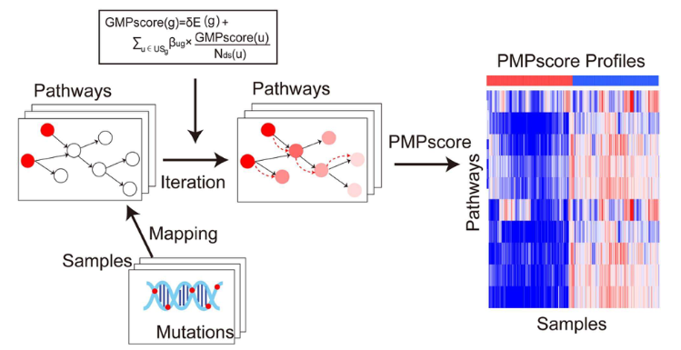

欢迎关注“小丫画图”公众号，回复“小白”，看小视频，实现点鼠标跑代码。

小丫微信: epigenomics  E-mail: figureya@126.com

作者：大鱼海棠，他的更多作品看这里<https://k.koudai.com/OFad8N0w>

单位：中国药科大学国家天然药物重点实验室，生物统计与计算药学研究中心

小丫编辑校验

```{r setup, include=FALSE}
knitr::opts_chunk$set(echo = TRUE)
```

# 需求描述

计算PMAPscore。这篇文章只计算了120+个信号通路，如果用全外数据，代谢等相关的基因也可能是会有突变的，所以能否把KEGG的所有通路都包含进去，这样用WES的话，能计算的信号通路就会增加到200+。



出自<https://academic.oup.com/bib/article-abstract/23/5/bbac360/6691915?redirectedFrom=fulltext&login=false>

Figure 1. Flowchart of iPMP method.

# 应用场景

计算PMAP得分，增加了全部KEGG通路到这个计算中。

他计算的时候只关心有哪些基因出现了突变，将发生突变的基因数，根据他们在KEGG通路网上的位置，进行加权求和。

这个PMAPscore需要的通路信息格式得是kgml，所以msigdb的基因集是不能直接用在这上面的。所以增加了批量下载kgml文件，并读取为R对象，以及应用到PMAP计算的代码。

# 环境设置

使用国内镜像安装包

```{r eval=FALSE}
options("repos"= c(CRAN="https://mirrors.tuna.tsinghua.edu.cn/CRAN/"))
options(BioC_mirror="http://mirrors.tuna.tsinghua.edu.cn/bioconductor/")
install.packages("PMAPscore")
browseVignettes("PMAPscore")
BiocManager::install("SPIA")
```

加载包

```{r}
library(PMAPscore)
library(ComplexHeatmap)
library(KEGGREST)
library(SPIA)
source("utils.R") # 修正的源代码

options(timeout=500)
Sys.setenv(LANGUAGE = "en") #显示英文报错信息
options(stringsAsFactors = FALSE) #禁止chr转成factor
```

# 输入文件

以PMAPscore自带数据为例：

- maffile：一个存储队列突变信息的maf对象
- gene_Ucox_res：各基因单变量cox回归结果，包括HR和置信区间
- sur：患者的生存情况，行名应与maf_data的样本名称一致，包括STATUS和TIME两列
- gene_symbol_Entrez：Gene SYMBOL和EntrezID的对应表
- roc_data：存放样本分组信息，至少需要sample、response两列

```{r}
# 加载数据
data("maffile", "gene_Ucox_res", "sur", "gene_symbol_Entrez", "roc_data")

# 清理数据
maf_data <- maffile@data[, c("Hugo_Symbol", "Variant_Classification", "Tumor_Sample_Barcode")]
# maf_data <- maf_data[maf_data$Hugo_Symbol %in% intersect(rownames(gene_Ucox_res), gene_symbol_Entrez$Hugo_Symbol), ]
patient <- intersect(rownames(sur), unique(maf_data$Tumor_Sample_Barcode))
maf_data <- maf_data[maf_data$Tumor_Sample_Barcode %in% patient, ]
# gene_Ucox_res <- gene_Ucox_res[, "HR"]
sur <- sur[patient, ]
roc_data <- as.data.frame(roc_data[, c("sample", "response")])
```

# 下载并生成KEGG通路基因集，只需运行一次

```{r eval=FALSE}
id <- unique(keggLink("pathway", "hsa"))
id <- gsub("path:", "", id)
for (x in id){
  if (!file.exists(file.path("Inputdata", "KEGG", paste0(x, ".xml")))){
    download.file(url = file.path("https://rest.kegg.jp/get", x, "kgml"),
                  destfile = file.path("Inputdata", "KEGG", paste0(x, ".xml")), quiet = T)
  }
  Sys.sleep(0.2) # 避免下载次数过多导致服务器拒绝访问
}
## 将kgml格式的通路文件转换为Rdata
makeSPIAdata(kgml.path = "InputData/KEGG", organism = "hsa", out.path = "InputData")
```

# 计算签名

```{r}
# 设置所用基因集为自定义基因集
data.dir = "InputData/"

## 整理突变信息，转换为基因×样本的矩阵
mut_status <- get_mut_status(maf_data = maf_data,  # 突变信息
                             nonsynonymous = TRUE) # 矩阵中是否只保留非同义突变
## 计算各通路的突变相关评分
pfs_score <- get_pfs_score(mut_status = mut_status,                 # 突变矩阵
                           percent = 0.03,                          # 突变频率低于此数的基因不会被纳入计算
                           gene_Ucox_res = gene_Ucox_res,           # 基因预后信息
                           gene_symbol_Entrez = gene_symbol_Entrez, # Gene SYMBOL和EntrezID的对应表格
                           verbose = F,
                           data.dir = data.dir)                     # 使用自定义基因集

## 生成预后相关的签名
final_signature <- get_final_signature(pfs_score = pfs_score,  # 各通路得分
                                       sur = sur)              # 生存信息

## 计算风险得分（multiple_score列）
km_data <- neo_get_km_data(mut_sam = mut_status,                # 突变信息
                           gene_Ucox = gene_Ucox_res,           # 基因单变量cox回归系数
                           symbol_Entrez = gene_symbol_Entrez,  # Gene Symbol和EntrezID对应表
                           sur = sur,                           # 生存信息
                           path_Ucox_mul = NULL,                # 通路多变量cox回归系数，不填，由R包根据其他输入参数求出
                           sig = final_signature,               # get_final_signature生成的预后签名
                           TRAIN = T,                           # 是否由R包根据其他输入参数求出通路多变量cox回归系数
                           data.dir = data.dir)                           

## 划分高低分组
cls <- neo_get_sam_cla(km_data = km_data,     # 风险得分
                       cut_off = -0.986)      # 高低分组阈值（此阈值为函数默认值）
```

# 开始画图

```{r}
## 绘制km曲线图
get_km_survival_curve(km_data = km_data, TRAIN = TRUE, risk.table=TRUE) # 根据中位数高低分组，绘制km曲线
dev.copy2pdf(file = "km_curve.pdf", width = 5, height = 5)

## 绘制roc曲线图
roc_data$risk_score <- km_data$multiple_score
get_roc_curve(roc_data, print.auc = TRUE, main = "Objective Response") # 绘制由风险得分判断是否响应的roc曲线
dev.copy2pdf(file = "roc_curve.pdf", width = 5, height = 5)

## 绘制OncoPlot
load(file = file.path(system.file("extdata", package = "PMAPscore"), "hsaSPIA.RData"))   # PMAP包提供的基因集
load(file = file.path(data.dir, "hsaSPIA.RData"))                                        # 自定义的基因集
path_gene <- getPathGene(path.info = path.info, gene_symbol_Entrez = gene_symbol_Entrez) # 获取所有通路涉及的基因
risk_score <- km_data$multiple_score
names(risk_score) <- rownames(km_data)
cut_off <- median(risk_score)
get_Oncoplots(maffile = maffile,                  # 队列maf文件
              path_gene = path_gene,              # 各通路相关基因
              mut_status = mut_status,            # 突变状态矩阵
              risk_score = risk_score,            # 风险得分
              cut_off = cut_off,                  # 风险得分高低分组阈值
              final_signature = final_signature,  # 最终所使用的签名
              pathway_name = "Gap junction")      # 需要展示的通路名称
dev.copy2pdf(file = "Oncoplots.pdf", width = 8, height = 6)

## 绘制风险得分热图
plot.data <- km_data
plot.data <- dplyr::arrange(plot.data, plot.data$multiple_score)                  # 按照风险评分升序排列
annCol <- plot.data[, c("event", "survival", "multiple_score")]                   # 制作列注释信息
plot.data <- plot.data[, setdiff(colnames(plot.data), colnames(annCol))]          # 从绘图数据剔除列注释信息
annCol$survival = NULL
annColor <- list()                                                                # 指定列注释颜色
annColor[["event"]] = setNames(object = c("white", "black"), nm = c("0", "1"))
annColor[["multiple_score"]] = colorRampPalette(c("#F7FBFF", "#2171B5"))(100)
plot.data <- t((plot.data))
range = min(apply(plot.data, 1, max))   # 查看各列最大值，选取各通路最大值的最小值，
plot.data[plot.data>range] = range      # 作为热图主矩阵的上限

pheatmap(mat = plot.data, 
         color = colorRampPalette(c("#440259","#345F8C","#228C8A","#78CE51","#FAE71F"))(100), # 热图主矩阵的颜色
         show_rownames = T, show_colnames = F,                                                # 显示通路名，不显示行名
         cluster_cols = F, cluster_rows = T,                                                  # 对通路进行距离，不对样本进行聚类
         annotation_col = annCol, 
         annotation_colors = annColor,
         name = "PFS score")
dev.copy2pdf(file = "PFSscore.Heatmap.pdf", width = 10, height = 6)
```

# Session Info

```{r}
sessionInfo()
```