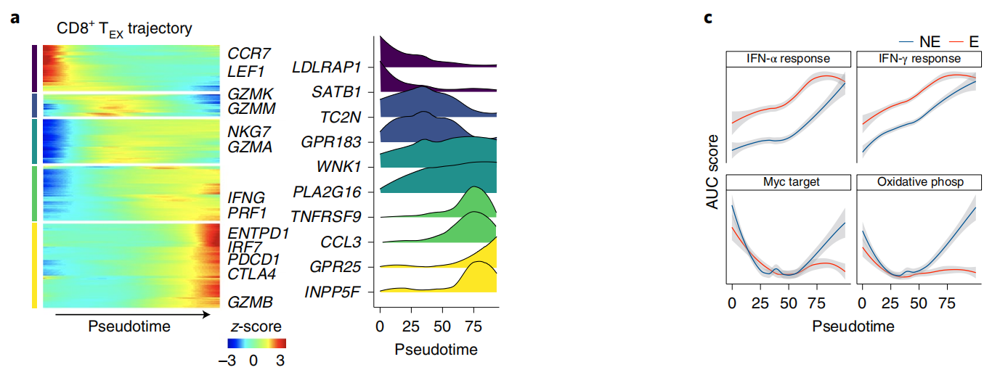

欢迎关注“小丫画图”公众号，回复“小白”，看小视频，实现点鼠标跑代码。

小丫微信: epigenomics  E-mail: figureya@126.com

作者：大鱼海棠，他的更多作品看这里<https://k.koudai.com/OFad8N0w>

单位：中国药科大学国家天然药物重点实验室，生物统计与计算药学研究中心

小丫编辑校验

```{r setup, include=FALSE}
knitr::opts_chunk$set(echo = TRUE)
```

# 需求描述

我想利用slingshot实现拟时序分析并绘制出特定基因随着时序变化的表达图。FigureYa285scRNA_monocle用monocle画过左边这样的图，但是我更想试一下这个slingshot。



出自<https://www.nature.com/articles/s41591-021-01323-8>

Fig. 3: Differentially expressed genes in CD8+ TEX and CD4+ TH1 trajectories.

# 应用场景

利用slingshot实现拟时序分析，并绘制出特定基因随着时序变化的表达图。

个人审美认为用monocle画出的特定基因随着时序变化的热图更好看，可参考FigureYa285scRNA_monocle <https://k.youshop10.com/ndalTqa=>

# 环境设置

使用国内镜像安装包

```{r eval=FALSE}
options("repos"= c(CRAN="https://mirrors.tuna.tsinghua.edu.cn/CRAN/"))
options(BioC_mirror="http://mirrors.tuna.tsinghua.edu.cn/bioconductor/")
BiocManager::install("slingshot")
devtools::install_github("statOmics/tradeSeq")
```

加载包

```{r}
library(slingshot)
library(mclust)
library(RColorBrewer)
library(tradeSeq)
library(ComplexHeatmap)
library(circlize)
library(reshape2)
library(ggplot2)
library(ggridges)

Sys.setenv(LANGUAGE = "en") #显示英文报错信息
options(stringsAsFactors = FALSE) #禁止chr转成factor
```

自定义函数

```{r}
# 数据标准化
standarize.fun <- function(indata=NULL, halfwidth=NULL, centerFlag=T, scaleFlag=T) {  
  outdata=t(scale(t(indata), center=centerFlag, scale=scaleFlag))
  if (!is.null(halfwidth)) {
    outdata[outdata>halfwidth]=halfwidth
    outdata[outdata<(-halfwidth)]= -halfwidth
  }
  return(outdata)
}

# 分位数回归
FQnorm <- function(counts){
  rk <- apply(counts,2,rank,ties.method='min')
  counts.sort <- apply(counts,2,sort)
  refdist <- apply(counts.sort,1,median)
  norm <- apply(rk,2,function(r){ refdist[r] })
  rownames(norm) <- rownames(counts)
  return(norm)
}
```

# 输入文件

读取sce对象（SingleCellExperiment对象，会用到里面的counts）。

```{r}
sce <- readRDS("sce.rds")
## 预处理
geneFilter <- apply(assays(sce)$counts,1,function(x){
  sum(x >= 3) >= 10 # 去除低表达的基因
})
sce <- sce[geneFilter, ]
assays(sce)$norm <- FQnorm(assays(sce)$counts) # 分位数回归标准化
```

# 计算pca，聚类，拟时序分析

```{r}
pca <- prcomp(t(log1p(assays(sce)$norm)), scale. = FALSE) #pca
rd1 <- pca$x[,1:2]
reducedDims(sce) <- SimpleList(PCA = rd1)
colData(sce)$GMM <- Mclust(rd1)$classification #聚类
sce <- slingshot(sce, clusterLabels = 'GMM', reducedDim = 'PCA') #拟时序

colors <- colorRampPalette(brewer.pal(11,'Spectral')[-6])(100) # 设置颜色
plotcol <- colors[cut(sce$slingPseudotime_1, breaks=100)]
pdf("data distribution.pdf", width = 5,height = 5)
par(bty="o", mgp = c(1.5,.33,0), mar=c(3.1,3.1,2.1,2.1), las=1, tcl=-.25,las = 1, xpd = T)
plot(reducedDims(sce)$PCA, col = plotcol, pch=16, asp = 1)
lines(SlingshotDataSet(sce), lwd=2, col='black')
invisible(dev.off())

# 差异分析
sce <- fitGAM(sce)
ATres <- associationTest(sce)
topgenes <- rownames(ATres[order(ATres$pvalue), ])[1:250]
pst.ord <- order(sce$slingPseudotime_1, na.last = NA)
```

# 开始画图

```{r fig.width=4, fig.height=6}
# 1. 绘制特定基因随着时序变化的热图
plot.data <- assays(sce)$counts[topgenes, pst.ord]
plot.data <- standarize.fun(plot.data, halfwidth = 2)

## 图例颜色
hm.col <- colorRampPalette(brewer.pal(11,'Spectral'))(100)
cell.col <- setNames(brewer.pal(6, "Set1"), 1:6)
time.col <- colorRamp2(breaks = seq(min(sce$slingPseudotime_1, na.rm = T),
                                    max(sce$slingPseudotime_1, na.rm = T),
                                    length.out = 8), 
                       colors = brewer.pal(8, "PuBu"))
plot.gene <- sample(rownames(plot.data), 5) #这里随机抽取5个基因，后面把基因名标在图左侧
#plot.gene <- c("G548", "G578", "G704") #可直接写入想要在图中标注基因名的基因

## 行列注释
col_ha <- columnAnnotation("clust" = as.character(sce$GMM)[!is.na(sce$slingPseudotime_1)],
                           "pseudotime" = sce$slingPseudotime_1[!is.na(sce$slingPseudotime_1)],
                           col = list("clust" = cell.col,
                                      "pseudotime" = time.col))
row_ha <- rowAnnotation(gene = anno_mark(at = match(plot.gene, rownames(plot.data)),
                                         labels = plot.gene, side = "left")) #标注基因名

#pdf("pseudotimeHeatmap.pdf")
Heatmap(matrix = plot.data, col = rev(hm.col),
        cluster_rows = T, cluster_columns = F, 
        row_km = 5, show_row_dend = T, row_title=NULL,
        show_row_names = F, show_column_names = F,
        bottom_annotation = col_ha, left_annotation = row_ha,
        name = "z-score")
#dev.off()

# 2. Density-like plot
plot.gene <- topgenes[seq(1, length(topgenes), length.out = 5)]
plot.data <- assays(sce)$counts[plot.gene, ]
plot.data <- melt(plot.data) # 生成基因-细胞-表达值数据框
colnames(plot.data) <- c("Gene", "Cell", "Expression") 
plot.data$Pseudotime <- sce$slingPseudotime_1[match(plot.data$Cell, colnames(sce))]
plot.data$Expression <- log(1 + plot.data$Expression)
plot.data <- lapply(1:nrow(plot.data), function(i){ # 根据表达值，生成伪密度数据
  data.frame("Pseudotime" = rep(plot.data$Pseudotime[i], plot.data$Expression[i]),
             "Gene" = rep(plot.data$Gene[i], plot.data$Expression[i]))
})
plot.data <- do.call(rbind, plot.data)
ggplot(plot.data, aes(x = Pseudotime, y = Gene, fill = Gene)) +
  geom_density_ridges() +
  theme_classic() +
  scale_fill_viridis_d()
ggsave("density.pdf", width = 4, height = 6)

# 3. curve Plot
plot.gene <- topgenes[seq(1, length(topgenes), length.out = 5)]
plot.data <- assays(sce)$counts[plot.gene, ]
plot.data <- melt(plot.data) # 生成基因-细胞-表达值数据框
colnames(plot.data) <- c("Gene", "Cell", "Expression")
plot.data$Pseudotime <- sce$slingPseudotime_1[match(plot.data$Cell, colnames(sce))]

ggplot(plot.data, aes(x = Pseudotime, y = Expression)) +
  geom_smooth() +
  facet_wrap(~Gene, ncol = 1) +
  theme_classic()
ggsave("curve.pdf", width = 2, height = 8)
```

# Session Info

```{r}
sessionInfo()
```