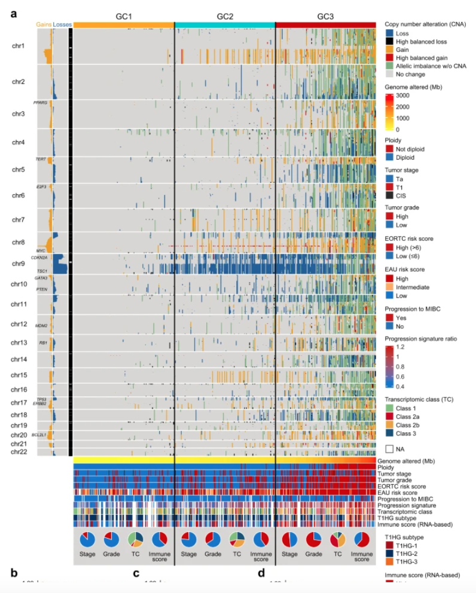

欢迎关注“小丫画图”公众号，回复“小白”，看小视频，实现点鼠标跑代码。

小丫微信: epigenomics  E-mail: figureya@126.com

作者：大鱼海棠，他的更多作品看这里<https://k.koudai.com/OFad8N0w>

单位：中国药科大学国家天然药物重点实验室，生物统计与计算药学研究中心
      法国斯特拉斯堡遗传与分子生物研究所，癌症功能基因组实验室
      
小丫编辑校验

```{r setup, include=FALSE}
knitr::opts_chunk$set(echo = TRUE)
```

# 需求描述

希望画出拷贝数变异的图。



出自<https://www.nature.com/articles/s41467-021-22465-w>

Fig. 2: Copy number alterations in NMIBC.
a Genome-wide copy number landscape of 473 tumors stratified by genomic class (GC) 1–3. Gains (gain + high balanced gain) and losses (loss + high balanced loss) are summarized to the left of the chromosome band panel. 
EORTC European Organisation for Research and Treatment of Cancer, EAU European Association of Urology, MIBC  muscle-invasive bladder cancer.

# 应用场景

利用GISTIC算法的输出文件，绘制拷贝数热图（不包含底部饼图）。

我们众筹过一些突变相关的图<https://k.youshop10.com/gZBI0YzR>以及富集分析的图<https://k.youshop10.com/sm2p0xYn>，可灵活运用，画出文中的图：

- Figure 1ah共识聚类及热图，可参考FigureYa202consensusGene<https://k.youshop10.com/dNHdlWen>
- Figure 1b桑基图，画法可参考FigureYa25sankey<https://k.youshop10.com/1vm3In-4>
- Figure 1cd、2bcd、3c、4e、5c、多亚型生存分析，可参考FigureYa284pairwiseLogrank<https://k.youshop10.com/=nHJB0CE>或FigureYa1survivalCurve<https://k.youshop10.com/3GKrTHDG>
- Figure 2a，本文档将带你实现。只画左侧频率对比图，可参考FigureYa79CNV<https://k.youshop10.com/7N-Flfly>
- Figure 3e突变综合热图，可参考FigureYa248MutLandscape<https://k.youshop10.com/hm=bnmr6>
- Figure 5a森林图，可参考FigureYa90subgroup<https://k.youshop10.com/HD4mSqRP>

# 环境设置

使用国内镜像安装包

```{r}
options("repos"= c(CRAN="https://mirrors.tuna.tsinghua.edu.cn/CRAN/"))
options(BioC_mirror="http://mirrors.tuna.tsinghua.edu.cn/bioconductor/")
BiocManager::install("trackViewer")
```

加载包

```{r}
library(ComplexHeatmap)
#library(TxDb.Hsapiens.UCSC.hg38.knownGene) # 如果是用hg38的基因组请加载
library(TxDb.Hsapiens.UCSC.hg19.knownGene) # 如果是用hg19的基因组请加载
library(trackViewer) # 用于获取基因位点信息
library(org.Hs.eg.db)
library(ggplot2)
library(TCGAbiolinks) # 用于获取TCGA数据的分子亚型信息
library(dplyr)
library(RColorBrewer)
library(circlize)
Sys.setenv(LANGUAGE = "en") #显示英文报错信息
options(stringsAsFactors = FALSE) #禁止chr转成factor
```

自定义函数，用于获取基因位点

```{r}
getGeneLocation <- function(symbol, txdb, org){
  # 获取基因位置
  # trackViewer::getLocation的改进版，避免报错，增加GeneSymbol列
  dbPrefix <- sub(".db", "", org)
  eg <- mget(symbol, get(paste0(dbPrefix, "SYMBOL2EG")), ifnotfound = NA)
  eg <- lapply(eg, `[`, i = 1)
  eg <- unlist(eg, use.names = TRUE)
  eg <- eg[!is.na(eg)]
  if (length(eg) < 1) {
    return(NULL)
  }
  genes <- genes(txdb)
  eg <- eg[eg%in%genes$gene_id]
  gr <- genes[eg]
  gr$symbol <- names(eg)
  seqlevelsStyle(gr) <- "UCSC"
  seqlevels(gr) <- seqlevels(gr)[seqlevels(gr) %in% as.character(seqnames(gr))]
  if (length(seqinfo(gr)) > 0) {
    seqinfo(gr) <- seqinfo(gr)[seqlevels(gr)]
  }
  return(gr)
}
```

# 输入文件

这里以TCGA数据为例。TCGA_BLCA.all_thresholded.by_genes.txt，该文件为GISTIC算法的输出文件之一，也可在<http://firebrowse.org/>中获取已经分析好的GISTIC结果。

```{r}
cnv <- read.table("TCGA_BLCA.all_thresholded.by_genes.txt", sep = "\t", row.names = 1, header = T, check.names = F)
## 构建基因*样本矩阵
cnv$`Locus ID` = cnv$Cytoband = NULL
colnames(cnv) <- substr(colnames(cnv)[4:ncol(cnv)], 1, 12)
```

# 准备绘图数据

```{r}
## 获取每一行基因在染色体上的位置，并按顺序重排
geneLocation <- as.data.frame(getGeneLocation(symbol = rownames(cnv), 
                                              txdb = TxDb.Hsapiens.UCSC.hg19.knownGene, 
                                              org = "org.Hs.eg.db"))
geneLocation$seqnames <- as.character(geneLocation$seqnames)
geneLocation <- geneLocation[which(geneLocation$seqnames %in% c("chr1","chr2","chr3","chr4","chr5","chr6","chr7","chr8","chr9","chr10","chr11",
                                                                "chr12","chr13","chr14","chr15","chr16","chr17","chr18","chr19","chr20","chr21","chr22")),]
geneLocation <- arrange(geneLocation, geneLocation$seqnames, geneLocation$start)
geneLocation$seqnames <- factor(geneLocation$seqnames, levels = c("chr1","chr2","chr3","chr4","chr5","chr6","chr7","chr8","chr9","chr10","chr11",
                                                                  "chr12","chr13","chr14","chr15","chr16","chr17","chr18","chr19","chr20","chr21","chr22"))

## 获取分子亚型信息
classVar <- "Mutation.process.cluster"
sampleInfo <- data.frame(TCGAquery_subtype(tumor = "blca")) 
sampleInfo <- sampleInfo[sampleInfo$patient %in% colnames(cnv), ]
sampleInfo <- arrange(sampleInfo, sampleInfo[[classVar]])
sampleInfo <- sampleInfo[sampleInfo[[classVar]] != "NA", ]

## 整理需要用来画图的样本信息(plot.sampleInfo)
cnv <- cnv[geneLocation$symbol, sampleInfo$patient]
plot.sampleInfo <- sampleInfo[, c("Noninvasive.bladder.history", "AJCC.pathologic.tumor.stage", "Number.of.LNs.examined")]
colnames(plot.sampleInfo) <- c("Noninvasive","AJCC.stage","Nb.LNs.examined")
plot.sampleInfo$Nb.LNs.examined <- as.numeric(plot.sampleInfo$Nb.LNs.examined)
```

# 开始画图

```{r fig.width=10, fig.height=10}
## 指定左侧标注基因名的基因
plot.gene <- c("E2F3", "GATA3", "PTEN")

## 制作样本信息注释数据框
RColorBrewer::display.brewer.all()
str(plot.sampleInfo)

### 按照数据框顺序填写各列注释所使用的颜色 
sampleCol <- list(setNames(object = c("grey", "blue", "red"), nm = c("ND", "NO", "YES")), # 分类变量
                  setNames(object = c(brewer.pal(n = 4, name = "Set1"), "grey"),          # 分类变量
                           nm = c("I", "II", "III", "IV", "ND")), 
                  colorRamp2(breaks = c(0, 30), colors = c("#1874CB", "#CA0A07")))        # 连续变量
names(sampleCol) <- names(plot.sampleInfo) # 为颜色列表赋上与样本信息相同的名字
col_ha = columnAnnotation(df = plot.sampleInfo, col = sampleCol, 
                          simple_anno_size = unit(0.8, "cm"),         # 样本注释高度
                          show_annotation_name = T, show_legend = T)  # 显示注释列名，显示图例

## 制作基因信息注释
barCol <- ifelse(test = rowSums(cnv)>0, yes = "#ED9A15", no = "#245F9B") # 根据基因合计拷贝数变异，计算大小
row_ha = rowAnnotation(gene = anno_mark(at = match(plot.gene, rownames(cnv)),  #指出基因
                                        labels = plot.gene, side = "left"),
                       chr = anno_barplot(rowSums(cnv), bar_width = 0.8, border = FALSE, # 显示全样本下拷贝数变异情况
                                          gp = gpar(fill = barCol, col = NA), 
                                          # add_numbers = T, numbers_offset = unit(-10, "mm"),
                                          axis_param = list("labels_rot" = 0, direction = "reverse"),
                                          # numbers_gp = gpar(fontsize = 9, col = "white"),
                                          width = unit(1, "cm")),
                       show_annotation_name = F, show_legend = F)

# 绘制热图
hm <- Heatmap(matrix = cnv, 
              row_split = geneLocation$seqnames,
              bottom_annotation = col_ha, left_annotation = row_ha,
              column_split = sampleInfo[[classVar]], 
              cluster_columns = T, cluster_rows = F, cluster_column_slices = F, 
              col = c("#020000", "#245F9B", "#D8D6D4", "#ED9A15", "#D10909"),
              show_column_names = F, show_row_names = F, 
              row_title_rot = 0,
              # width = unit(10, "cm"), height = unit(10, "cm"), 
              show_heatmap_legend = T, show_column_dend = F)
hm

pdf("CNVheatmap.pdf", width = 10,height = 10)
draw(hm, heatmap_legend_side = "right", annotation_legend_side = "right", merge_legend = TRUE)
invisible(dev.off())
```

# 后期处理

底部饼图画法可参考FigureYa196PanPie <https://k.youshop10.com/cuTrQYIe>

前面生成的PDF文件是矢量图文件，可以用Illustrator等矢量图编辑器打开编辑。

# Session Info

```{r}
sessionInfo()
```