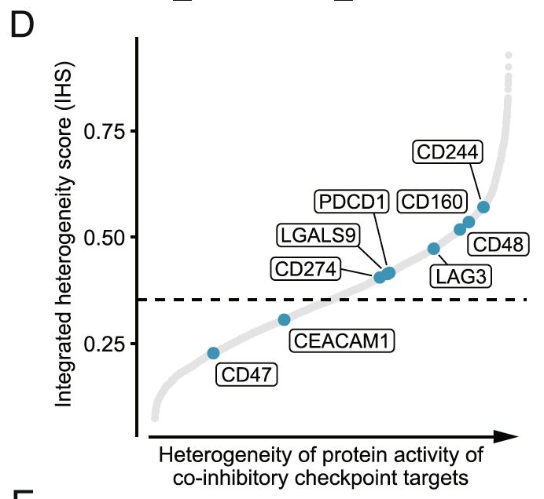

欢迎关注“小丫画图”公众号，回复“小白”，看小视频，实现点鼠标跑代码。

小丫微信: epigenomics  E-mail: figureya@126.com

作者：大鱼海棠，他的更多作品看这里<https://k.koudai.com/OFad8N0w>

单位：中国药科大学国家天然药物重点实验室，生物统计与计算药学研究中心
      法国斯特拉斯堡遗传与分子生物研究所，癌症功能基因组实验室

小丫编辑校验

```{r setup, include=FALSE}
knitr::opts_chunk$set(echo = TRUE)
```

# 需求描述

我想众筹一下这篇文章里figure5d，作者写了一个计算基因异质性的方法，然后用viper推断检查点蛋白活性以后计算了检查点蛋白的异质性，我想这个方法应该也可以用来计算其他种类蛋白的异质性，应该挺实用的。

FigureYa296VIPER<https://k.youshop10.com/CTEFqnpF>跟这个不一样。这篇里面用的是新版的weighted viper，和之前的算法不一样，而且这个图重点是IHS分数的计算，不仅是蛋白活性的计算。



出自<https://genomemedicine.biomedcentral.com/articles/10.1186/s13073-022-01143-6>

Fig. 5 Immune heterogeneity in HCC. 
D IHS of protein activity of 9 co-inhibitory immune checkpoint genes.
Dotted lines indicate the median IHS value across 5099 proteins

# 应用场景

通过weighted viper推断检查点蛋白活性并计算异质性。

更多异质性FigureYa看这里<https://k.youshop10.com/S-utnyI7>

- FigureYa114ternaryCluster，在一组样本中某个geneset表达谱变异很大时，**展示这个geneset的所有基因表达异质性**。
- FigureYa223scNMF，适合**异质性较大的样本的聚类分析**。
- FigureYa150diversityScore，用**单细胞DNA测序**数据计算diversity score，用来评价肿瘤异质性。
- FigureYa241scRNA_NMI，利用**单细胞**数据评估同一(时间点)肿瘤样本的**转录异质性**。
- FigureYa308IHS，推断检查点**蛋白活性并计算异质性**。
- FigureYa95pairwise，**多维度相关性**研究，可用于推断体细胞突变和免疫浸润在影响肿瘤异质性上的相关程度。
- FigureYa216MetaREM，**meta分析**的异质性检验，给出Q和pvalue。

# 环境设置

使用国内镜像安装包

```{r eval=FALSE}
options("repos"= c(CRAN="https://mirrors.tuna.tsinghua.edu.cn/CRAN/"))
options(BioC_mirror="http://mirrors.tuna.tsinghua.edu.cn/bioconductor/")
install.packages("optparse")
```

加载包

```{r}
library(viper)
library(nlme)
library(spatstat.explore)
library(ggplot2)
library(ggrepel)
Sys.setenv(LANGUAGE = "en") #显示英文报错信息
options(stringsAsFactors = FALSE) #禁止chr转成factor
```

自定义函数以计算IHS

```{r}
CalIHS <- function(vec, clin, method){
  # vec：各样本的活性值
  # clin：样本临床信息，样本顺序应当与活性值的顺序一致，应有Patient列标识样本的患者来源
  # method：nlme和hclust两种
  # 患者内肿瘤异质性越强，得分越高
  
  IHS <- switch(
    method,
    "nlme" = {
      df <- cbind(clin, "regulon" = vec)
      fit <- lme(regulon~1, random=~1|Patient, data=df)
      var <- as.numeric(data.frame(as.character(VarCorr(fit)))[,1])
      
      var_sum <- data.frame(between_group=var[1],
                            within_group=var[2],
                            std1=var[3],
                            std2=var[4],
                            all=var[1]+var[2],
                            WT=var[2]/(var[1]+var[2]))
      return(var_sum$WT)
    },
    "hclust" = {
      hcs <- unlist(lapply(1:length(unique(clin$Patient)), function(x){
        hc = cutree(hclust(d = dist(vec), method = "ward.D2"), k = x)
        df = cbind(clin, "clust" = hc)
        df = split(df, df$Patient)
        sum(unlist(lapply(df, function(x) length(unique(x$clust)) == 1)))
      }))
      a = auc(ppp(x = (1:length(hcs))/length(hcs), y = hcs/length(hcs)), covariate = "x")
      1-a/(length(hcs-1))
    }
  )
}
```

# 输入文件

Renji_cohort_MR_exp.matrix，样本表达矩阵。每行一个基因，每列一个样本。第一行是样本名，第一列是基因名。下载自<https://zenodo.org/record/7336311#.ZBE6xbRBzt0>

easy_input_cli.csv，样本分组信息。共三列，第一列为样本名，跟表达矩阵里面的样本名一致；第二列是Patient ID；第三列是该Patient的Sample ID。

```{r}
work.path <- "."; #setwd(work.path)
pkg.path <- file.path(work.path, "Packages") # 存放脚本的路径
res.path <- file.path(work.path, "Results") # 存放结果的路径

# 读取样本表达矩阵，构建样本分组信息
expr <- read.table("Renji_cohort_MR_exp.matrix", header = T, row.names = 1)
expr <- expr[, -grep("^N", colnames(expr))]
#saveRDS(expr, file.path(res.path, "expr.rds")) # 保存表达矩阵

# 例文的样本名中带有分组信息，格式为：T患者编号_该患者的样本编号。我们从中提取出分组信息：
#clin.info <- data.frame(row.names = colnames(expr),
#                        "Patient" = gsub("(.+)_(.+)", "\\1", colnames(expr)),
#                        "Sample" = gsub("(.+)_(.+)", "\\2", colnames(expr)))
#write.csv(clin.info, "easy_input_cli.csv", quote = F)

# 自己的数据，可以参考easy_input_cli.csv的格式提供分组信息
clin.info <- read.csv("easy_input_cli.csv", header = T)
```

# 计算蛋白活性

由于需要进行200次bootstrap，耗时较长大概在2天左右，请耐心等待。

```{r eval=FALSE}
pisce.path <- pkg.path # pisce所在的文件夹
system(paste("Rscript", file.path(pisce.path, "pisce.R"), # aracne主代码位置
             file.path(pisce.path),                       # pisce所使用数据的位置
             file.path(res.path),                         # pisce结果存放位置
             "human", "symbol", 1e-8, 200))               # 物种(human, mouse)，基因名称类型(ensg, symbol)、P值阈值，bootstrap次数
```

这里会生成`out_unPruned.rds`文件，用于下一步计算。`out_unPruned.rds`文件已上传至云盘，便于测试。下载地址：<https://www.yuque.com/figureya/figureyaplus/easyinput>。下载后删除扩展名`.txt`，存入Result文件夹，即可继续往下运行。

```{r}
out_unPruned <- readRDS(file.path(res.path, "out_unPruned.rds")) # 读取aracne结果
vip.mat <- viper(expr, out_unPruned, method = "none",     # 生成活性矩阵
                 eset.filter = FALSE, minsize = 5)
saveRDS(vip.mat, file.path(res.path, "vip.mat.rds"))
```

# 计算IHS

患者内肿瘤异质性越强，integrated heterogeneity score (IHS) 得分越高。

```{r}
vip.mat <- readRDS(file.path(res.path, "vip.mat.rds"))
IHS <- data.frame(
  "Protein" = rownames(vip.mat),
  "lme" = apply(vip.mat, 1, function(x){
    CalIHS(vec = x, clin = clin.info, method = "nlme")
  }),
  "hclust" = apply(vip.mat, 1, function(x){
    CalIHS(vec = x, clin = clin.info, method = "hclust")
  })
)
IHS$IHS <- sqrt(IHS$lme * IHS$hclust) # 将两种算法取几何平均数

# 保存到文件
write.table(IHS, file.path(res.path, "output_IHS.txt"), row.names = T, col.names = T, sep = "\t", quote = F)
```

# 开始画图

```{r fig.width=4, fig.height=4}
# 自定义要在图中标注基因名的点
to.plot <- c("CD47", "CEACAM1", "CD274", "LGALS9", "PDCD1", "CD160", "CD244", "LAG3", "CD48")

# 绘制IHS落石图
IHS <- read.table(file.path(res.path, "output_IHS.txt"))
medianIHS <- median(IHS$IHS)

plot.data <- data.frame(
  "protein" = IHS$Protein,
  "IHS" = IHS$IHS
)

plot.data$label <- ifelse(plot.data$protein %in% to.plot, plot.data$protein, NA)
plot.data$color <- ifelse(plot.data$protein %in% to.plot, "deepskyblue3", "grey80")
plot.data$size <- ifelse(plot.data$protein %in% to.plot, 2, 1)
plot.data$protein <- factor(plot.data$protein, levels = plot.data$protein[order(plot.data$IHS)])

ggplot(plot.data, aes(x = protein, y = IHS, label = label)) +
  # 画虚线
  geom_hline(yintercept = medianIHS, color="black", 
             linetype="longdash", lwd = 0.5) +

  geom_point(col = plot.data$color, size = plot.data$size) +
  geom_label_repel() +
  #geom_text_repel() +
  scale_color_manual(values = c("deepskyblue3" = "deepskyblue3", "grey80" = "grey80")) +
  # 用蓝色突出显示标注基因名的点
  geom_point(mapping = aes(x = protein, y = IHS, col = color), data = plot.data[plot.data$color == "deepskyblue3", ]) +
  
  labs(x="Heterogeneity of protein activity of \n co-inhibitory checkpoint targets", y="Integrated heterogeneity score (IHS)", title="") + 
  theme_classic() +
  theme(axis.text.x = element_blank(), axis.ticks.x = element_blank()) +
  guides(color = "none") #不显示图例
ggsave(file.path(res.path, "IHS.pdf"), width = 4, height = 4)
```

# Session Info

```{r}
sessionInfo()
```