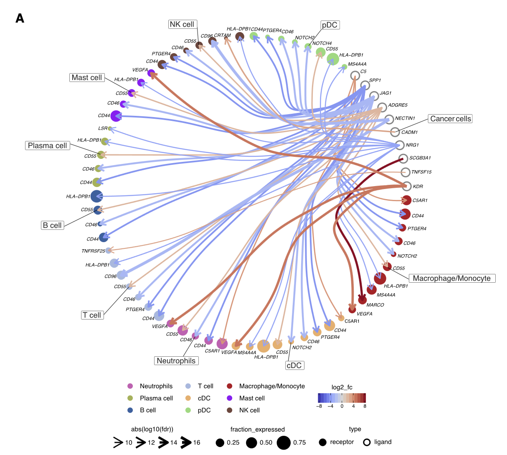

欢迎关注“小丫画图”公众号，回复“小白”，看小视频，实现点鼠标跑代码。

小丫微信: epigenomics  E-mail: figureya@126.com

作者：大鱼海棠，他的更多作品看这里<https://k.koudai.com/OFad8N0w>

单位：中国药科大学国家天然药物重点实验室，生物统计与计算药学研究中心
      法国斯特拉斯堡遗传与分子生物研究所，癌症功能基因组实验室

小丫编辑校验

```{r setup, include=FALSE}
knitr::opts_chunk$set(echo = TRUE)
```

# 需求描述

以cellphonedb的结果文件作为输入，画出细胞沟通的弦图



出自<https://linkinghub.elsevier.com/retrieve/pii/S1535610822004998>

Figure 3. Cellular crosstalk analysis
(A) Circos plot of the cellular crosstalk of cancer cells toward the major immune cells in **LUAD versus LUSC**. 
Shown are the top 10 differentially expressed cancer cell ligands. 
**Red** interactions are upregulated in LUAD, and **blue** interactions are upregulated in LUSC.

# 应用场景

用cellphoneDB结果，对比展示**两组样本**的配体-受体差异。

- 用本地CellPhoneDB分析配体-受体，用ggplot2画泡泡图，可参考FigureYa178receptorLigand<https://k.youshop10.com/YICoy-XB>
- 用cellchat分析对比**两组样本**的配体-受体差异，可参考FigureYa267scCellChat<https://k.youshop10.com/qruuYZow>

# 环境设置

使用国内镜像安装包

```{r eval=FALSE}
options("repos"= c(CRAN="https://mirrors.tuna.tsinghua.edu.cn/CRAN/"))
options(BioC_mirror="http://mirrors.tuna.tsinghua.edu.cn/bioconductor/")
devtools::install_github("zktuong/ktplots")
```

加载包

```{r}
library(ktplots)
library(SingleCellExperiment)
library(reshape2)
library(Seurat)
library(circlize)
library(igraph)
library(ggraph)
library(ggrepel)
library(RColorBrewer)
library(grid)

Sys.setenv(LANGUAGE = "en") #显示英文报错信息
options(stringsAsFactors = FALSE) #禁止chr转成factor
```

自定义函数，用于两组之间的差异分析、画图

```{r}
limit <- function(vec, min, max){
  vec[vec<min] = min
  vec[vec>max] = max
  return(vec)
}

cpdb.chordgram <- function(seu, means, pvalues, 
                           source.group, target.group,
                           comparison, celltypes, 
                           ident.1, ident.2,
                           min.frac = 0.1, padj.cutoff = 0.05,
                           return_df = F, cell.col = NULL){
  
  # 读取cellphoneDB运行结果
  variable <- c("id_cp_interaction", "interacting_pair", "partner_a", "partner_b", 
                "gene_a", "gene_b", "secreted", "receptor_a", "receptor_b", "annotation_strategy", "is_integrin")
  mean.df <- melt(means, id.vars = variable, variable.name = "pair", value.name = "mean")
  pvalues.df <- melt(pvalues, id.vars = variable, variable.name = "pair", value.name = "pval")
  
  # 进行差异分析，筛选两种状态下的显著差异基因
  deg.df <- lapply(unique(seu@meta.data[[celltypes]]), function(celltype){
    sub.seu <- subset(seu, seurat_annotations == celltype)
    Idents(sub.seu) <- sub.seu[[comparison]]
    deg <- FindMarkers(sub.seu, ident.1 = ident.1, ident.2 = ident.2, min.pct = min.frac, verbose = F)
    deg$celltype <- celltype
    deg$gene <- rownames(deg)
    return(deg)
  })
  deg.df <- do.call(rbind, deg.df)
  deg.df <- deg.df[deg.df$p_val_adj<padj.cutoff, ]
  
  # 整合相互作用对与差异基因
  cpdb.df <- cbind(mean.df, "pval" = pvalues.df$pval)
  cpdb.df$pair <- as.factor(cpdb.df$pair)
  cpdb.df$source <- gsub("(.+)\\|(.+)", "\\1", cpdb.df$pair)
  cpdb.df$target <- gsub("(.+)\\|(.+)", "\\2", cpdb.df$pair)
  
  ligand.df <- deg.df[match(paste0(cpdb.df$gene_a, "_", cpdb.df$source),
                            paste0(deg.df$gene, "_", deg.df$celltype)),
                      c("pct.1", "avg_log2FC", "p_val_adj")]
  colnames(ligand.df) <- c("L_pct", "L_logFC", "L_pval")
  receptor.df <- deg.df[match(paste0(cpdb.df$gene_b, "_", cpdb.df$target),
                              paste0(deg.df$gene, "_", deg.df$celltype)),
                        c("pct.1", "avg_log2FC", "p_val_adj")]
  colnames(receptor.df) <- c("R_pct", "R_logFC", "R_pval")
  
  cpdb.df <- cbind(cpdb.df, ligand.df, receptor.df)
  # cpdb.df <- subset(cpdb.df, !is.na(L_pval) & !is.na(R_pval) & pval < 0.05)
  cpdb.df <- subset(cpdb.df, !is.na(L_pval) & pval < 0.05) # 与原文保持一致，仅剔除ligand不是差异基因的的相互作用对
  
  # 准备绘图数据
  plot.data <- data.frame(
    "ligand" = cpdb.df$gene_a, "receptor" = cpdb.df$gene_b,
    "source" = cpdb.df$source,  "target" = cpdb.df$target,
    "logpadj" = -log(cpdb.df$L_pval), "logFC" = cpdb.df$L_logFC,
    "L_Fraction" = cpdb.df$L_pct, "R_Fraction" = cpdb.df$R_pct
  )
  
  plot.data$from <- paste0(plot.data$ligand, "_", plot.data$source)
  plot.data$to <- paste0(plot.data$receptor, "_", plot.data$target)
  plot.data$logFC <- limit(plot.data$logFC, min = -2, max = 2)
  plot.data$logpadj <- limit(plot.data$logpadj, min = 10, max = 20)
  # plot.data <- subset(plot.data, L_Fraction>min.frac & R_Fraction>min.frac, )
  plot.data <- subset(plot.data, L_Fraction>min.frac, ) # 与原文保持一致，仅针对ligand进行剔除
  
  if (!is.null(source.group)) plot.data <- subset(plot.data, source %in% source.group)
  if (!is.null(target.group)) plot.data <- subset(plot.data, target %in% target.group)
  
  if (return_df == T){
    return(plot.data)
  }else{
    # 绘图
    vertices <- data.frame(
      name = c(plot.data$from, plot.data$to),
      celltype = c(plot.data$source, plot.data$target),
      type = rep(c("ligand", "receptor"), each = nrow(plot.data)),
      frac = c(plot.data$L_Fraction, plot.data$R_Fraction),
      label = c(plot.data$ligand, plot.data$receptor),
      logpadj = c(plot.data$logpadj, plot.data$logpadj),
      logFC = c(plot.data$logFC, plot.data$logFC)
    )
    vertices <- vertices[!duplicated(vertices$name), ]
    vertices$cellident <- paste0(vertices$celltype, "_", vertices$type)
    vertices.head <- data.frame(matrix(ncol = ncol(vertices), 
                                       nrow = length(unique(c(vertices$celltype, vertices$cellident)))+1))
    colnames(vertices.head) <- colnames(vertices)
    vertices.head$name <- c("root", unique(vertices$celltype), unique(vertices$cellident))
    vertices <- rbind(vertices.head[, colnames(vertices)], vertices)
    
    edgelist <- rbind(
      data.frame("from" = paste0(plot.data$source, "_ligand"), "to" = plot.data$from),
      data.frame("from" = paste0(plot.data$target, "_receptor"), "to" = plot.data$to)
    )
    edgelist.head <- data.frame("to" = unique(na.omit(vertices$cellident)))
    edgelist.head$from <- gsub("_receptor|_ligand", "", edgelist.head$to)
    edgelist.head <- rbind(edgelist.head, data.frame("from" = "root", "to" = unique(na.omit(vertices$celltype))))
    edgelist.head[, c("logFC", "logpadj")] = NA
    edgelist <- rbind(edgelist.head[, colnames(edgelist)], edgelist)
    
    mygraph <- graph_from_data_frame(d = edgelist, directed = T, vertices=vertices)
    d <- igraph::as_data_frame(mygraph, "both")
    from  <-  match(plot.data$from, vertices$name)
    to  <-  match(plot.data$to, vertices$name)
    e.fun <- get_con(from = from, to = to)
    e.df <- e.fun(create_layout(mygraph, layout = "dendrogram"))
    e.df$logpadj[is.na(e.df$logpadj)] <- 0
    
    if (is.null(cell.col)){
      cell = intersect(unique(seu@meta.data[[celltypes]]), vertices$celltype)
      cell.col <- setNames(object = brewer.pal(length(cell), "Set3"),
                           nm = cell)
    }
    
    g <- ggraph(mygraph, layout = 'dendrogram', circular = TRUE) +
      geom_conn_bundle(data = get_con(from = from, to = to),
                       aes(colour = logFC), width = 2, tension = .5,
                       arrow = arrow(length = unit((e.df$logpadj)*0.2, "mm"))) +
      geom_node_point(aes(size = frac, filter = leaf, color = celltype, shape = type)) + 
      geom_text_repel(aes(x = x, y = y, label = label), 
                      segment.square = TRUE, segment.inflect = TRUE, 
                      segment.size = 0.2, force = 0.5, size = 3, 
                      force_pull = 0) +
      scale_edge_colour_gradientn(colors = c("#3E52C5", "#FFFFFF", "#B91129"), limits = c(-2, 2)) + # 设置相互作用的颜色
      scale_shape_manual(values = c("ligand" = 1, "receptor" = 19)) +   # 设置点形状
      scale_color_manual(values = cell.col) +                           # 设置细胞类型对应的颜色
      theme_void()
  }
  return(g)
}
```

# 输入文件的获得

先运行cellphoneDB，然后以cellphoneDB的结果文件作为输入画图。

ifnb.rds，A Seurat object。可以从语雀下载：<https://www.yuque.com/figureya/figureyaplus/easyinput/>

```{r}
# 准备cellphoneDB所需表达数据
seu <- readRDS("ifnb.rds")
write.table(as.matrix(seu@assays$RNA@data), 'cellphonedb_count.txt', sep='\t', quote=F)

meta_data <- cbind(colnames(seu), as.character(seu$seurat_annotations))
meta_data <- as.matrix(meta_data)
write.table(meta_data, 'cellphonedb_meta.txt', sep='\t', quote=F, row.names=F)
```

CellPhoneDB需要在终端（Linux、MAC系统）安装和运行。Windows用户用wsl<https://docs.microsoft.com/en-us/windows/wsl/install-win10>

安装CellPhoneDB，参考<https://github.com/Teichlab/cellphonedb>

```bash
#Installing CellPhoneDB
python3 -m venv cpdb-venv

#Activate virtualenv
source cpdb-venv/bin/activate

#Install CellPhoneDB
pip install cellphonedb

# 运行cellphoneDB，细胞信息为细胞类型
cellphonedb method statistical_analysis  cellphonedb_meta.txt  cellphonedb_count.txt  --counts-data=gene_name
```

运行完，会在当前文件夹下产生一个out文件夹，里面有四个文件means.txt、pvalues.txt、significant_means.txt、deconvoluted.txt

out文件夹里的是cellphoneDB的运行结果文件。

# 读取cellphoneDB运行结果

```{r}
# 读取cellphoneDB运行结果
means <- read.delim('out/means.txt', check.names = FALSE)
pvalues <- read.delim('out/pvalues.txt', check.names = FALSE)
deconvoluted <- read.delim('out/deconvoluted.txt', check.names = FALSE)

# 查看通过筛选的相互作用
plot.data <- cpdb.chordgram(seu = seu, means = means, pvalues = pvalues, # seurat对象、cellphoneDB输出结果
                            source.group = NULL, target.group = NULL,    # 指定相互作用的细胞类型，设为NULL时，不筛选细胞类型
                            comparison = "stim", celltypes = "seurat_annotations", # 细胞分组、细胞类型注释所属变量
                            ident.1 = "STIM", ident.2 = "CTRL",          # 指定细胞分组的比较顺序，ident.1 vs ident.2
                            return_df = T)                               # 返回数据框，而非返回图

# 筛选需要展示的相互作用对
table(plot.data$source, plot.data$target)
```

# 差异分析并画图

```{r}
# 指定细胞类型对应的颜色
node.color <- c("CD4 Memory T" = "#86bc86", 
                "CD4 Naive T" = "#B07aa1",
                "CD8 T" = "#ff7f0e", 
                "CD14 Mono" = "#bcbd22",
                "CD16 Mono" = "#17becf")

# 箭头大小表示差异基因的padj（大小为logpadj*0.2mm）
cpdb.chordgram(seu = seu, means = means, pvalues = pvalues,              # seurat对象、cellphoneDB输出结果
               source.group = c("CD16 Mono"),                            # 指定相互作用的细胞类型
               target.group = c("CD4 Memory T", "CD4 Naive T", "CD8 T", "CD14 Mono"),
               comparison = "stim", celltypes = "seurat_annotations",    # 细胞分组、细胞类型注释所属变量
               ident.1 = "STIM", ident.2 = "CTRL",                       # 指定细胞分组的比较顺序，ident.1 vs ident.2
               cell.col = node.color)                                    # 设置各细胞类型所属颜色

# 保存图像
ggsave("cpdb.chordgram.pdf", width = 10, height = 9)

# 注意：箭头大小需要手动添加图例，箭头的大小对应着配体基因在两组之间的差异分析矫正后p值(logpadj)，可参考以下箭头大小
# grid.lines(x = unit(c(0.42, 0.74), "npc"),
#            y = unit(c(0.8, 0.8), "npc"),
#            gp = gpar(fill="black", lwd = 2),
#            arrow = arrow(length = unit(plot.data$logpadj[7], "mm")))
```

> 注意：图中有些节点没有画圈，是因为采用例文的方式，针对ligand进行了剔除。

- 第136行，位于“自定义函数”，针对ligand进行了剔除；
- 如果不想剔除，就删掉第136行；
- 如果想针对受体、配体都剔除，就改用上面的第135行。

# Session Info

```{r}
sessionInfo()
```