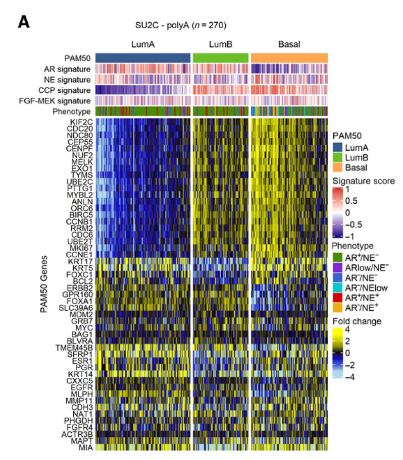

欢迎关注“小丫画图”公众号，回复“小白”，看小视频，实现点鼠标跑代码。

小丫微信: epigenomics  E-mail: figureya@126.com

作者：大鱼海棠，他的更多作品看这里<https://k.koudai.com/OFad8N0w>

单位：法国斯特拉斯堡遗传与分子生物学研究所，肿瘤功能基因组实验室

小丫编辑校验

```{r setup, include=FALSE}
knitr::opts_chunk$set(echo = TRUE)
```

# 需求描述

作者根据PAM50乳腺癌分子分型方法进行了改良，在分类前从训练集和质心分数中移除 Her2 和 Normal 样本，从而将分类限制为 LumA、LumB 和 Basal。同时比较了这三个亚型在雄激素受体（AR）,神经内分泌（NE）得分，CCP，FGF-MEK签名，以及作者之前建立有关神经内分泌前列腺癌的6种分型（phenotype）间的差异热图。



出自<https://aacrjournals.org/clincancerres/article/28/14/3127/706873/Therapeutic-Implications-for-Intrinsic-Phenotype>

Figure 1. PAM50 classification of metastatic prostate cancer associates with AR activity, proliferation, and genotype. 
A, PAM50 classification partitions mCRPC tumors from the SU2C cohort into LumA, LumB, and Basal subtypes. Fold difference scale reflects mean-centered log2 FPKM values from RNAseq. Molecular signature scores and phenotypes shown at the top of plot and colored according to legends at the right side.

# 应用场景

PAM50分型原本有5个，例文作者根据自己的研究对象的特点，仅用其中三类：LumA、LumB和 Basal，从训练集和质心分数中移除了另外两类：Her2和Normal的样本。你也可以根据自己的研究兴趣灵活取舍。

我们有7个FigureYa用到过PAM50分型:<https://k.youshop10.com/h81FZiMR>

# 环境设置

使用国内镜像安装包

```{r eval=FALSE}
options("repos"= c(CRAN="https://mirrors.tuna.tsinghua.edu.cn/CRAN/"))
options(BioC_mirror="http://mirrors.tuna.tsinghua.edu.cn/bioconductor/")
BiocManager::install("genefu")
```

加载包

```{r}
library(genefu) # 用于获取乳腺癌PAM50分型
library(AnnotationDbi) # 用于获得ENTREZID
library(org.Hs.eg.db) # 用于获得ENTREZID
library(GSVA) # 用于计算Molecular signature scores
library(ComplexHeatmap) # 用于画图
library(circlize) # 用它的配色方案
Sys.setenv(LANGUAGE = "en") #显示英文报错信息
options(stringsAsFactors = FALSE) #禁止chr转成factor
```

# 输入文件

data_mrna_seq_fpkm_polya.txt，表达矩阵。可以从语雀下载<https://www.yuque.com/figureya/figureyaplus/easyinput>

easyinput_signature.txt，基因签名，用于计算图中的Molecular signature scores ，即AR、NE、CCP、FGF-MEK签名。出自ccr-21-4289_supplementary_tables_ts1-13_suppts1-13.xlsx里的Table S13。可以替换成自己感兴趣的签名。

easyinput_clin.txt，样本分组信息，对应图中的Phenotype。其中Sample列里是样本名，跟表达矩阵的列名一致。出自ccr-21-4289_supplementary_tables_ts1-13_suppts1-13.xlsx里的Table S1。可以替换成自己想要对比展示的注释信息。

```{r}
# 读取原文表达谱
eset <- read.table("data_mrna_seq_fpkm_polya.txt", header = T, sep = "\t", check.names = F)
eset <- eset[!duplicated(eset$Hugo_Symbol), ] # 去掉重名基因
rownames(eset) <- eset$Hugo_Symbol; eset$Hugo_Symbol <- NULL
eset <- log2(eset + 1) # 表达谱对数化

# 读取原文给到的基因签名
signature <- read.table("easyinput_signature.txt", header = T, sep = "\t")
signature <- split(signature$Gene.Symbol, signature$Signature)

# 读取原文给到的样本分组信息
clin <- read.table("easyinput_clin.txt", header = T, sep = "\t")
clin <- clin[match(colnames(eset), clin$Sample) , ]
```

# PAM50分型

使用genefu包进行PAM50分型，并只保留LumA，LumB和Basal亚型。

```{r}
subtype.to.predict <- c("LumA", "LumB", "Basal")
data(pam50.robust)
pam50.robust$centroids <- pam50.robust$centroids[, subtype.to.predict] # 取出感兴趣亚型的质心

# 构建注释
eannot <- data.frame( 
  row.names = rownames(eset),
  "probe" = rownames(eset),
  "Gene.Symbol" = rownames(eset)
)
# 检索获得Gene Symbol对应的ENTREZID
tmp <- select(x = org.Hs.eg.db, keys = rownames(eset), columns = "ENTREZID", keytype = "SYMBOL")
eannot$EntrezGene.ID <- tmp$ENTREZID[match(eannot$Gene.Symbol, tmp$SYMBOL)]

# 亚型预测
# identify breast cancer molecular subtypes using the Single Sample Predictor (SSP)
pam50.predict <- intrinsic.cluster.predict(sbt.model = pam50.robust, 
                                           data = t(eset), 
                                           annot = eannot, 
                                           do.mapping = T)

# 计算Molecular signature scores
gs.score <- gsva(expr = as.matrix(eset), gset.idx.list = signature)
```

# 开始画图

```{r fig.width=10, fig.height=8}
# 构建样本信息注释
sampleInfo <- data.frame(
  row.names = colnames(eset),
  "PAM50" = pam50.predict$subtype,
  "AR.signature" = gs.score["AR", ],
  "NE.signature" = gs.score["NE", ],
  "CCP.signature" = gs.score["CCP", ],
  "FGF-MEK.signature" = gs.score["FGF-MEK", ],
  "Phenotype" = clin$polyA_phenotype
)

# 绘制热图
pam50.gene <- pam50.robust$centroids.map$probe
plot.data <- t(scale(t(eset[intersect(pam50.gene, rownames(eset)), ]), center = T, scale = F)) # 对数据进行中心化
plot.data[plot.data > 4] = 4; plot.data[plot.data< (-4) ] = -4 # 对极端值做截断处理

sampleInfo$PAM50 <- factor(sampleInfo$PAM50, levels = c("LumA", "LumB", "Basal"))

cell.col = c("#ADD9E3", "#3B5CCC", "#000000", "#C6C706", "#FDFB0B")
PAM50.col = c("LumA" = "#395790", "LumB" = "#6BBD2A", "Basal" = "#FFA652")
gsva.col = colorRamp2(breaks = c(-1, 0, 1), colors = c("#170B88", "#FFFFFF", "#D23C30"))
pheno.col = c("ARlow_NEneg" = "#8029CE", "ARneg_NElow" = "#07C7CF", "ARneg_NEneg" = "#3D62CD",
              "ARneg_NEpos" = "#EDAE11", "ARpos_NEneg" = "#478D06", "ARpos_NEpos" = "#CE0706")

col_ha <- columnAnnotation(
  df = sampleInfo,
  col = list("PAM50" = PAM50.col, 
             "AR.signature" = gsva.col,
             "NE.signature" = gsva.col,
             "CCP.signature" = gsva.col,
             "FGF.MEK.signature" = gsva.col,
             "Phenotype" = pheno.col),
  annotation_name_side = "left"
)

hm = Heatmap(plot.data, 
             col = cell.col, 
             name = "Fold Change", 
             cluster_columns = F, 
             cluster_rows = T, 
             cluster_column_slices = F,
             column_split = sampleInfo$PAM50,
             show_column_names = F, 
             show_row_names = T, 
             row_names_side = "left",
             show_column_dend = F, 
             show_row_dend = F,
             top_annotation = col_ha)

draw(hm)

# 保存热图
pdf("logFC.PAM50Heatmap.pdf", width = 10, height = 8)
draw(hm)
invisible(dev.off())
```

# Session Info

```{r}
sessionInfo()
```