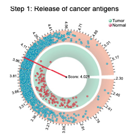

欢迎关注“小丫画图”公众号，回复“小白”，看小视频，实现点鼠标跑代码。

小丫微信: epigenomics  E-mail: figureya@126.com

作者：大鱼海棠，他的更多作品看这里<https://k.koudai.com/OFad8N0w>

单位：法国斯特拉斯堡遗传与分子生物学研究所，肿瘤功能基因组实验室

小丫编辑校验

```{r setup, include=FALSE}
knitr::opts_chunk$set(echo = TRUE)
```

# 需求描述

画出圆圈图。



出自<https://aacrjournals.org/cancerres/article/78/23/6575/543748/TIP-A-Web-Server-for-Resolving-Tumor>

Figure 2. Visualization of immunophenotype for one specific BRCA sample, TCGA-A2-A0ST-01A-12R-A084-07. 
C, Six circular plots show the comparison of activity scores of anticancer immunity for this specific sample (red pointer) with those for all tumor (green points in outer circle) and normal (red points in inner circle) samples from TCGA BRCA data.

# 应用场景

对比两个群体的数值分布，无需一一对应，可以用散点图展示。

我们在垂直坐标系中画过很多散点图<https://k.youshop10.com/PqTXapih>，用不同颜色或形状分组。这次画成圆圈，用不同圆圈来分组。

# 环境设置

使用国内镜像安装包

```{r}
options("repos"= c(CRAN="https://mirrors.tuna.tsinghua.edu.cn/CRAN/"))
options(BioC_mirror="http://mirrors.tuna.tsinghua.edu.cn/bioconductor/")

```

加载包

```{r}
library(circlize)

Sys.setenv(LANGUAGE = "en") #显示英文报错信息
options(stringsAsFactors = FALSE) #禁止chr转成factor
```

# 输入文件

easy_input.csv，包含四列，每行对应图中一个数据点。sector写为main即可，分组信息Group决定该数据点画在哪个圆圈上，数据点的实际值Value决定数据点在圆圈上的角度，y决定数据点与圆心的距离。

```{r}
# 加载模拟数据
plot.data <- read.delim(file = "easy_input.txt",sep = "\t",row.names = NULL,header = T,check.names = F,stringsAsFactors = F)
head(plot.data)
```

# 开始画图

```{r}
# 设置参数
prop = 0.05 # 右侧空白处所占全图比例
mark = 20   # 红色线所指向的值

plot.data$Group <- factor(plot.data$Group, levels = c("Circle1", "Circle2"))

# 生成绘图用数据
plot.region <- c(min(plot.data$Value), max(plot.data$Value))
plot.region <- rbind(plot.region, (plot.region-min(plot.region))*prop)
plot.data <- split(plot.data[, 1:3], plot.data$Group)

# 开始绘图
## 调整起始角度，以保证上下对称
deg.adjust <- 360 * 0.5 * prop
circos.par("start.degree" = 360-deg.adjust)
circos.initialize(sectors = c("main", "spare"), xlim = plot.region)

## 绘制第一环
# 绘制背景
draw.sector(deg.adjust, 360-deg.adjust,
            rou1 = 0.99, rou2 = 0.79, clock.wise = FALSE,
            col = "#FF000080", border = NA) 
# 绘制数据点
circos.track(sectors = plot.data[[1]]$sector, 
             x = plot.data[[1]]$Value, 
             y = plot.data[[1]]$y, panel.fun = function(x, y) {
               circos.points(x, y, col = "deepskyblue3", bg = "deepskyblue", 
                             pch = 21, cex = 1.0)
             }, ylim = c(0, 1), bg.border = NA) 
# 绘制中位数线
circos.lines(rep(median(plot.data[[1]]$Value), 2), c(0, 1), 
             sector.index = "main", track.index = 1, 
             col = "#618895", lwd = 2) 

## 绘制第二环
# 绘制背景
draw.sector(deg.adjust, 360-deg.adjust,
            rou1 = 0.77, rou2 = 0.57, clock.wise = FALSE, 
            col = "#B1CFC3", border = NA) 
# 绘制数据点
circos.track(sectors = plot.data[[1]]$sector, 
             x = plot.data[[1]]$Value, 
             y = plot.data[[1]]$y, panel.fun = function(x, y) {
               circos.points(x, y, col = "firebrick3", bg = "firebrick1", 
                             pch = 21, cex = 1.0)
             }, ylim = c(0, 1), bg.border = NA) 
# 绘制中位数线
circos.lines(rep(median(plot.data[[2]]$Value), 2), c(0, 1), 
             sector.index = "main", track.index = 2, 
             col = "#618895", lwd = 2) 

## 绘制坐标轴
circos.xaxis(sector.index = "main", track.index = 1, h = "top", 
             labels.facing = "clockwise") 
## 绘制特定数值标注线
deg.mark <- get.cell.meta.data(name = "cell.xlim", sector.index = "main")
deg.range <- get.cell.meta.data(name = "xplot", sector.index = "main")
deg.mark <- deg.range[1] + (mark-deg.mark[1])*diff(deg.range)/diff(deg.mark)
draw.sector(deg.mark, deg.mark, rou1 = 1, rou2 = 0,
            border = "#FF000080", lwd = 2)
# 添加文字
text(x = 0, y = 0, "Score: 20")
circos.clear()
dev.copy2pdf(file = "Circular.pdf", width = 7, height = 7)
```

# 后期修改

输出的pdf文件是矢量图，图中四边文字有遮挡，可以用Illustrator等矢量图编辑器打开，进行移动图形、放大画布、编辑文字等操作。

# Session Info

```{r}
sessionInfo()
```