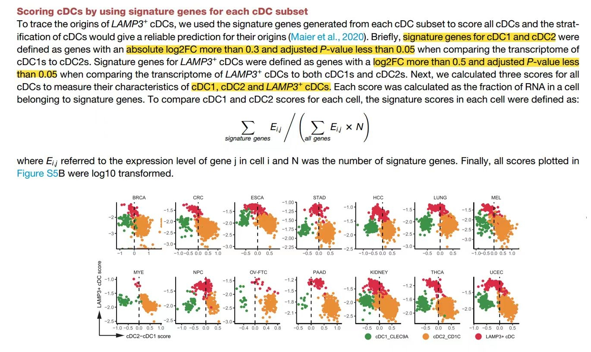

欢迎关注“小丫画图”公众号，回复“小白”，看小视频，实现点鼠标跑代码。

小丫微信: epigenomics  E-mail: figureya@126.com

作者：大鱼海棠，他的更多作品看这里<https://k.koudai.com/OFad8N0w>

单位：法国斯特拉斯堡遗传与分子生物学研究所，肿瘤功能基因组实验室

小丫编辑校验

```{r setup, include=FALSE}
knitr::opts_chunk$set(echo = TRUE)
```

# 需求描述

S5B是怎么实现的？这个计算公式要如何实现



出自<https://www.cell.com/cell/fulltext/S0092-8674(21)00010-6?_returnURL=https%3A%2F%2Flinkinghub.elsevier.com%2Fretrieve%2Fpii%2FS0092867421000106%3Fshowall%3Dtrue>

Figure S5. Origins and regulation of LAMP3+ cDCs, related to Figure 4
(B) Stratification of cDC transcriptomes by **scores generated from signature genes of three cDC subsets**.
  
# 应用场景

原文基于文献提出问题：Recent studies have suggested that LAMP3+ cDCs had the **potential to develop from both cDC1s and cDC2s** (Maier et al., 2020; Zhang et al., 2019). 

为了证实这个假设，原文作者用了如下计算方法：

Using multiple computational methods, including Monocle2 (Figures 4A), CytoTRACE (Figures S5A), the **direct stratification of LAMP3+ cDCs (Figures S5B，本文档)** and SingleR (Figures S5C), we confirmed the two potential origins of the LAMP3+ cDCs among various cancer types.

# 环境设置

使用国内镜像安装包

```{r eval=FALSE}
options("repos"= c(CRAN="https://mirrors.tuna.tsinghua.edu.cn/CRAN/"))
options(BioC_mirror="http://mirrors.tuna.tsinghua.edu.cn/bioconductor/")
install.packages("Matrix")
```

加载包

```{r}
library(Matrix)
library(Seurat)
library(ggplot2)

Sys.setenv(LANGUAGE = "en") #显示英文报错信息
options(stringsAsFactors = FALSE) #禁止chr转成factor
```

# 输入文件

原文作者已把数据上传到GEO数据库，<https://www.ncbi.nlm.nih.gov/geo/query/acc.cgi?acc=GSE154763>。我们从Supplementary file表格里下载csv.gz文件，放到当前目录下的InputData文件夹。

可以把所有癌症文件放进去合并起来跑，也可以每次只跑一种癌症类型，这里以UCEC为例：


```{r}
data.path <- file.path("InputData")
# 读取表达谱
emats <- lapply(list.files(data.path, pattern = "expression", full.names = T), function(x){
  emat = data.table::fread(x, data.table = F, sep = ",")
  rownames(emat) = emat$index; emat$index = NULL
  emat = as(as.matrix(t(emat)), "dgCMatrix")
  return(emat)
})

einfos <- lapply(list.files(data.path, pattern = "metadata", full.names = T), function(x){
  einfo = read.csv(x)
  rownames(einfo) = einfo$index
  return(einfo)
})

seu.objs <- mapply(function(x, y){
  seu = CreateSeuratObject(x, meta.data = y)
}, emats, einfos)
#seu <- merge(seu.objs[[1]], seu.objs[-1]) #InputData文件夹里的输入文件可以有多种癌症多个文件，合并起来跑时用这行代替下面那行
seu <- seu.objs[[1]]
seu <- subset(seu, MajorCluster %in% c("M03_cDC1_CLEC9A", "M04_cDC2_CD1C", "M05_cDC3_LAMP3")) #取子集来降低计算量
```

# 鉴定signature genes，下一步会用它计算得分

三个细胞群：Three distinct subsets in cDCs were identified, including two classical cDC subsets (**CLEC9A+ cDC1s** and **CD1C+ cDC2s**) and a mature cDC subset (**LAMP3+ cDC**) recently characterized.

筛选条件：signature genes for **cDC1 and cDC2** were defined as genes with an **absolute log2FC more than 0.3 and adjusted P-value less than 0.05** when comparing the transcriptome of cDC1s to cDC2s. 

```{r}
Idents(seu) <- seu$MajorCluster
seu <- subset(seu, MajorCluster %in% c("M03_cDC1_CLEC9A", "M04_cDC2_CD1C", "M05_cDC3_LAMP3")) # one vs other差异分析之前对Seurat亚群包含的细胞群再次确定
sig.gene <- FindAllMarkers(seu)
sig.gene <- subset(sig.gene, avg_log2FC > 0.3 & p_val_adj < 0.05) #选取显著基因
sig.gene <- split(sig.gene$gene, sig.gene$cluster)
```

# 计算基因集得分

这里提供两种打分策略，自选其一即可：

- 策略一：自定义函数，实现原文的计算公式
- 策略二：用AUCell的函数

```{r}
## 打分策略一：原文的计算公式
# emat：行为基因，列为细胞的表达矩阵
# gsets：基因签名列表
CalScore <- function(emat, gsets){
  scores = lapply(sig.gene, function(sig){
    colSums(emat[sig, ])/colSums(emat)/length(sig)
  })
  as.data.frame(do.call(cbind, scores))
}

# 用自定义函数计算基因集得分
plot.data <- CalScore(seu@assays$RNA@data, sig.gene)
# 如果emat使用对数化之后的数据，则计算的得分无需对数化
# 如果emat使用原始表达矩阵，则得分宜用对数化

## 打分策略二：AUCell
# score <- AUCell_run(seu@assays$RNA@data, sig.gene)
# plot.data <- as.data.frame(t(score@assays@data$AUC))

plot.data$celltype <- seu$MajorCluster
# 注意：这里用的是对数归一化的表达谱，因为GEO只给了对数归一化的数据，而原文用的是count，所以图片有数值上的出入，但趋势类似
# 为了使得坐标轴出现0的参考点，这里对数据做了以下scale，原文并未提及，可不做
plot.data$M04_cDC2_CD1C <- scale(plot.data$M04_cDC2_CD1C)
plot.data$M03_cDC1_CLEC9A <- scale(plot.data$M03_cDC1_CLEC9A)
plot.data$M05_cDC3_LAMP3 <- scale(plot.data$M05_cDC3_LAMP3)
```

# 开始画图

```{r fig.width=6, fig.height=6}
# 绘制散点图
ggplot(plot.data, aes(x = M04_cDC2_CD1C - M03_cDC1_CLEC9A, 
                      y = M05_cDC3_LAMP3, 
                      color = celltype)) +
  geom_point() + 
  scale_color_manual(values = c("#DC2C44","#EC8D37","#45924F")) + 
  geom_vline(xintercept = 0, color="black", 
             linetype="longdash", lwd = 0.6) + 
  theme_classic() + 
  labs(x = "cDC2-cDC1 score", y = "LAMP3+cDC score") +
  theme(axis.text.x = element_text(hjust = 0.5, size = 12, color = "black"),
        axis.title.y = element_text(hjust = 0.5, size = 12, color = "black"),
        axis.text.y = element_text(hjust = 0.5, size = 12, color = "black"),
        axis.ticks = element_line(size=0.2, color="black"),
        axis.ticks.length = unit(0.2, "cm"),
        panel.background = element_blank(),
        panel.grid = element_blank(),
        legend.position = "top",
        axis.title = element_text(size = 10),
        axis.text = element_text(size = 10))

ggsave("ScoreVisual.pdf", width = 6, height = 6)
```

# Session Info

```{r}
sessionInfo()
```