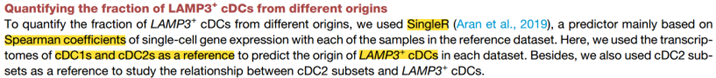
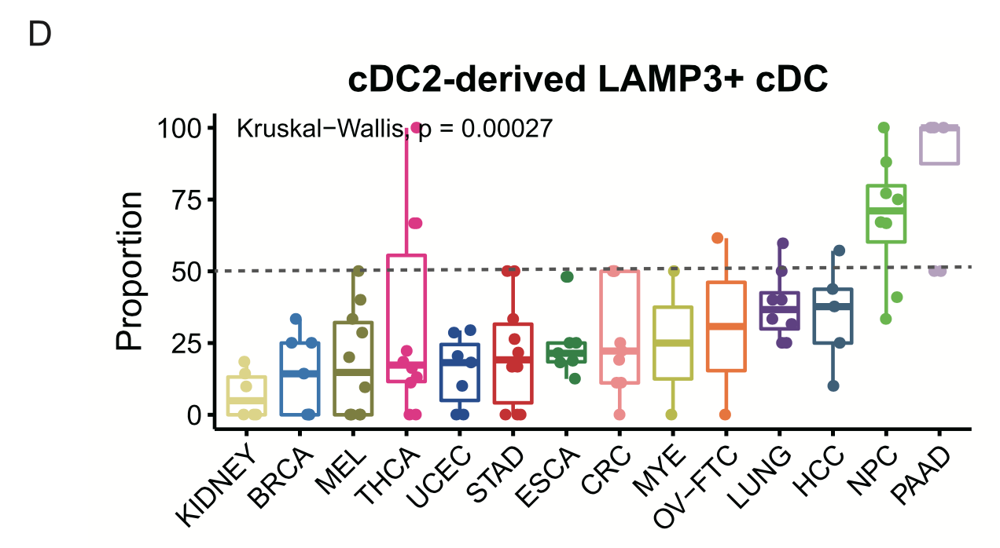
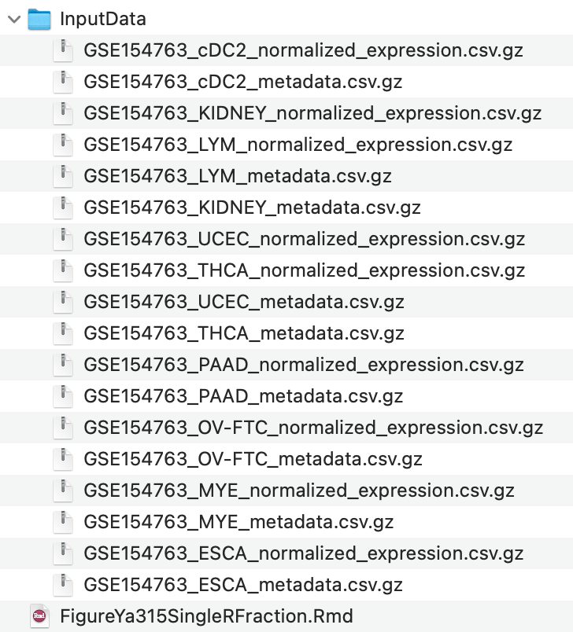

欢迎关注“小丫画图”公众号，回复“小白”，看小视频，实现点鼠标跑代码。

小丫微信: epigenomics  E-mail: figureya@126.com

作者：大鱼海棠，他的更多作品看这里<https://k.koudai.com/OFad8N0w>

单位：法国斯特拉斯堡遗传与分子生物学研究所，肿瘤功能基因组实验室

小丫编辑校验

```{r setup, include=FALSE}
knitr::opts_chunk$set(echo = TRUE)
```

# 需求描述

在单细胞数据中，怎么用singleR预测不同细胞亚群之间的相关性。





出自<https://www.cell.com/cell/fulltext/S0092-8674(21)00010-6?_returnURL=https%3A%2F%2Flinkinghub.elsevier.com%2Fretrieve%2Fpii%2FS0092867421000106%3Fshowall%3Dtrue>

Figure S5. Origins and regulation of LAMP3+ cDCs, related to Figure 4
(D) Boxplot showing the fractions of cDC2-derived LAMP3+ cDCs in all LAMP3+ cDCs across different cancer types. Kruskal-Wallis test.

# 应用场景

例文针对`origins of the LAMP3+ cDCs`的问题 做了多个角度的探讨，可以灵活运用到自己感兴趣的细胞类型中。

本文档使用SingleR计算cDC3_LAMP3来源于cDC2的占比，实现Figure S5D。

同一篇文章的Figure S5B（Stratification of cDC transcriptomes by scores generated from signature genes of three cDC subsets）可以用FigureYa314SingleRScore <https://k.youshop10.com/2DkhulHr>来计算和画图。

# 环境设置

使用国内镜像安装包

```{r eval=FALSE}
options("repos"= c(CRAN="https://mirrors.tuna.tsinghua.edu.cn/CRAN/"))
options(BioC_mirror="http://mirrors.tuna.tsinghua.edu.cn/bioconductor/")
BiocManager::install("SingleR")
```

加载包

```{r}
library(Matrix)
library(Seurat)
library(SingleR) #labels new cells from a test dataset based on similarity to the reference.
library(ggplot2) 
library(ggpubr) #用于实现Kruskal-Wallis test

Sys.setenv(LANGUAGE = "en") #显示英文报错信息
options(stringsAsFactors = FALSE) #禁止chr转成factor
```

# 输入文件

原文图中有14个cohort，作者上传到GEO数据库的只有9个，<https://www.ncbi.nlm.nih.gov/geo/query/acc.cgi?acc=GSE154763>。我们从Supplementary file表格里下载csv.gz文件，放到当前目录下的InputData文件夹。



实际应用中，直接跳到下一步“SingleR”，加载自己的seurat对象。

```{r}
data.path <- file.path("InputData")

# 读取表达谱
emats <- lapply(list.files(data.path, pattern = "expression", full.names = T), function(x){
  emat = data.table::fread(x, data.table = F, sep = ",")
  rownames(emat) = emat$index; emat$index = NULL
  emat = as(as.matrix(t(emat)), "dgCMatrix")
  return(emat)
})

einfos <- lapply(list.files(data.path, pattern = "metadata", full.names = T), function(x){
  einfo = read.csv(x)
  rownames(einfo) = einfo$index
  return(einfo)
})

seu.objs <- mapply(function(x, y){
  seu = CreateSeuratObject(x, meta.data = y)
}, emats, einfos)
seu <- merge(seu.objs[[1]], seu.objs[-1])
# 目的是看cDC3中cDC2来源的占比，如果队列里没有cDC3细胞的话，画图时不会出现这个队列
# 运行这句就可以看到哪些队列里有cDC3了
table(seu$cancer[seu$MajorCluster=="M05_cDC3_LAMP3"])

seu <- subset(seu, MajorCluster %in% c("M03_cDC1_CLEC9A", "M04_cDC2_CD1C", "M05_cDC3_LAMP3")) #取子集来降低计算量
```

# SingleR评估cDC3（LAMP3+ cDCs）的cDC2来源占比

原文：Here, we used the **transcriptomes of cDC1s and cDC2s as a reference** to predict the **origin of LAMP3+ cDCs in each dataset**. 

```{r}
# 由单细胞转录组数据生成cDC1、cDC2参考集
train <- AverageExpression(seu, group.by = "MajorCluster")[[1]]
train <- train[, c("M03_cDC1_CLEC9A", "M04_cDC2_CD1C")]

# 评估cDC3（LAMP3+ cDCs）的cDC2来源占比
test <- seu@assays$RNA@data[, seu$MajorCluster == "M05_cDC3_LAMP3"]
test.label <- as.data.frame(SingleR(test = test, #M05_cDC3_LAMP3
                                    ref = train, #M03_cDC1_CLEC9A和 M04_cDC2_CD1C
                                    labels = colnames(train)))
test.label$cohort <- seu$cancer[match(rownames(test.label), colnames(seu))]
test.label$patient <- seu$patient[match(rownames(test.label), colnames(seu))]
plot.data <- split(test.label, test.label$cohort)
plot.data <- lapply(plot.data, function(x){
  df = as.data.frame.matrix(table(x$patient, x$pruned.labels))
  data.frame("patient" = rownames(df), 
             "prop" = df$M04_cDC2_CD1C/rowSums(df)
             #或换成下面这行，计算cDC1来源占比
             #"prop" = df$M03_cDC1_CLEC9A/rowSums(df)
             )
})
plot.data <- do.call(rbind, plot.data)
plot.data$cohort <- gsub("(.+)\\.(.+)", "\\1", rownames(plot.data))
```

# 开始画图

## 基础版

```{r fig.width=5, fig.height=4}
ggplot(plot.data, aes(x = cohort, y = prop*100, color = cohort)) + 
  geom_boxplot() + 
  geom_point(shape = 16, 
             position = position_jitterdodge()) +
  scale_colour_brewer(palette = "Paired") + 
  #在50%处画虚线
  geom_hline(yintercept = 50, color="black",
             linetype="longdash", lwd = 0.5) + 
  theme_classic() + 
  guides(colour = "none") + 
  labs(x = "", y = "Proportion") + 
  ggtitle("cDC2-derived LAMP3+ CDC") +
  theme(axis.text.x = element_text(angle = 45, vjust = 1, hjust=1, 
                                   color = "black"),
        axis.title.y = element_text(hjust = 0.5, color = "black"),
        axis.text.y = element_text(hjust = 0.5, color = "black"),
        axis.ticks = element_line(color="black"),
        axis.ticks.length = unit(0.2, "cm"),
        panel.background = element_blank(),
        panel.grid = element_blank(),
        legend.position = "top",
        axis.title = element_text(size = 10),
        axis.text = element_text(size = 10)) +
  # Kruskal-Wallis test
  stat_compare_means(method = "kruskal.test")

ggsave("Proption.pdf", width = 5, height = 4)
```

## 升级版

```{r fig.width=5, fig.height=4}
ggplot(plot.data, aes(x = cohort, y = prop*100, fill = cohort)) + 
  geom_violin(alpha = 0.4, position = position_dodge(width = .75), 
              size = 0.8, color="white") + 
  geom_boxplot(notch = F, outlier.size = -1, 
               color="black", lwd = 0.6, alpha = 0.7) + 
  geom_boxplot() + 
  geom_point(shape = 21, size=1.2, 
             position = position_jitterdodge(), alpha = 0.6) + 
  scale_fill_brewer(palette = "Paired") + 
  geom_hline(yintercept = 50, color="black",
             linetype="longdash", lwd = 0.5) + 
  theme_classic() + 
  guides(fill = "none") + 
  labs(x = "", y = "Proportion") + 
  ggtitle("cDC2-derived LAMP3+ CDC") +
  theme(axis.text.x = element_text(angle = 45, vjust = 1, hjust=1, 
                                   color = "black"),
        axis.title.y = element_text(hjust = 0.5, color = "black"),
        axis.text.y = element_text(hjust = 0.5, color = "black"),
        axis.ticks = element_line(color="black"),
        axis.ticks.length = unit(0.2, "cm"),
        panel.background = element_blank(),
        panel.grid = element_blank(),
        legend.position = "top",
        axis.title = element_text(size = 10),
        axis.text = element_text(size = 10)) +
  stat_compare_means(method = "kruskal.test")

ggsave("Proption_plus.pdf", width = 5, height = 4)
```

# Session Info

```{r}
sessionInfo()
```