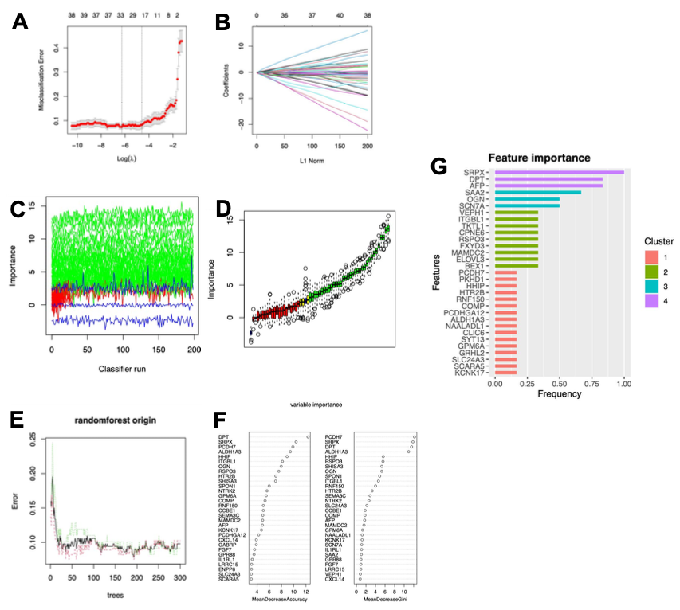

欢迎关注“小丫画图”公众号，回复“小白”，看小视频，实现点鼠标跑代码。

小丫微信: epigenomics  E-mail: figureya@126.com

作者：李国齐，他的更多作品看这里<https://k.youshop10.com/wWoVgT5G>

小丫编辑校验

```{r setup, include=FALSE}
knitr::opts_chunk$set(echo = TRUE)
```

# 需求描述

想众筹这篇文章的Figure S2；就是用4种机器学习来筛选生物标志物



出自<https://www.ijbs.com/v18p0360>

A total of 36, 15, 35 and 31 mRNAsi phenotype-based DEGs were selected by LASSO, SVM-RFE, RF and XGBoost, separately; results of each algorithm were shown in Figure S2.

# 应用场景

文章补充图2中展示的图形为4种算法的结果（LASSO，XGBoost，RF，Boruta），但方法学描述的确是5种（LASSO，SVM-REF，XGBoost，RF，Boruta）。

其中XGBoost是我们第一次众筹。FigureYa65SVM已经实现了前两种（LASSO，SVM-REF），本文档实现3种算法（XGBoost，RF，Boruta）。

我们众筹过的LASSO、SVM-REF、RF和Boruta如下。作者不同，可对比学习：

LASSO

- FigureYa31lasso <https://k.youshop10.com/BflugKvZ>
- FigureYa65SVM <https://k.youshop10.com/5RZm-I9h>
- FigureYa128Prognostic <https://k.youshop10.com/5be2BiFs>
- FigureYa220repeatedLasso <https://k.youshop10.com/4TzImkC6>
- FigureYa238corRiskMut <https://k.youshop10.com/nUP=aC-n>
- FigureYa293machineLearning <https://k.youshop10.com/vkyERKZ7>
- FigureYa45iCluster <https://k.youshop10.com/puSQ=xuo>

SVM-REF

- FigureYa65SVM <https://k.youshop10.com/5RZm-I9h>
- FigureYa130coxSVM <https://k.youshop10.com/eUd6aHnK>
- FigureYa217RMR <https://k.youshop10.com/S6owwKd8>
- FigureYa293machineLearning <https://k.youshop10.com/vkyERKZ7>

RF

- FigureYa159LR_RF <https://k.youshop10.com/YgeCQyJm>
- FigureYa184ranger <https://k.youshop10.com/ZvyyYkr9>
- FigureYa221tenFoldRF <https://k.youshop10.com/3mnuaz7y>

Boruta

- FigureYa204PCAscore <https://k.youshop10.com/=bRTDwW7>，不同于常规的lasso, cox回归系数与基因表达量的乘积，这篇文章采用Boruta降维，联合主成分分析第一主成分构建 signature score，特别适合做分子分型分析。

另外，我们众筹过的FigureYa可以实现文中的几个图：

- Figure 1A，可以用FigureYa161stemness来计算mRNAsi并画图。
- Figure 2A，可参考FigureYa71ssGSEA<https://k.youshop10.com/hhH631te>。
- Figure 2B，ESTIMATE可参考FigureYa211multiCohortImmSubtype<https://k.youshop10.com/VwpAWxx0>或FigureYa230immunelandscape<https://k.youshop10.com/wQSoNWJ0>，相关性展示可参考<https://k.youshop10.com/Eig1YOB4>。
- Figure 2D，CIBERSORT可参考FigureYa211multiCohortImmSubtype<https://k.youshop10.com/VwpAWxx0>，画图可参考FigureYa12box<https://k.youshop10.com/GyC0Qm3g>
- Figure 3C，ClusterProfiler衔接GOplot可参考FigureYa52GOplot<https://k.youshop10.com/DmEbg3iO>
- Figure 3E，可参考FigureYa69cancerSubtypes<https://k.youshop10.com/kdKt1Kit>
- Figure 5K，可参考FigureYa131CMap<https://k.youshop10.com/7kOjUwPe>
- Figure 6D，可参考FigureYa102multipanelROC<https://k.youshop10.com/7bYkTnXu>

# 环境设置

使用国内镜像安装包

```{r eval=FALSE}
options("repos"= c(CRAN="https://mirrors.tuna.tsinghua.edu.cn/CRAN/"))
options(BioC_mirror="http://mirrors.tuna.tsinghua.edu.cn/bioconductor/")
BiocManager::install("randomForest")
```


```{r}
Sys.setenv(LANGUAGE = "en") #显示英文报错信息
options(stringsAsFactors = FALSE) #禁止chr转成factor
```

# 输入文件

easy_input.csv，带有分组信息的矩阵。来自FigureYa65 <https://k.youshop10.com/5RZm-I9h>。

可自行准备，至少包含以下信息：

- 第一列：sample ID
- 第二列：样本分组信息，最好为二分类变量
- 第三列之后：表达矩阵

```{r}
data <- read.csv("easy_input.csv", row.names = 1, as.is = F)
set.seed(100)
```

# RF算法

```{r fig.width=5, fig.height=5}
library(randomForest)

rf_input <- data[, 1:51] # 为了节约时间，使用部分数据进行展示
n <- length(names(rf_input))
outTab <- data.frame()
for (i in 1:(n-1)) {
  mtry_fit <- randomForest(group~., data = rf_input, mtry = i)
  err <- mean(mtry_fit$err.rate)
  print(err)
  outTab <- rbind(outTab,err)
  colnames(outTab) <- "err"
}
# 选取randomforest –mtry节点值，对应误差最小的节点值为41
which.min(outTab$err)

# 随机设置决策树的大小，以找到模型内误差基本稳定点所对应的决策树数目
ntree_fit <- randomForest(group~., data = rf_input, mtry = 41, ntree = 2000)

plot(ntree_fit)
pdf("A_RF.pdf", width = 5, height = 5)
plot(ntree_fit)
dev.off()
# 之后选择ntree值，ntree指定随机森林所包含的决策树数目，默认为500；
# 在1500左右时，模型内误差基本稳定，故取ntree = 1500
rf <- randomForest(group ~., data = rf_input, mtry = 41, ntree = 1500, importance = T)
rf
importance <- importance(x=rf)
importance
write.table(importance,"output_importance_RF.txt", col.names = T, row.names = T, sep = "\t", quote = F)
pdf("B_RF.pdf", width = 5, height = 5)
varImpPlot(rf)
dev.off()
```

# XGBoost算法

```{r fig.width=5, fig.height=5}
library(xgboost)
library(Matrix)
#install.packages("Ckmeans.1d.dp")
#如果此处报错，例如
#Error in install.packages : ERROR: failed to lock directory ‘C:\Users\96251\Documents\R\win-library\4.1’ for modifying
#Try removing ‘C:\Users\96251\Documents\R\win-library\4.1/00LOCK’
#只需要去上述所指定的路径下（例子为C:\Users\96251\Documents\R\win-library\4.1/）删除00LOCK文件夹即可

matrix <- sparse.model.matrix(group ~ .-1, data = data)
label <- as.numeric(ifelse(data$group=="NR", 0, 1))#XGBoost算法需要的分类变量为数值型
fin <- list(data=matrix,label=label) 
dmatrix <- xgb.DMatrix(data = fin$data, label = fin$label) 
# 模型训练
xgb <- xgboost(data = dmatrix,max_depth=6, eta=0.5,  
               objective='binary:logistic', nround=25)
# 重要重要性排序 
xgb.importance <- xgb.importance(matrix@Dimnames[[2]], model = xgb)  
head(xgb.importance)
write.table(xgb.importance, "output_importance_XGBoost.txt", col.names = T, row.names = T, sep = "\t", quote = F)

pdf("XGBoost.pdf", width = 5, height = 5)
xgb.ggplot.importance(xgb.importance)
dev.off()
```

# Boruta算法

```{r fig.width=5, fig.height=5}
library(Boruta)
library(mlbench)
# 为了节约时间，使用部分数据进行展示
Boruta_input <- data[, 1:51]

boruta <- Boruta(group ~ ., data = Boruta_input, doTrace = 2, maxRuns = 500)

print(boruta)
# 通过计算发现19个特征是重要特征，对应下图绿色，29个是不重要的特征，对应下图红色，2个是不明确重要特征，对应下图蓝色

#可视化选择的结果
pdf("A_Boruta.pdf",width = 5, height = 5)
plot(boruta, las = 2, cex.axis = 0.7)
dev.off()
#可视化具体的选择过程
pdf("B_Boruta.pdf", width = 5, height = 5)
plotImpHistory(boruta)
dev.off()

#采用TentativeRoughFix的方法来解析不确定的特征
bor <- TentativeRoughFix(boruta)
print(bor)

#显示最终特征选择的结果
attStats(boruta)
write.table(attStats(boruta), "output_importance_Boruta.txt", col.names = T, row.names = T, sep = "\t", quote = F)
```

# Session Info

```{r}
sessionInfo()
```