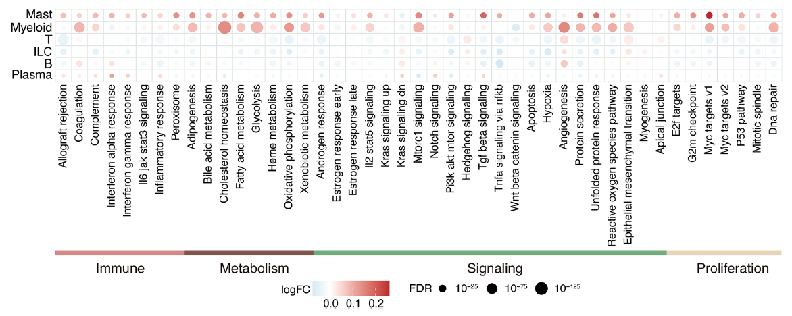
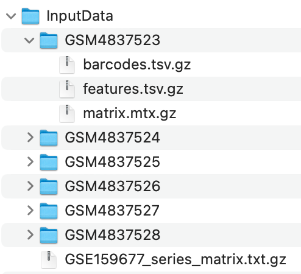

欢迎关注“小丫画图”公众号，回复“小白”，看小视频，实现点鼠标跑代码。

小丫微信: epigenomics  E-mail: figureya@126.com

作者：大鱼海棠，他的更多作品看这里<https://k.koudai.com/OFad8N0w>

单位：法国斯特拉斯堡遗传与分子生物学研究所，肿瘤功能基因组实验室

小丫编辑校验

```{r setup, include=FALSE}
knitr::opts_chunk$set(echo = TRUE)
```

# 需求描述

代谢分析最后的f图，他是怎么算70多条代谢通路在单细胞里面跟其他基因集相关性的。



出自<https://bmcbiol.biomedcentral.com/articles/10.1186/s12915-023-01540-2>

Fig. 1 Dissection of the immune landscape in atherosclerosis with scRNA-seq.
f Dot plots showing differentially enriched pathways in the global cell type between AC and PA tissues

# 应用场景

根据单细胞数据，计算不同细胞类型中两组间通路活性得分，并绘制差异分析点图(Fig.1 f)。点的大小表示显著性（padj或FDR等），点的颜色表示logFC。

Figure 1e，细胞比例分布特异度（Ro/e）折线图，可参考FigureYa317RoeDot<https://k.youshop10.com/Qn2Wb5MU>。

# 环境设置

使用国内镜像安装包

```{r eval=FALSE}
options("repos"= c(CRAN="https://mirrors.tuna.tsinghua.edu.cn/CRAN/"))
options(BioC_mirror="http://mirrors.tuna.tsinghua.edu.cn/bioconductor/")
install.packages("BiocManager")
install.packages("SeuratObject")
BiocManager::install("GEOquery")
BiocManager::install("AUCell")
BiocManager::install("clusterProfiler")
BiocManager::install("limma")
BiocManager::install("GSVA")
```

加载包

```{r}
library(Seurat)
library(magrittr)
library(GEOquery)
library(plyr)
library(openxlsx)
library(GSVA)
library(AUCell)
library(clusterProfiler)
library(limma)
library(ggplot2)
library(dplyr)
library(cowplot)
Sys.setenv(LANGUAGE = "en") #显示英文报错信息
options(stringsAsFactors = FALSE) #禁止chr转成factor
```

# 输入文件

Seurat对象：这步跟FigureYa317RoeDot相同。包含样本来源（Group）和细胞类型（Celltypes）信息。从GEO下载输入数据，<https://www.ncbi.nlm.nih.gov/geo/query/acc.cgi?acc=GSE159677>，下载Supplementary file表格里的`GSE159677_RAW.tar`，和Download family里的`Series Matrix File(s)`，存放在InputData文件夹里。也可以从语雀下载<https://www.yuque.com/figureya/figureyaplus/easyinput>



h.all.v7.5.1.symbols.gmt，基因集文件，存放基因与通路的关联关系

GenesetInfo.txt，通路信息文件，标识通路及其所属分类

```{r eval=FALSE}
# 单细胞数据的准备
# 目标：生成一个注释好的Seurat对象，以备作图需求
# Seurat对象应包含以下信息
# 样本分组（group）和细胞类型（Celltypes）

# 设置存放输入数据的路径
data.path <- file.path("InputData") 
# 读取样本信息
sample.info <- getGEO(filename = file.path(data.path,"GSE159677_series_matrix.txt.gz"))
sample.info <- as.data.frame(sample.info)
sample.info$title <- gsub(" scRNA-seq", "", sample.info$title)
sample.info <- data.frame(
  "geo" = sample.info$geo_accession,
  "patient" = gsub("(.+)\ (.+)\ (.+)", "\\1\\2", sample.info$title),
  "group" = gsub("(.+)\ (.+)\ (.+)", "\\3", sample.info$title)
)

# 批量读取表达矩阵
samples <- list.dirs("InputData", full.names = T)[-1]
mtx.list <- lapply(samples, function(sample){
  mtx = Read10X(data.dir = sample)
  colnames(mtx) = paste0(substr(basename(sample), 1, 10), colnames(mtx))
  return(mtx)
})
mtx <- do.call(cbind, mtx.list)

# 生成Seurat对象
seu <- CreateSeuratObject(mtx, min.cells = 3, min.features = 200)
seu$Sample <- substr(colnames(seu), 1, 10)
seu$Patient <- mapvalues(x = seu$Sample,
                         from = sample.info$geo, to = sample.info$patient)
seu$Group <- mapvalues(x = seu$Sample,
                       from = sample.info$geo, to = sample.info$group)
seu <- FindVariableFeatures(seu) %>% NormalizeData() %>% ScaleData()
seu <- RunPCA(seu)
seu <- RunUMAP(seu, dims = 1:20)
seu <- FindNeighbors(seu, dims = 1:20) %>% FindClusters(resolution = 0.4)
DimPlot(seu, group.by = "seurat_clusters", label = T)

# 此处使用机器注释，实际情况中应使用手动注释
marker <- read.xlsx("marker.xlsx")
marker <- split(marker$GeneSymbol, marker$Celltype)
marker.score <- gsva(expr = AverageExpression(seu)[[1]],
                     gset.idx.list = marker)
anno <- data.frame(
  "cluster" = colnames(marker.score),
  "celltype" = rownames(marker.score)[apply(marker.score, 2, which.max)]
)
seu$Celltypes <- mapvalues(x = seu$seurat_clusters,
                           from = anno$cluster, to = anno$celltype)
saveRDS(seu, "seu.rds") # 保存seu对象
```

# 不同细胞类型中，两组间通路活性得分的差异分析

```{r}
# 读取Seurat对象
seu <- readRDS("seu.rds")
# 读取通路信息，计算各细胞类型的通路得分
# 设置存放输入数据的路径
data.path <- file.path("InputData") 
geneset <- read.gmt("h.all.v7.5.1.symbols.gmt")
geneset <- split(geneset$gene, geneset$term)
genesetInfo <- read.delim("GenesetInfo.txt", sep = ",")
genesetInfo <- subset(genesetInfo, Classification != "")
levels = c("Immune", "Metabolism", "Signaling", "Proliferation")
genesetInfo$Classification <- factor(genesetInfo$Classification, levels)
genesetInfo <- arrange(genesetInfo, genesetInfo$Classification, genesetInfo$geneset)
genesetInfo$geneset <- factor(genesetInfo$geneset, levels = genesetInfo$geneset)
score <- AUCell_run(seu@assays$RNA@counts, geneset)
score <- score@assays@data$AUC

# 在不同细胞类型中，对两组进行差异分析
compare="AC-PA" # AC组与PA组进行比较
adjust.method = "bonferroni" # p值矫正方法，设定为bonferroni，用于作图的显著性指标为FDR
DP.list <- lapply(levels(seu$Celltypes), function(celltype){
  group = setNames(object = seu$Group[seu$Celltypes == celltype],
                   nm = colnames(seu)[seu$Celltypes == celltype])
  design = model.matrix(~ 0 + factor(group))
  colnames(design) = levels(factor(group))
  rownames(design) = names(group)
  
  contrast.matrix = makeContrasts(compare, levels = design) # should be Test-Control
  fit = lmFit(score[, names(group)], design)
  fit2 = contrasts.fit(fit, contrast.matrix)
  fit2 = eBayes(fit2) 
  DPs = topTable(fit2, coef=1, n=Inf, adjust.method = adjust.method)
  DPs$Celltypes = celltype
  DPs$Pathway = rownames(DPs)
  return(DPs)
})
DPs <- do.call(rbind, DP.list)

# 输出差异分析表格
write.table(DPs, file = "output_hallmark.txt",
            sep = "\t", row.names = F, col.names = T, quote = F)
```

# 开始画图 - Fig.1 f

```{r fig.width=12, fig.height=4}
# 准备画图数据
DPs <- read.table("output_hallmark.txt", header = T)
plot.data <- DPs
plot.data <- subset(plot.data, Pathway %in% genesetInfo$geneset)
plot.data$Celltypes <- factor(plot.data$Celltypes)
plot.data$Pathway <- factor(plot.data$Pathway, levels = genesetInfo$geneset) # 通路顺序与genesetInfo一致
plot.data$FDR<- cut(plot.data$adj.P.Val, breaks = c(0, 1e-125, 1e-75, 1e-25, 1),
                    include.lowest = T)
plot.data$FDR <- factor(as.character(plot.data$FDR),
                        levels = rev(levels(plot.data$FDR)))
levels(plot.data$Pathway) <- tolower(gsub("HALLMARK_", "", levels(plot.data$Pathway)))

# 准备绘图
color = c("#4682B4", "#FFFFFF", "#CD2626") # logFC对应的颜色
class.color = c("Immune" = "#D58986", "Metabolism" = "#80554C",
                "Signaling" = "#71AC7A", "Proliferation" = "#E8D4B4") # 通路分类对应的颜色
p1 <- ggplot(plot.data, aes(x = Pathway, y = Celltypes, color = logFC, size = FDR)) +
  geom_point() +
  scale_color_gradient2(low = color[1], mid = color[2], high = color[3]) +
  geom_hline(yintercept = seq(min(as.numeric(plot.data$Celltypes))-0.5,
                              max(as.numeric(plot.data$Celltypes))+0.5),
             color = "grey80") +
  geom_vline(xintercept = seq(min(as.numeric(plot.data$Pathway))-0.5,
                              max(as.numeric(plot.data$Pathway))+0.5),
             color = "grey80") +
  theme_classic() +
  theme(axis.text.x = element_text(angle = 90, hjust = 1, vjust = 0.5),
        axis.line = element_blank())

p2 <- ggplot(genesetInfo, aes(x = geneset, y = 1, fill = Classification)) +
  geom_tile() +
  theme_classic() +
  scale_fill_manual(values = class.color) +
  theme(axis.text = element_blank(), axis.title = element_blank(),
        axis.ticks = element_blank(), axis.line = element_blank())

plot_grid(p1, p2, ncol = 1, align = 'v', rel_heights = c(10, 1)) # 拼接图像
ggsave("hallmark.pdf", width = 12, height = 4)
```

# 后期处理

输出的pdf文件是矢量图文件，可以用Illustrator等矢量图编辑器打开，调整图形或文字的位置。

# Session Info

```{r}
sessionInfo()
```