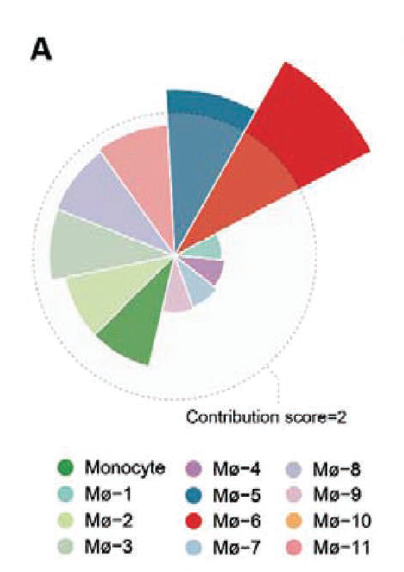
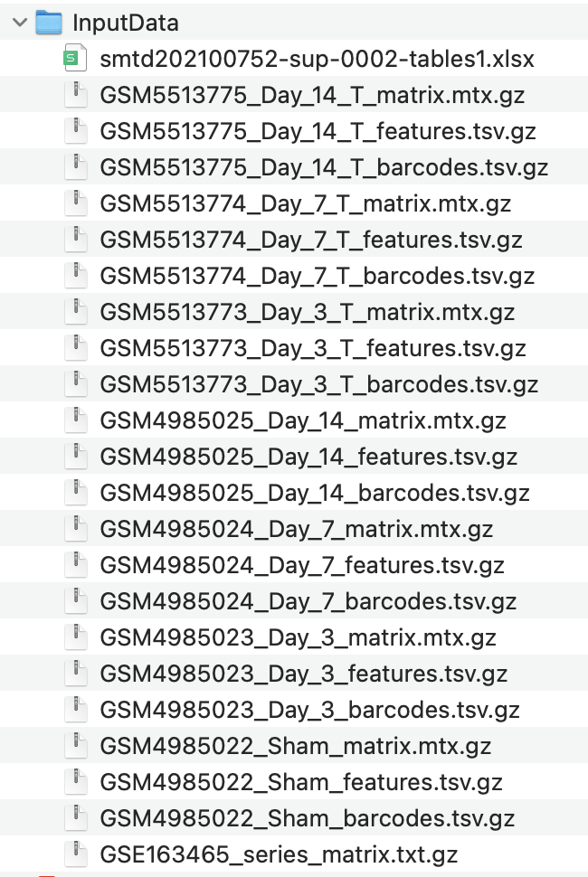

欢迎关注“小丫画图”公众号，回复“小白”，看小视频，实现点鼠标跑代码。

小丫微信: epigenomics  E-mail: figureya@126.com

作者：大鱼海棠，他的更多作品看这里<https://k.koudai.com/OFad8N0w>

单位：法国斯特拉斯堡遗传与分子生物学研究所，肿瘤功能基因组实验室

小丫编辑校验

```{r setup, include=FALSE}
knitr::opts_chunk$set(echo = TRUE)
```

# 需求描述

想众筹这个a图，怎么去算单细胞某个细胞亚群对疾病贡献度，知道哪些细胞亚群最重要。



出自<https://onlinelibrary.wiley.com/doi/10.1002/smtd.202100752>

Figure 6. Tanshinone IIA treatment validates the effectiveness of early infiltrated macrophage subsets suppression in attenuating pathological MI progression.
A) Disease contributions of distinct macrophage subsets. The radius is proportional to the contribution score. Detailed information is described in the Experimental Section.

# 应用场景

根据单细胞数据，计算细胞亚群对疾病贡献度ContributionScore，绘制环形柱状图（Fig. 6A）

例文中有几个有特点的图我们曾经众筹过：

- Figure 2B，可参考FigureYa235scDEG <https://k.youshop10.com/m=E-yK5Z>
- Figure 3D，可参考FigureYa285scRNA_monocle <https://k.youshop10.com/ndalTqa=>
- Figure 5F，可参考FigureYa178ReceptorLigand <https://k.youshop10.com/YICoy-XB>

更多单细胞FigureYa看这里<https://k.youshop10.com/McawGY6=>

# 环境设置

使用国内镜像安装包

```{r eval=FALSE}
options("repos"= c(CRAN="https://mirrors.tuna.tsinghua.edu.cn/CRAN/"))
options(BioC_mirror="http://mirrors.tuna.tsinghua.edu.cn/bioconductor/")
install.packages("Seurat")
BiocManager::install("SingleR")
```

加载包

```{r}
library(Seurat)
library(magrittr)
library(GEOquery)
library(SingleR)
library(plyr)
library(openxlsx)
library(GSVA)
library(dplyr)
library(reshape2)
library(ggplot2)
Sys.setenv(LANGUAGE = "en") #显示英文报错信息
options(stringsAsFactors = FALSE) #禁止chr转成factor
```

# 输入文件

Seurat对象：具有细胞亚型注释（subtype）和分组信息（time）。从GEO下载输入数据，<https://www.ncbi.nlm.nih.gov/geo/query/acc.cgi?acc=GSE163465>，下载Supplementary file表格里的`GSE163465_RAW.tar`，和Download family里的`Series Matrix File(s)`，下载后存放在InputData文件夹里。

smtd202100752-sup-0002-tables1.xlsx，原文提供的marker，用于髓系细胞亚型注释。下载地址：<https://onlinelibrary.wiley.com/action/downloadSupplement?doi=10.1002%2Fsmtd.202100752&file=smtd202100752-sup-0002-TableS1.xlsx>



```{r}
# 设置存放输入数据的路径
data.path <- file.path("InputData") 
# 读取样本信息
sample.info <- getGEO(filename = file.path(data.path,"GSE163465_series_matrix.txt.gz"))
sample.info <- as.data.frame(sample.info)
sample.info$title <- gsub("CD45\\+\\ |Cd45\\+\\ |_T", "", sample.info$title)
sample.info <- data.frame(
  "geo" = sample.info$geo_accession,
  "time" = sample.info$title
)

# 读取原文提供的marker，用于髓系细胞亚型注释
marker <- read.xlsx(xlsxFile = file.path(data.path,"smtd202100752-sup-0002-tables1.xlsx"), 
                    sheet = "Mø and Monocyte")
marker <- subset(marker, avg_logFC > 0.5 & p_val_adj < 0.05)
marker <- split(marker$gene, marker$cluster)

# 读取表达矩阵
samples <- list.files(data.path, pattern = "mtx.gz$", full.names = T)
mtx.list <- lapply(samples, function(sample){
  mtx = ReadMtx(mtx = sample, 
                cells = gsub("matrix.mtx.gz", "barcodes.tsv.gz", sample), 
                features = gsub("matrix.mtx.gz", "features.tsv.gz", sample),
                cell.column = 1, feature.column = 2)
  colnames(mtx) = paste0(substr(basename(sample), 1, 10), colnames(mtx))
  return(mtx)
})
mtx <- do.call(cbind, mtx.list)

# 生成Seurat对象
seu <- CreateSeuratObject(mtx, min.cells = 3, min.features = 200)
seu$Sample <- substr(colnames(seu), 1, 10)
seu$Time <- sample.info$time[match(seu$Sample, sample.info$geo)]
seu <- FindVariableFeatures(seu) %>% NormalizeData() %>% ScaleData()
seu <- RunPCA(seu)
seu <- RunUMAP(seu, dims = 1:50)
seu <- FindNeighbors(seu, dims = 1:50) %>% FindClusters()
DimPlot(seu, group.by = "seurat_clusters", label = T)

# 注释细胞类型
SingleR.ref <- readRDS("MouseRNAseqData.rds") # 其他的参考集可以通过celldex包获取: http://bioconductor.org/packages/release/data/experiment/html/celldex.html
anno <- SingleR(test = seu@assays$RNA@data, clusters = seu$seurat_clusters,
                ref = SingleR.ref, labels = SingleR.ref$label.main)
anno <- as.data.frame(anno)
seu$Celltypes <- mapvalues(x = seu$seurat_clusters,
                           from = rownames(anno),
                           to = anno$pruned.labels)

# 提取髓系细胞，进行细胞亚型注释
seu <- subset(seu, Celltypes %in% c("Macrophages", "Monocytes"))
seu <- FindVariableFeatures(seu) %>% NormalizeData() %>% ScaleData()
seu <- RunPCA(seu)
seu <- RunUMAP(seu, dims = 1:50)
seu <- FindNeighbors(seu, dims = 1:50) %>% FindClusters()
DimPlot(seu, group.by = "seurat_clusters", label = T)
marker.score <- gsva(expr = AverageExpression(seu)[[1]],
                     gset.idx.list = marker)
anno <- apply(marker.score, 2, which.max)
anno <- data.frame(clusters = levels(Idents(seu)), label = names(marker)[anno])
seu$Subtypes <- mapvalues(seu$seurat_clusters, 
                          from = anno$clusters, to = anno$label)
DimPlot(seu, group.by = "Subtypes")
saveRDS(seu, "seu.rds") # 保存seu对象
```

# 进行ContributionScore计算

```{r}
# 计算流程如下：
# ①：在髓系细胞中计算Day3组相对于Sham组的前100个高表达基因
# ②：在各亚型中计算Day3相对于Sham组各基因的表达量FCexp和表达占比FCprop
# ③：计算FCexp和FCprop的平方根，作为ContributionScore

seu <- readRDS("seu.rds") #读取seu对象
Bulk.DEGs <- FindMarkers(seu, group.by = "Time", ident.1 = "Day_3", ident.2 = "Sham")
Bulk.DEGs$symbol <- rownames(Bulk.DEGs)
Bulk.DEGs <- arrange(Bulk.DEGs, Bulk.DEGs$p_val_adj, -Bulk.DEGs$avg_log2FC)
Bulk.DEGs <- Bulk.DEGs[1:100, ]
subset.DEGs <- lapply(SplitObject(seu, split.by = "Subtypes"), function(subset){
  deg = FindMarkers(subset, 
                    features = Bulk.DEGs$symbol, min.pct = 0, logfc.threshold = 0,
                    group.by = "Time", ident.1 = "Day_3", ident.2 = "Sham")
  deg$symbol = rownames(deg)
  deg$subtypes = unique(subset$Subtypes)
  return(deg)
})
subset.DEGs <- do.call(rbind, subset.DEGs)
subset.DEGs$FCexp <- 2^subset.DEGs$avg_log2FC
subset.DEGs$FCprop <- subset.DEGs$pct.1/subset.DEGs$pct.2
subset.DEGs$FCscore <- sqrt(subset.DEGs$FCexp*subset.DEGs$FCprop)
subset.DEGs$FCscore[is.infinite(subset.DEGs$FCscore)] <- NA
FCscore <- dcast(subset.DEGs, symbol~subtypes, measure.var = "FCscore")

#输出ContributionScore得分表（基因×细胞类型，FC score.txt）
write.table(FCscore, "output_FCscore.txt", 
            sep = "\t", row.names = F, col.names = T, quote = F)
```

# 开始画图 - Fig. 6A

绘制环形柱状图

```{r}
color = c("Monocyte" = "#359948", "Mø.1" = "#83C9BE",
          "Mø.2" = "#C4DB98", "Mø.3" = "#BBD2B2", 
          "Mø.4" = "#AE7EAD", "Mø.5" = "#356A80", 
          "Mø.6" = "#A6C6D9", "Mø.7" = "#DD2326", 
          "Mø.8" = "#BBB6C8", "Mø.9" = "#DAB7C6", 
          "Mø.10" = "#F6B060", "Mø.11" = "#E89093")
plot.data <- read.table("output_FCscore.txt", row.names = 1, header = T)
plot.data <- data.frame(
  "subtypes" = colnames(plot.data),
  "FCscore" = colMeans(plot.data, na.rm = T)
)
plot.data <- arrange(plot.data, plot.data$FCscore)
plot.data$subtypes <- factor(plot.data$subtypes, levels = plot.data$subtypes)

ggplot(plot.data, aes(x = subtypes, y = FCscore, fill = subtypes)) + 
  geom_bar(stat = "identity") + 
  scale_fill_manual(values = color) + 
  geom_hline(yintercept = 1, # 根据自己的数据调整
             color = "grey", linetype="dashed") + 
  coord_polar() + 
  theme_classic() + 
  theme(axis.text = element_blank(), axis.title = element_blank(),
        axis.line = element_blank(), axis.ticks = element_blank())
# 保存图像
ggsave("ContributionScore.pdf", width = 6, height = 4) 
```

# Session Info

```{r}
sessionInfo()
```