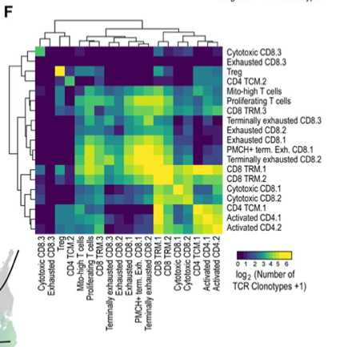

欢迎关注“小丫画图”公众号，回复“小白”，看小视频，实现点鼠标跑代码。

小丫微信: epigenomics  E-mail: figureya@126.com

作者：大鱼海棠，他的更多作品看这里<https://k.koudai.com/OFad8N0w>

单位：法国斯特拉斯堡遗传与分子生物学研究所，肿瘤功能基因组实验室

小丫编辑校验

```{r setup, include=FALSE}
knitr::opts_chunk$set(echo = TRUE)
```

# 需求描述

不同细胞类型间的共享克隆热图



出自<https://www.cell.com/cancer-cell/fulltext/S1535-6108(21)00115-X>

Figure 4. TCR analysis reveals lower diversity in terminally exhausted T cells. 
(F) Heatmap displaying the relative numbers of phenotypically “homogeneous” clonotypes (i.e. clonotypes found predominantly in 1 cluster) and phenotypically “heterogeneous” clonotypes (i.e. clonotypes predominantly distributed across multiple clusters). 

# 应用场景

评估克隆型在各细胞类型间分布情况，并绘制热图，颜色表示各细胞类型间共享克隆型的对数值。

# 环境设置

使用国内镜像安装包

```{r}
options("repos"= c(CRAN="https://mirrors.tuna.tsinghua.edu.cn/CRAN/"))
options(BioC_mirror="http://mirrors.tuna.tsinghua.edu.cn/bioconductor/")

```

加载包

```{r}
library(openxlsx)
library(ComplexHeatmap)

Sys.setenv(LANGUAGE = "en") #显示英文报错信息
options(stringsAsFactors = FALSE) #禁止chr转成factor
```

# 输入文件

cell.info.txt，应当包含barcode列(barcode)，细胞类型列(celltype)，克隆型列(clonaltype)。

- 细胞类型的获得需要识别细胞簇并进行细胞类型注释。由于目前对细胞亚型的注释未有通用工具，且注释结果受个人影响差异较大，因此本部分假设使用者已经完成了细胞分群和细胞注释。
- 克隆型可由cellranger VDJ分析模块生成，一般储存在*all_contig_annotations.csv中，克隆型根据使用者的偏好也可由其他软件进行再校准，有较高的自由度，因此本部分假设使用者已从cellranger或其他软件中获得克隆型数据。FigureYa177RNAvelocity <https://k.youshop10.com/RNHFyO4a>用过cellranger。

```{r}
cell.info <- read.table("cell.info.txt", sep = "\t", header = T)
celltypes <- unique(cell.info$celltype)
cell.info <- cell.info[-which(cell.info$celltype == "-1"),] # 移除定义不明确的类
count <- lapply(celltypes, function(A){
  sapply(celltypes, function(B){
    length(intersect(
      cell.info[["clonaltype"]][cell.info[["celltype"]] == A],
      cell.info[["clonaltype"]][cell.info[["celltype"]] == B]
    ))
  })
})
count <- do.call(rbind, count)
rownames(count) = colnames(count) = celltypes

# 输出各细胞类型共享的克隆型数目
write.table(count, "output_count.txt", row.names = T, col.names = T, sep = "\t", quote = F)
```

# 开始画图

```{r fig.width=8, fig.height=8}
upper <- 6 # 热图数值上限
# 设置行列顺序
plot.order <- c("Cytotoxic CD8.3", 
                "Exhausted CD8.3", 
                "Treg",
                "CD4 TCM.2", 
                "Mito-high T cells", 
                "Proliferating T cells",
                "CD8 TRM.3", 
                "Terminally exhausted CD8.3",
                "Exhausted CD8.2", "Exhausted CD8.1", 
                "PMCH+ terminally Exhausted CD8.1",
                "Terminally exhausted CD8.2",
                "CD8 TRM.1",
                "CD8 TRM.2",
                "Cytotoxic CD8.1",
                "Cytotoxic CD8.2",
                "CD4 TCM.1",
                "Activated CD4.1",
                "Activated CD4.2") 

count <- read.table("output_count.txt", header = T, sep = "\t", check.names = F)
count <- log(1 + count)
count[count > upper] = upper
count <- count[plot.order, plot.order]

# 绘制热图
hm <- pheatmap(as.matrix(count), 
         color = colorRampPalette(c("#440052", "#259290", "#F8E725"))(100),
         border_color = NA,
         #cluster_rows = F, 
         #cluster_cols = F,
         show_colnames = T, 
         show_rownames = T,
         cellwidth = 12, 
         cellheight = 12,
         name = "log(1+Number of\nTCR clonaltypes)")
pdf(file = "count_heatmap.pdf", width = 8, height = 8)
draw(hm)
invisible(dev.off())
```

# Session Info

```{r}
sessionInfo()
```