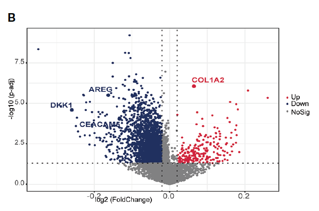

欢迎关注“小丫画图”公众号，回复“小白”，看小视频，实现点鼠标跑代码。

小丫微信: epigenomics  E-mail: figureya@126.com

作者：大鱼海棠，他的更多作品看这里<https://k.koudai.com/OFad8N0w>

单位：法国斯特拉斯堡遗传与分子生物学研究所，肿瘤功能基因组实验室

小丫编辑校验

```{r setup, include=FALSE}
knitr::opts_chunk$set(echo = TRUE)
```

# 需求描述

在癌症中高低分数组中的APA分析，用火山图展示(Fig.5 B)。



出自<https://www.frontiersin.org/articles/10.3389/fimmu.2022.1031184/full>

FIGURE 5 Transcriptional and post-transcriptional characteristics related to WM_Score. 
(B) **The differences in the PDUI** of each gene between WM_Score_high and WM_Score_low groups.

# 应用场景

例文关注的是PAAD，可以套用于TCGA其他癌症类型。

使用火山图展示差异分析结果。也可以使用FigureYa其他作者绘制的更复杂的火山图：

- 一组FigureYa59volcano <https://k.youshop10.com/spa8oEli>，FigureYa75baseVolcano   <https://k.youshop10.com/74G9Hb6K>
- 多组FigureYa135multiVolcano <https://k.youshop10.com/e-HIhe8N>，
- 更多散点图<https://k.youshop10.com/PqTXapih>

# 环境设置

使用国内镜像安装包

```{r}
options("repos"= c(CRAN="https://mirrors.tuna.tsinghua.edu.cn/CRAN/"))
options(BioC_mirror="http://mirrors.tuna.tsinghua.edu.cn/bioconductor/")

```

加载包

```{r}
library(limma)
library(ggplot2)
library(ggrepel)
library(TCGAbiolinks)

Sys.setenv(LANGUAGE = "en") #显示英文报错信息
options(stringsAsFactors = FALSE) #禁止chr转成factor
```

# 输入文件

TCGA_PAAD_Combined_PDUIs.txt，从synapse网站中下载的TC3A_PDUI（Percentage of Distal polyA site Usage Index）的计算结果。下载网址：<https://doi.org/10.7303/syn24982198>，里面有TCGA其他癌症的PDUI数据，根据自己的研究兴趣灵活运用。

TCGA_PAAD.clin.txt，样本分组信息group。原文未提供分型信息，使用xena下载的样本信息，下载自<https://tcga-xena-hub.s3.us-east-1.amazonaws.com/download/TCGA.PAAD.sampleMap%2FPAAD_clinicalMatrix>

```{r}
# 读取PDUI信息和样本信息
PDUI <- read.table("TCGA_PAAD_Combined_PDUIs.txt", header = T)
rownames(PDUI) <- PDUI$event_id
PDUI <- PDUI[, -c(1:3)]
colnames(PDUI) <- substr(colnames(PDUI), 1, 15)

group <- read.table("TCGA_PAAD.clin.txt", sep = "\t", header = T, row.names = 1)
rownames(group) <- gsub("-", "\\.", rownames(group))

samples <- intersect(rownames(group), colnames(PDUI))
PDUI <- PDUI[, samples]; group <- group[samples, ]
group <- setNames(object = ifelse(test = group$vital_status == "LIVING",
                                  yes = "LIVING", no = "DEAD"), 
                  nm = samples)
group <- factor(group, levels = c("LIVING", "DEAD")) # 设定测试组和对照组
```

# 进行差异分析

```{r}
design <- model.matrix(~0 + factor(group))
colnames(design) = levels(factor(group))
rownames(design) = names(group)
contrast.matrix <- makeContrasts(paste0(unique(group),collapse = "-"), 
                                 levels = design) # should be Test-Control
fit <- lmFit(PDUI[, names(group)], design)
fit2 <- contrasts.fit(fit, contrast.matrix)
fit2 <- eBayes(fit2) # Empirical Bayes Statistics for Differential Expression
DEGs = topTable(fit2, coef=1, n=Inf)
DEGs$RefSeq <- gsub("(.+)\\|(.+)\\|(.+)\\|(.+)", "\\1", rownames(DEGs))
DEGs$SYMBOL <- gsub("(.+)\\|(.+)\\|(.+)\\|(.+)", "\\2", rownames(DEGs))
DEGs$CHR <- gsub("(.+)\\|(.+)\\|(.+)\\|(.+)", "\\3", rownames(DEGs))

openxlsx::write.xlsx(DEGs, "output_DEGs.xlsx")
```

# 开始画图

```{r}
# 准备绘图数据
plot.data <- DEGs
plot.data$logPadj <- -log(plot.data$adj.P.Val)
plotgene <- c("DKK1", "COL1A2", "AREG", "CEACAM6") # 想在图上标记的基因
plot.data$label[plot.data$SYMBOL %in% plotgene] <- plot.data$SYMBOL[plot.data$SYMBOL %in% plotgene]

plot.data$color <- "#868686"
plot.data$color[plot.data$logFC < (-0.05) & plot.data$logPadj > 1] <- "#4966AE"
plot.data$color[plot.data$logFC > 0.05 & plot.data$logPadj > 1] <- "#E9281E"
plot.data$size <- abs(plot.data$logFC * plot.data$logPadj)

col <- names(table(plot.data$color))
names(col) <- col

# 绘制火山图
ggplot(data = plot.data, aes(x = logFC, y = logPadj, color = color)) + 
  geom_point(alpha = 0.6) +
  scale_color_manual(values = col) +
  scale_size_continuous(range=c(1, 8)) +
  geom_label_repel(aes(label = label), box.padding = unit(0.35, "lines"), 
                   point.padding = unit(0.3, "lines"), size = 4)+
  geom_vline(xintercept = c(-0.05, 0.05), color="grey40", linetype="longdash", lwd = 0.25) +
  geom_hline(yintercept = 1, color="grey40", linetype="longdash", lwd = 0.25) +
  theme_bw() +
  theme(panel.grid=element_blank(), plot.title = element_text(hjust = 0.5), legend.position = "none") +
  geom_point(data = subset(plot.data, !is.na(label)),  alpha = 1, shape = 1, 
             stroke = 0.5, #圈粗细
             color = "black")
ggsave("volcano.pdf", width = 6, height = 6)
```

# Session Info

```{r}
sessionInfo()
```