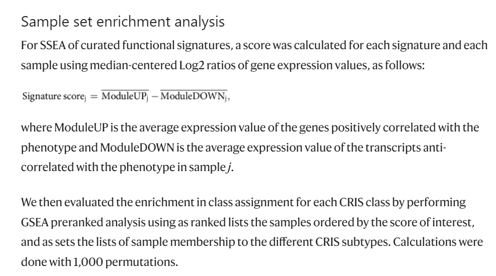

欢迎关注“小丫画图”公众号，回复“小白”，看小视频，实现点鼠标跑代码。

小丫微信: epigenomics  E-mail: figureya@126.com

作者：大鱼海棠，他的更多作品看这里<https://k.koudai.com/OFad8N0w>

单位：法国斯特拉斯堡遗传与分子生物学研究所，肿瘤功能基因组实验室

小丫编辑校验

```{r setup, include=FALSE}
knitr::opts_chunk$set(echo = TRUE)
```

# 需求描述

这篇文章中SSEA算法可否复现，数据没有限制，想学习一下这个计算流程。



出自<https://www.nature.com/articles/ncomms15107>

# 应用场景

计算通路的亚型富集得分SSEA，并绘制各亚型SSEA得分雷达图。

如果只想画雷达图，可以套用easy_input_SSEA.txt的格式调整自己的数据，直接前往“开始画图”。

适合同时展示多组数据的多个特征。

一组数据多个特征或多组数据一个特征，可参考FigureYa8radar <https://k.youshop10.com/XJpd8V=R>，画成花瓣雷达图。

# 环境设置

使用国内镜像安装包

```{r eval=FALSE}
options("repos"= c(CRAN="https://mirrors.tuna.tsinghua.edu.cn/CRAN/"))
options(BioC_mirror="http://mirrors.tuna.tsinghua.edu.cn/bioconductor/")
BiocManager::install("fmsb")
```

加载包

```{r}
library(openxlsx)
library(GSVA)
library(org.Hs.eg.db)
library(ggplot2)
library(fmsb)
library(fgsea)
library(dplyr)

Sys.setenv(LANGUAGE = "en") #显示英文报错信息
options(stringsAsFactors = FALSE) #禁止chr转成factor
```

自定义函数

```{r}
### 计算样本通路得分
# 注：其中样本通路得分也可用GSVA代替
ModuleScore <- function(expr, geneset){
  if (max(expr)>50) expr = log2(1+expr)
  base = apply(expr, 1, median)
  base = matrix(base, nrow = length(base), ncol = ncol(expr), byrow = FALSE)
  expr = expr-base
  score = lapply(geneset, function(gene){
    apply(expr[gene, ], 2, mean, na.rm = T)
  })
  return(do.call(rbind, score))
}

### Sample set enrichment analysis/SSEA
EnrichScore <- function(scores, group){
  group = split(names(scores), group)
  scores = sort(scores, decreasing = T)
  setNames(fgsea(pathways = group, stats = scores)$NES, names(group))
}
```

# 输入文件

TCGA-READ.htseq_counts.tsv.gz，TCGA-COAD.htseq_counts.tsv.gz，表达谱eset。文件较大，从语雀下载<https://www.yuque.com/figureya/figureyaplus/easyinput>。TCGA其他癌症类型表达数据可以到XENA下载<https://xenabrowser.net/datapages/>

41467_2017_BFncomms15107_MOESM425_ESM.xlsx，样本分组信息subtype。

signature.xlsx，基因集signature【包含up和down两个列表】

```{r}
## 读取基因集，表达谱和亚型信息
### 读取基因集
signature <- read.xlsx("signature.xlsx", sheet = "clean")
signature <- split(signature, signature$Type)
signature <- lapply(signature, function(sig){
  geneList = strsplit(sig$Gene, " ")
  names(geneList) = sig$Pathway
  return(geneList)
})

### 读取表达谱
eset <- lapply(list.files(pattern = "tsv.gz"), read.table, 
               row.names = 1, header = T, check.names = F)
eset <- do.call(cbind, eset)
eset <- eset[, substr(colnames(eset), 14, 16) == "01A"]
colnames(eset) <- substr(colnames(eset), 1, 12)
rownames(eset) <- gsub("(.+)\\.(.+)", "\\1", rownames(eset))
tmp <- AnnotationDbi::select(org.Hs.eg.db, rownames(eset),
                             columns = "SYMBOL", keytype = "ENSEMBL")
SYMBOL <- tmp$SYMBOL[match(rownames(eset), tmp$ENSEMBL)]
eset <- eset[!duplicated(SYMBOL) & !is.na(SYMBOL), ]
rownames(eset) <- SYMBOL[!duplicated(SYMBOL) & !is.na(SYMBOL)]

### 读取亚型信息
subtype <- read.xlsx("41467_2017_BFncomms15107_MOESM425_ESM.xlsx",
                     startRow = 3)
subtype <- subtype[subtype$Dataset.ID == "TCGA", ]
rownames(subtype) <- subtype$Sample.ID

### 整理样本信息
comsam <- intersect(colnames(eset), subtype$Sample.ID)
eset <- eset[, comsam]; subtype <- subtype[comsam, "CRIS.Assignment"]
```

# 计算通路得分

```{r}
### 计算各样本的通路得分
pathway <- Reduce(union, lapply(signature, names))
score <- lapply(signature, function(sig){
  s = as.data.frame(ModuleScore(eset, sig))
  s = s[pathway, ]
  s[is.na(s)] = 0
  return(s)
})
score <- score$UP - score$DOWN

### 计算SSEA
score <- apply(score, 1, EnrichScore, group = subtype)
colnames(score) <- pathway

# 输出各亚型SSEA得分
write.table(score, "easy_input_SSEA.txt", 
            row.names = T, col.names = NA, sep = "\t", quote = F)
```

# 开始画图

绘制雷达图

```{r}
### 设置颜色
color = setNames(c("#EF4A2B", "#D52026", "#1C265B", "#008646", "#00AB9B"),
                 c("CRISA", "CRISB", "CRISC", "CRISD", "CRISE"))

### 准备绘图数据
plot.data <- read.table("easy_input_SSEA.txt", sep = "\t", header = T, row.names = 1)
# plot.data <- plot.data + min(plot.data)
#### 对通路顺序进行排序，保证富集在同一亚型的通路在相近的位置
set.order <- data.frame( 
  row.names = colnames(plot.data),
  "maxcol" = apply(plot.data, 2, which.max),
  "maxprop" = apply(plot.data, 2, max)/colSums(plot.data)
)
set.order <- arrange(set.order, set.order$maxcol, -set.order$maxprop)
plot.data <- plot.data[, rownames(set.order)]

plot.data <- rbind(
  min = min(plot.data), max = max(plot.data), plot.data
)

## 绘制雷达图
width = c(3, 1) # 雷达图和图例的比例
layout(cbind(matrix(1, nrow = 2, ncol = width[1], byrow = TRUE),
             matrix(2, nrow = 2, ncol = width[2], byrow = TRUE)))
radarchart(plot.data, 
           pcol = color, plty = "solid", plwd = 3)  
plot.new()
legend(x = "center", legend = names(color),
       bty = "n", pch = 20 , col = color,
       text.col = "black", cex = 1, pt.cex = 1.5
) 
dev.copy2pdf(file = file.path("SSEA.radar.pdf"),
             width = 8, height = 8)
```

# Session Info

```{r}
sessionInfo()
```