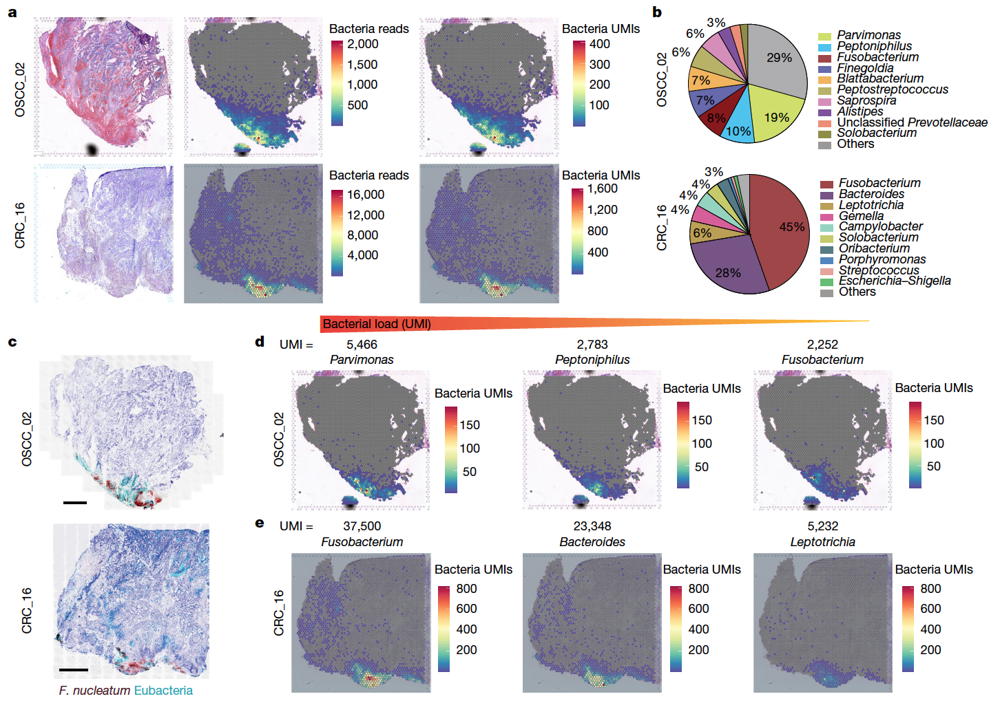

欢迎关注“小丫画图”公众号，回复“小白”，看小视频，实现点鼠标跑代码。

小丫微信: epigenomics  E-mail: figureya@126.com

作者：大鱼海棠，他的更多作品看这里<https://k.koudai.com/OFad8N0w>

单位：法国斯特拉斯堡遗传与分子生物学研究所，肿瘤功能基因组实验室

小丫编辑校验

```{r setup, include=FALSE}
knitr::opts_chunk$set(echo = TRUE)
```

# 需求描述

通过[pathseq](https://gatk.broadinstitute.org/hc/en-us/articles/360035889911)分析得到空间转录组的微生物UMI，画出FIG 1。



出自<https://www.nature.com/articles/s41586-022-05435-0>

Fig. 1: Assessing the spatial distribution of intratumoral bacteria throughout the tumour tissue.
a, Haematoxylin and eosin (H&E) staining (left), spatial distribution of total bacterial reads (centre) and total UMI transcripts (right) throughout the tumour tissue in the 10x Visium capture slides from human OSCC and CRC specimens. 
b, Pie chart of the top 10 most dominant bacterial genera detected in the 10x Visium RNA-sequencing data from the OSCC and CRC tumours. 
c, RNAscope-FISH imaging showing the distribution of bacteria across the tumour tissue in a sequential slide following the 10x Visium section. The F.nucleatum probe is red and the eubacterial probe is cyan. Scale bars, 1 mm. 
d, Spatial distribution of Parvimonas, Peptoniphilus and Fusobacterium UMIs detected in the 10x Visium OSCC specimen data. 
e, Spatial distribution of Fusobacterium, Bacteroides and Leptotrichia UMIs detected in the 10x Visium CRC specimen data.

# 应用场景

分析空间转录组测序文件中的微生物组信息。

本流程仅在样本支持的情况下能够提取微生物组信息，绝大部分的公开数据集是不能满足该条件的。

关于如何才能生成符合条件的样本数据，请参看原文献的protocol或咨询测序方。

# 环境设置

注意：该流程对内存和存储要求很高，内存应当在200G以上，可支配存储应在300G以上（150G参考基因组+每个样本30G~100G数据量）

在Codes/S2.pathseq.sh中修改gatk变量，以保证能够正常调用gatk软件

gatk变量可定义为"gatk"或"java -Xmx100G -jar path/to/gatk.jar"

# 输入文件

需要空间转录组样本测序数据和参考信息。

1. 空间转录组样本的数据信息（包括FASTQ，tiff）

下载地址：<https://github.com/FredHutch/Galeano-Nino-Bullman-Intratumoral-Microbiota_2022>

在InputData下按样本放置输入文件，以样本CRC_16为例，相关文件放在InputData/CRC_16路径下，即

- InputData/CRC_16/CRC_16_*.fastq.gz
- InputData/CRC_16/CRC_16.tiff
- InputData/CRC_16/V10S15-020.gpr

在InputData/sample_sheet.csv文件中写入样本信息，包括sample、slide、area。

2. 参考信息：spaceranger参考基因组，pathseq参考组

切换到Reference目录下，运行BuildReference.sh脚本，脚本会自动下载所需参考组，并解压到既定位置。

# 分析过程

运行STpathseq.sh脚本，【在主目录下运行STpathseq.sh】

或根据STpathseq.sh的用法分步运行Codes/S1.spaceranger.sh、Codes/S2.pathseq.sh和Codes/S3.postprocess.sh

关于Codes文件夹下S1~S3.sh脚本的功能和用法介绍 【在主目录下bash *.sh】

- S1.spaceranger.sh	参数sample（样本名称），slide，area，slide和area需询问测序方
- S2.pathseq.sh 参数sample（样本名称）
- S3.postprocess.sh	参数sample（样本名称）

# 输出文件

Seurat对象【Results/*/outs/ST.seu.rds】，文件较大，从语雀下载<https://www.yuque.com/figureya/figureyaplus/easyinput>，下载后保存到`STpathseq/Results/CRC_16/outs/`文件夹下

微生物组RNA总量空间分布图【Results/*/outs/*TotalMicrobe.pdf】


# Session Info

```{r}
sessionInfo()
```