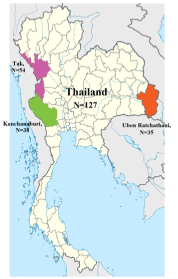
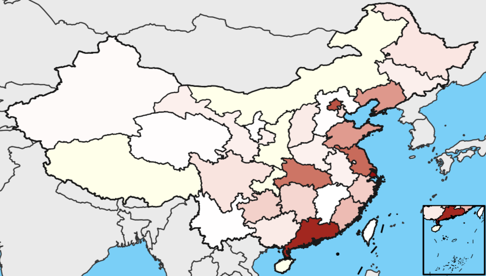

欢迎关注“小丫画图”公众号，回复“小白”，看小视频，实现点鼠标跑代码。

小丫微信：epigenomics，E-mail: figureya@126.com

作者：张杰

小丫编辑校验


```{r setup, include=FALSE}
knitr::opts_chunk$set(echo = TRUE)
```

# 需求描述

世界地图上的中国标准地图，省份内填充的颜色展示该省数据。



出自<http://dx.plos.org/10.1371/journal.pntd.0005930>

# 应用场景 

展示某一特征值在各省的分布情况。例如：人口、发病率、GDP等。

# 环境设置

用国内清华的镜像安装包，更快

```{r, eval=FALSE}
options("repos"= c(CRAN="https://mirrors.tuna.tsinghua.edu.cn/CRAN/"))
install.packages("Cairo")
install.packages('pinyin')
```

加载R包

```{r}
library(pinyin) #汉字转拼音
library(maps)
library(ggplot2)
library(scales)
library(plyr)
library(Cairo)
library(maptools)
library(rgdal)
library(stringr)

Sys.setenv(LANGUAGE = "en") #显示英文报错信息
options(stringsAsFactors = FALSE) #禁止chr转成factor
```

# 输入数据

easy_input.csv，要画的各省数据。包含两列：省的名字和数值

```{r}
mydata <- read.csv("easy_input.csv")
head(mydata)
```

# 导入地图数据，并编辑

bou2_4m文件夹，中国省级地图文件，比例尺为400万分之一。来源于国家基础地理信息中心的网站<http://nfgis.nsdi.gov.cn>，里面的省名是GBK编码的汉字。

字母p结尾的表示多边形数据，用来绘制区域；字母l结尾的文件是线形数据，用来绘制边界。

```{r}
world_map <- map_data("world")

#边界线
china_map <- readOGR("bou2_4m/bou2_4l.shp")  
x <- china_map@data
xs <- data.frame(id=row.names(x),x)
china_map0<- fortify(china_map)
china_line_data <- join(china_map0, xs, type = "full")

#省级区域地图
china_map <- readOGR("bou2_4m/bou2_4p.shp")  
x <- china_map@data
xs <- data.frame(id=row.names(x),x)

#把省名从GBK转成UTF-8
xs$NAME <- iconv(xs$NAME, from = "GBK", to = "UTF-8")
#把省名从汉字转成拼音
pinyinProv <- data.frame(NAME = unique(xs$NAME), 
                         province = apply(data.frame(unique(xs$NAME), stringsAsFactors = F),1,
                                        function(x)(py(x, sep = "", dic = pydic(method = "toneless", dic = "pinyin2")))))
#删掉sheng、zizhiqu、huizuzizhiqu、weiwuerzizhiqu、zhuangzuzizhiqu、tebiehangzhengqu字样
pinyinProv$province <- str_replace_all(pinyinProv$province, "sheng","")
pinyinProv$province <- str_replace_all(pinyinProv$province, "shi","")
pinyinProv$province <- str_replace_all(pinyinProv$province, "huizuzizhiqu","")
pinyinProv$province <- str_replace_all(pinyinProv$province, "weiwuerzizhiqu","")
pinyinProv$province <- str_replace_all(pinyinProv$province, "zhuangzuzizhiqu","")
pinyinProv$province <- str_replace_all(pinyinProv$province, "tebiehangzhengqu","")
pinyinProv$province <- str_replace_all(pinyinProv$province, "zizhiqu","")
#把陕西跟山西的拼音区分开，陕西的拼音是shannxi
pinyinProv[11,]$province <- "shannxi" 

#把拼音合并进地图文件
xss <- join(xs,pinyinProv,type = "full")

#提取经纬度
china_map0<- fortify(china_map)
china_map_data <- join(china_map0, xss, type = "full")
```

# 南海方框内地图的计算

```{r}
#参数设置
Width<-8
Height<-9

#方框的位置
long_Start<-128 
lat_Start<-18

#南海方框内要画的经纬度范围
china_map1<-china_line_data[china_line_data$long>106.55 & china_line_data$long<123.58,]
china_map1<-china_map1[china_map1$lat>4.61 & china_map1$lat<25.45,]

china_map2<-china_map_data[china_map_data$long>106.55 & china_map_data$long<123.58,]
china_map2<-china_map2[china_map2$lat>4.61 & china_map2$lat<25.45,]

#缩小后的经纬度
china_map3<-china_map1
china_map3$long <- (china_map1$long-min(china_map2$long, na.rm = TRUE)) / (max(china_map2$long, na.rm = TRUE) - min(china_map2$long, na.rm = TRUE)) * Width + long_Start
china_map3$lat <- (china_map1$lat-min(china_map2$lat, na.rm = TRUE)) / (max(china_map2$lat, na.rm = TRUE) - min(china_map2$lat, na.rm = TRUE)) * Height + lat_Start

china_map4<-china_map2
china_map4$long<-(china_map2$long-min(china_map2$long, na.rm = TRUE))/(max(china_map2$long, na.rm = TRUE) - min(china_map2$long, na.rm = TRUE))*Width + long_Start
china_map4$lat<-(china_map2$lat-min(china_map2$lat, na.rm = TRUE))/(max(china_map2$lat, na.rm = TRUE) - min(china_map2$lat, na.rm = TRUE))*Height + lat_Start
```

# 开始画图

```{r}
#地图跟各省数据value合并
china_data<-join(china_map_data, mydata, type="full") 
china_map4<-join(china_map4, mydata, type="full") 

#保存到pdf文件
CairoPDF(file="China_map",width=6.14*2,height=3.22*2)
p <- ggplot() +
  #先画世界地图作为背景，后面画的就是往它上面叠加
  geom_polygon(data=world_map,
               aes(x=long,y=lat,group=group),
               colour="grey20", #边界线深灰色
               fill="#EAEAEA", #浅灰色填充
               size=.1)+

  #边界线黑色
  geom_path(data=china_line_data,
            aes(x=long,y=lat,group=group),
            colour="black",size=0.15)+
  
  #自定义填充色
  scale_fill_gradient(low = "white",high = "#92150C", #渐变色
                      na.value = "#FEFFE8") + #没有值的省用黄色填充

  #省份区域颜色填充
  geom_polygon(data=china_data,
               aes(x=long,y=lat,group=group,fill=Value), #或as.factor(Value)设置单个的颜色
               colour="grey10",size=.1)+
  
  #南海边框
  geom_rect(aes(xmin = long_Start, xmax = long_Start + Width, 
                ymin = lat_Start, ymax = lat_Start + Height),
            fill=NA,colour="black",size=0.15)+
  
  #南海方框内的省份颜色填充
  geom_polygon(data=china_map4,
               aes(x=long,y=lat,group=group,fill=Value),
               colour="grey10",size=.05)+
  
  #南海方框内的边界线
  geom_path(data=china_map3,
            aes(x=long,y=lat,group=group),
            colour="black",size=.05)+
  
  coord_quickmap() + 
  theme_void() + #不画坐标系
  theme(plot.background = element_rect(fill="lightskyblue"))#海水蓝色
        
p
dev.off()
```

# 后期处理

输出的pdf文件是矢量图，可以在Illustrator等软件里打开，截取想要的区域即可。例如：



```{r}
sessionInfo()
```
